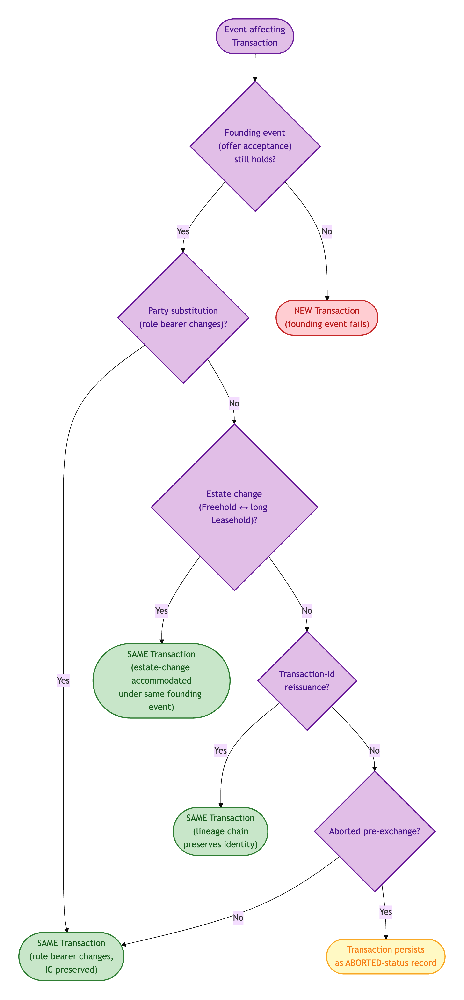
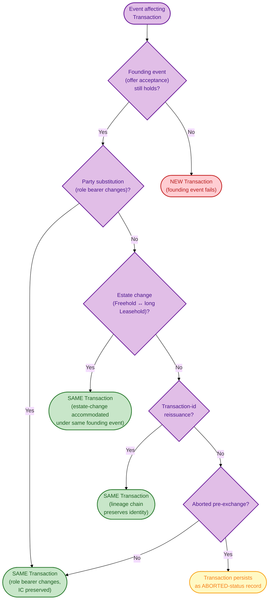
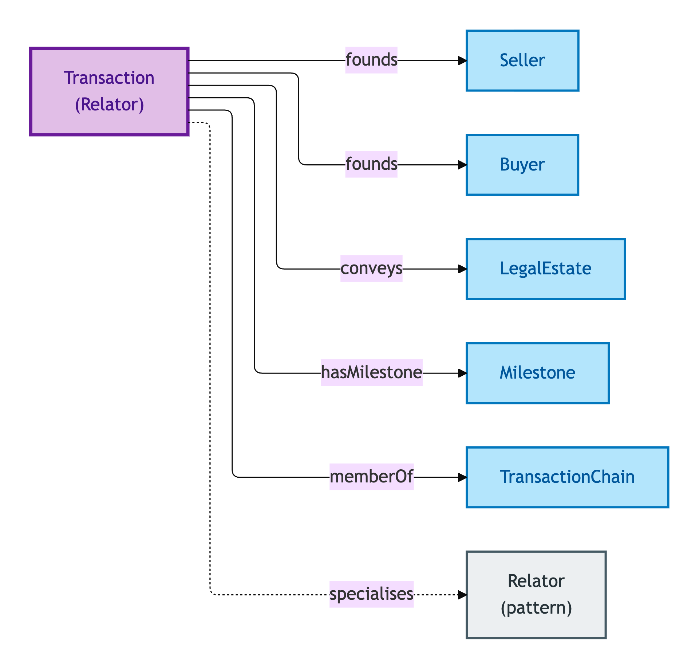
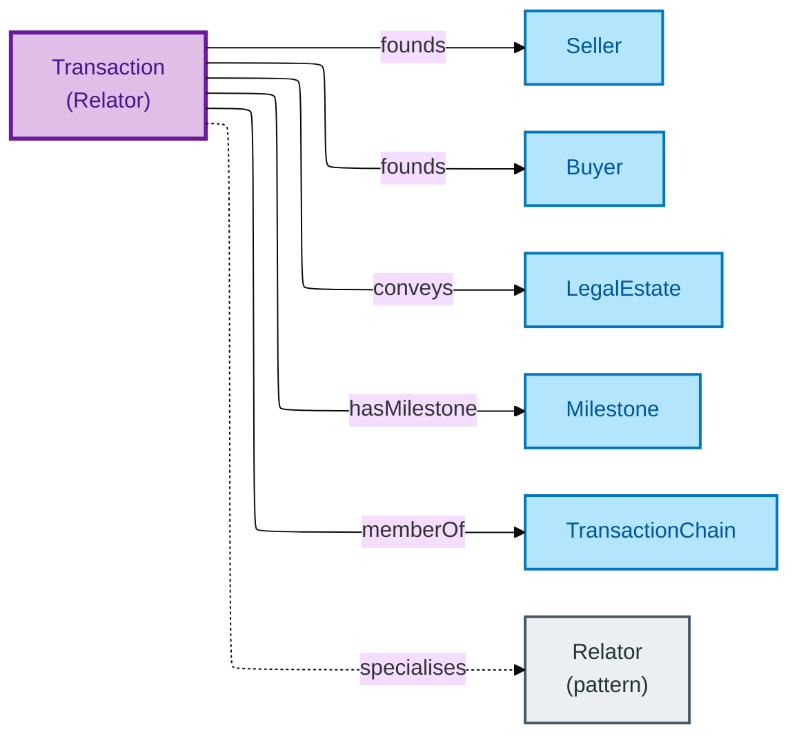

# Transaction

A Transaction is the **binding** that links Sellers, Buyers, and the Legal Estate being conveyed, founded by a transaction-starting event (typically offer acceptance). It is a Relator — a thing-in-its-own-right with its own identity and properties.

## Why it matters

A residential property transaction is not a property of the Property, nor of the Seller, nor of the Buyer — it is a *binding* that connects all three and carries its own properties (transaction-id, founding event, status, milestones). OPDA models it as a Relator so the binding can be queried, validated, and traced through party-substitutions, estate-changes, and chain-rearrangements without conflating it with any of the parties.

If you are a conveyancer, lender, or transaction-management platform asking "which transaction is this, and is it the same one after the substitution?", this is the entity whose IC answers you.

## Hard cases

- **Party-substitution.** A Buyer drops out; another Buyer steps in. The Transaction's IC persists (founding event unchanged); only the bearer of the Buyer Role Mixin changes.
- **Estate-change.** The Sellers offer a Freehold; mid-transaction it becomes a long Leasehold (e.g. a freehold strip is reserved). The Legal Estate changes; under the IC this is treated as a continuation only if the founding event still holds.
- **Transaction-id reissuance.** A transaction management system re-issues an id mid-flow. The IC tracks lineage explicitly — re-issued ids do not produce a new Transaction, they extend the predecessor's id-lineage.
- **Chain-link-break.** A buyer-also-seller withdraws from a chain. Their Transaction may persist (if the buy-side completes independently) or terminate (aborted-transaction). The Chain re-forms around the break.
- **Aborted-transaction.** Offer accepted then abandoned without exchange. The Transaction record persists as an aborted-status record; the IC does not erase it from the audit trail.

## Identity Criterion

A Transaction is identified by its **5-tuple**: (Legal Estate concerned, Sellers-set, Buyers-set, transaction-id-lineage, founding event). Two records refer to the same Transaction only if all five components match — party-substitutions handled via founding-event persistence; id-reissuance handled via lineage chain. See the [Logical tier →](../../logical/transaction/transaction.md) for the typed structure.

### IC walk-through: party-substitution vs estate-change vs id-reissuance

How each hard case resolves under the 5-tuple IC — the founding event is the gating component:

Mermaid Source

## Related Kinds

- [Relator](../foundation/relator.md) — Transaction is the canonical OPDA Relator alongside Proprietorship
- [Seller](../agent/seller.md) — Role Mixin founded by a Transaction
- [Buyer](../agent/buyer.md) — Role Mixin founded by a Transaction
- [Legal Estate](../property/legal-estate.md) — the rights bundle being conveyed
- [Milestone](./milestone.md) — the lifecycle markers within a Transaction
- [Transaction Chain](./transaction-chain.md) — aggregates of dependent Transactions

### Related-Kinds graph

Mermaid Source

## Source ODR

[ODR-0007 — Transactions and lifecycle §Q1](../../../ontology/odr/ODR-0007-transactions-and-lifecycle.md)
