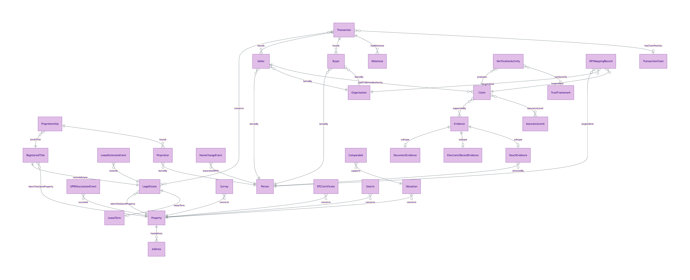
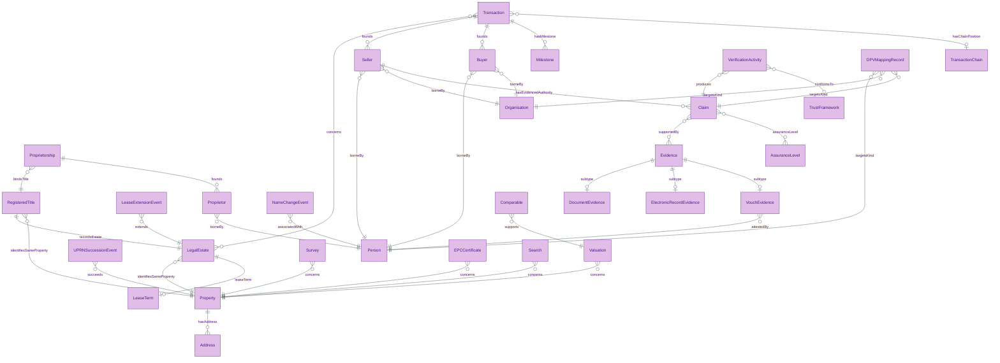
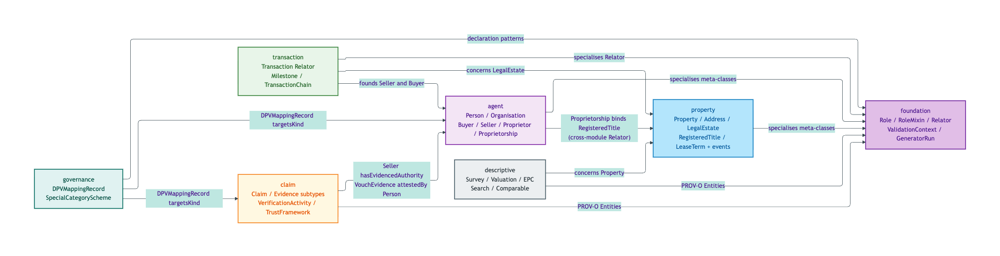

# OPDA Logical Model

This tier shows the entity-relationship structure of OPDA's ontology in platform-independent form. Audience: data engineers, solution architects, integration architects, technical product managers. The reader is expected to be comfortable with entity-relationship modelling but should not need to read RDF, SHACL, or SKOS Turtle.

OPDA's Logical-tier inventory: 41 entities (including three short-name aliases under `owl:equivalentClass`) across seven modules + 23 enumeration schemes.

## Reading order

1. This tier overview — module catalogue, entity index, master ER diagram (below)
2. The seven module directories (in IC-dependency order):
   - [`foundation/`](./foundation/) — six foundation classes (UFO meta-classes, ValidationContext, generator provenance)
   - [`property/`](./property/) — Property + Address + LegalEstate + RegisteredTitle + LeaseTerm + lifecycle events
   - [`agent/`](./agent/) — Person + Organisation + Roles + Relators
   - [`transaction/`](./transaction/) — Transaction Relator + Milestone + TransactionChain
   - [`claim/`](./claim/) — Claim + Evidence subtypes + VerificationActivity
   - [`governance/`](./governance/) — DPV mapping records + special-category data
   - [`descriptive/`](./descriptive/) — Survey + Valuation + EPC + Search + Comparable
3. Per-module `enumerations/` subdirectories — typed value sets (SKOS schemes) bound by each module's attributes.

## What's in each entity file

Every entity follows the same nine-section shape:

1. **Summary** — one paragraph; UFO meta-category in brackets; back-link to Concept tier
2. **Attributes** — typed table with cardinality + identity-bearing flags
3. **Relationships** — typed table with cardinality + inverse predicate
4. **Identity key** — typed shape of the Identity Criterion
5. **Constraints** — non-cardinality business rules with SHACL severity tier
6. **Derived attributes** — attributes computed from SHACL-AF rules
7. **ER diagram** — Mermaid `erDiagram` of the entity + direct neighbours
8. **Source ODR + ADR** — link targets only (no quoted text)

## Module catalogue

| Module | Entities | Schemes used | Description |
|---|---|---|---|
| [foundation](./foundation/) | 6 | — | UFO meta-classes (Role, RoleMixin, Relator); ValidationContext; generator provenance (GeneratorRun); diagnostic exemplars |
| [property](./property/) | 7 | 15 | Physical Property + Address + LegalEstate + RegisteredTitle + LeaseTerm + lifecycle events |
| [agent](./agent/) | 7 | 4 | Person + Organisation as substances; Buyer/Seller/Proprietor as Roles; Proprietorship Relator |
| [transaction](./transaction/) | 3 | 2 | Transaction Relator; lifecycle Milestones; TransactionChain aggregate |
| [claim](./claim/) | 11 | 2 | Verifiable Claims + Evidence subtypes + VerificationActivity + AssuranceLevel + TrustFramework |
| [governance](./governance/) | 2 | — | DPV mapping records (PII baseline + variants); special-category data scheme |
| [descriptive](./descriptive/) | 5 | — | Class-promoted descriptive Kinds: Survey, Valuation, EPC, Search, Comparable |

## Entity index (alphabetical)

| Entity | Module | UFO meta-category |
|---|---|---|
| [Address](./property/address.md) | property | Substance Kind |
| [AssuranceLevel](./claim/assurance-level.md) | claim | Quale-in-Region |
| [Buyer](./agent/buyer.md) | agent | RoleMixin |
| [Claim](./claim/claim.md) | claim | Information particular |
| [Comparable](./descriptive/comparable.md) | descriptive | Substance Kind (informational) |
| [DiagnosticExemplar](./foundation/diagnostic-exemplar.md) | foundation | Substance Kind (informational) |
| [Document](./claim/document.md) | claim | Substance Kind (informational; alias) |
| [DocumentEvidence](./claim/document-evidence.md) | claim | Substance Kind (informational) |
| [DPVMappingRecord](./governance/dpv-mapping-record.md) | governance | Information particular |
| [ElectronicRecord](./claim/electronic-record.md) | claim | Substance Kind (informational; alias) |
| [ElectronicRecordEvidence](./claim/electronic-record-evidence.md) | claim | Substance Kind (informational) |
| [EPCCertificate](./descriptive/epc-certificate.md) | descriptive | Substance Kind (informational) |
| [Evidence](./claim/evidence.md) | claim | Substance Kind (informational) |
| [GeneratorRun](./foundation/generator-run.md) | foundation | Information particular |
| [LeaseExtensionEvent](./property/lease-extension-event.md) | property | Event particular |
| [LeaseTerm](./property/lease-term.md) | property | Information particular |
| [LegalEstate](./property/legal-estate.md) | property | Substance Kind |
| [Milestone](./transaction/milestone.md) | transaction | Event particular |
| [NameChangeEvent](./agent/name-change-event.md) | agent | Event particular |
| [Organisation](./agent/organisation.md) | agent | Substance Kind |
| [Person](./agent/person.md) | agent | Substance Kind |
| [Property](./property/property.md) | property | Substance Kind |
| [Proprietor](./agent/proprietor.md) | agent | Role |
| [Proprietorship](./agent/proprietorship.md) | agent | Relator |
| [RegisteredTitle](./property/registered-title.md) | property | Substance Kind (informational) |
| [Relator](./foundation/relator.md) | foundation | Meta-class (UFO Relator) |
| [Role](./foundation/role.md) | foundation | Meta-class (UFO Role) |
| [RoleMixin](./foundation/role-mixin.md) | foundation | Meta-class (UFO RoleMixin) |
| [Search](./descriptive/search.md) | descriptive | Substance Kind (informational) |
| [Seller](./agent/seller.md) | agent | RoleMixin |
| [SpecialCategoryScheme](./governance/special-category-scheme.md) | governance | Information particular (declaration only) |
| [Survey](./descriptive/survey.md) | descriptive | Substance Kind (informational) |
| [Transaction](./transaction/transaction.md) | transaction | Relator |
| [TransactionChain](./transaction/transaction-chain.md) | transaction | Aggregate |
| [TrustFramework](./claim/trust-framework.md) | claim | Information particular |
| [UPRNSuccessionEvent](./property/uprn-succession-event.md) | property | Event particular |
| [Valuation](./descriptive/valuation.md) | descriptive | Substance Kind (informational) |
| [ValidationContext](./foundation/validation-context.md) | foundation | Substance Kind (informational) |
| [VerificationActivity](./claim/verification-activity.md) | claim | Event particular |
| [Vouch](./claim/vouch.md) | claim | Substance Kind (informational; alias) |
| [VouchEvidence](./claim/vouch-evidence.md) | claim | Substance Kind (informational) |

## Master ER diagram

The diagram below shows the cross-module relationships at a glance. Per-module ER diagrams (showing within-module detail) live in the module READMEs and in [`diagrams/`](./diagrams/).

Mermaid Source

Source file: [`diagrams/master-er.mmd`](./diagrams/master-er.mmd).

## Module dependency diagram

Module dependencies in IC-dependency order. Edges indicate that the source module declares entities or predicates whose domain or range resolves to an entity in the target module.

```mermaid
---
config:
  layout: elk
---
%%{init: {"theme": "base", "themeVariables": {"primaryColor": "#E1BEE7", "primaryTextColor": "#4A148C", "primaryBorderColor": "#6A1B9A", "lineColor": "#37474F"}}}%%
flowchart LR
    accTitle: OPDA Module Dependency Diagram
    accDescr: Inter-module dependency edges across the seven Logical-tier modules in IC-dependency order — foundation is the root; descriptive and governance are the leaves.

    classDef foundationMod fill:#E1BEE7,stroke:#6A1B9A,stroke-width:2px,color:#4A148C
    classDef propertyMod fill:#B3E5FC,stroke:#0277BD,stroke-width:2px,color:#01579B
    classDef agentMod fill:#F3E5F5,stroke:#7B1FA2,stroke-width:2px,color:#4A148C
    classDef transactionMod fill:#E8F5E9,stroke:#2E7D32,stroke-width:2px,color:#1B5E20
    classDef claimMod fill:#FFF8E1,stroke:#F57F17,stroke-width:2px,color:#E65100
    classDef governanceMod fill:#E0F2F1,stroke:#00695C,stroke-width:2px,color:#004D40
    classDef descriptiveMod fill:#ECEFF1,stroke:#455A64,stroke-width:2px,color:#263238

    Foundation["foundation<br/>Role / RoleMixin / Relator<br/>ValidationContext / GeneratorRun"]:::foundationMod
    Property["property<br/>Property / Address / LegalEstate<br/>RegisteredTitle / LeaseTerm + events"]:::propertyMod
    Agent["agent<br/>Person / Organisation<br/>Buyer / Seller / Proprietor / Proprietorship"]:::agentMod
    Transaction["transaction<br/>Transaction Relator<br/>Milestone / TransactionChain"]:::transactionMod
    Claim["claim<br/>Claim / Evidence subtypes<br/>VerificationActivity / TrustFramework"]:::claimMod
    Governance["governance<br/>DPVMappingRecord<br/>SpecialCategoryScheme"]:::governanceMod
    Descriptive["descriptive<br/>Survey / Valuation / EPC<br/>Search / Comparable"]:::descriptiveMod

    Property -->|"specialises meta-classes"| Foundation
    Agent -->|"specialises meta-classes"| Foundation
    Transaction -->|"specialises Relator"| Foundation
    Claim -->|"PROV-O Entities"| Foundation
    Governance -->|"declaration patterns"| Foundation
    Descriptive -->|"PROV-O Entities"| Foundation

    Agent -->|"Proprietorship binds RegisteredTitle<br/>(cross-module Relator)"| Property
    Transaction -->|"concerns LegalEstate"| Property
    Transaction -->|"founds Seller and Buyer"| Agent
    Claim -->|"Seller hasEvidencedAuthority<br/>VouchEvidence attestedBy Person"| Agent
    Governance -->|"DPVMappingRecord targetsKind"| Agent
    Governance -->|"DPVMappingRecord targetsKind"| Claim
    Descriptive -->|"concerns Property"| Property
```

Mermaid Source

## Identity-key index

Each entity is named alongside its Identity Criterion key. Use this as a navigation aid when designing payload shapes or evaluating cross-tier mappings.

```mermaid
---
config:
  layout: elk
---
%%{init: {"theme": "base", "themeVariables": {"primaryColor": "#E1BEE7", "primaryTextColor": "#4A148C", "primaryBorderColor": "#6A1B9A", "lineColor": "#37474F"}}}%%
flowchart LR
    accTitle: OPDA Identity-Key Index
    accDescr: Flowchart grouping every OPDA Logical-tier entity by its Identity Criterion key surface — spatial-material, identifier-bundle, PROV-O tuple, digest, or parasitic role-identity.

    classDef icKey fill:#F8BBD9,stroke:#AD1457,stroke-width:2px,color:#880E4F
    classDef entity fill:#B3E5FC,stroke:#0277BD,stroke-width:2px,color:#01579B
    classDef parasitic fill:#FFF8E1,stroke:#F57F17,stroke-width:2px,color:#E65100
    classDef metaEntity fill:#E1BEE7,stroke:#6A1B9A,stroke-width:2px,color:#4A148C

    SpatialMaterial[Spatial-material<br/>continuity]:::icKey
    AuthorityRecord[Authority-record<br/>variant + record-id]:::icKey
    RightsBundle[Rights-bundle<br/>persistence]:::icKey
    TitleLineage[Title-number lineage<br/>+ registry-event history]:::icKey
    OWLTime[OWL-Time interval<br/>+ LegalEstate]:::icKey
    ProvTuple[PROV-O tuple<br/>entity + timestamp]:::icKey
    IdentifierBundle[Identifier bundle<br/>FIBO multi-id]:::icKey
    Tuple[Relator tuple<br/>bearers + founding event]:::icKey
    Digest[Cryptographic digest<br/>content-addressable]:::icKey
    SchemeMember[Scheme-member<br/>notation]:::icKey
    URI[Dereferenceable URI]:::icKey
    ProvActivity[Provenance Activity<br/>prov:wasGeneratedBy]:::icKey
    TargetTuple[targetsKind<br/>+ baselineCategory]:::icKey
    GenRun[generatorVersion<br/>+ sourceCommit]:::icKey
    Parasitic["Parasitic on bearer<br/>+ Relator (no IC)"]:::icKey

    Property[Property]:::entity --> SpatialMaterial
    Address[Address]:::entity --> AuthorityRecord
    LegalEstate[LegalEstate]:::entity --> RightsBundle
    RegisteredTitle[RegisteredTitle]:::entity --> TitleLineage
    LeaseTerm[LeaseTerm]:::entity --> OWLTime
    LeaseExtensionEvent[LeaseExtensionEvent]:::entity --> ProvTuple
    UPRNSuccessionEvent[UPRNSuccessionEvent]:::entity --> ProvTuple
    NameChangeEvent[NameChangeEvent]:::entity --> ProvTuple

    Person[Person]:::entity --> IdentifierBundle
    Organisation[Organisation]:::entity --> IdentifierBundle
    Proprietorship[Proprietorship]:::entity --> Tuple
    Transaction[Transaction]:::entity --> Tuple
    Milestone[Milestone]:::entity --> Tuple
    TransactionChain[TransactionChain]:::entity --> Tuple

    Seller[Seller]:::parasitic --> Parasitic
    Buyer[Buyer]:::parasitic --> Parasitic
    Proprietor[Proprietor]:::parasitic --> Parasitic
    Role[Role]:::metaEntity --> Parasitic
    RoleMixin[RoleMixin]:::metaEntity --> Parasitic
    Relator[Relator]:::metaEntity --> Tuple

    Claim[Claim]:::entity --> Digest
    Evidence[Evidence]:::entity --> Digest
    DocumentEvidence[DocumentEvidence]:::entity --> Digest
    ElectronicRecordEvidence[ElectronicRecordEvidence]:::entity --> Digest
    VouchEvidence[VouchEvidence]:::entity --> Digest
    Document[Document]:::entity --> Digest
    ElectronicRecord[ElectronicRecord]:::entity --> Digest
    Vouch[Vouch]:::entity --> Digest
    VerificationActivity[VerificationActivity]:::entity --> ProvTuple

    AssuranceLevel[AssuranceLevel]:::entity --> SchemeMember
    TrustFramework[TrustFramework]:::entity --> URI
    ValidationContext[ValidationContext]:::entity --> URI

    DPVMappingRecord[DPVMappingRecord]:::entity --> TargetTuple
    GeneratorRun[GeneratorRun]:::entity --> GenRun

    Survey[Survey]:::entity --> ProvActivity
    Valuation[Valuation]:::entity --> ProvActivity
    EPCCertificate[EPCCertificate]:::entity --> ProvActivity
    Search[Search]:::entity --> ProvActivity
    Comparable[Comparable]:::entity --> ProvActivity
```

Mermaid Source

## UFO category index

Each entity grouped by its UFO meta-category bracket (pulled from the entity's `## Summary` UFO bracket per the IA spec).

```mermaid
---
config:
  layout: elk
---
%%{init: {"theme": "base", "themeVariables": {"primaryColor": "#E1BEE7", "primaryTextColor": "#4A148C", "primaryBorderColor": "#6A1B9A", "lineColor": "#37474F"}}}%%
flowchart LR
    accTitle: OPDA UFO Category Index
    accDescr: Flowchart grouping the 41 OPDA Logical-tier entities by their UFO meta-category — Substance Kind, Role, RoleMixin, Relator, Event particular, Information particular, Quale-in-Region, Aggregate, Meta-class.

    classDef ufoCat fill:#E1BEE7,stroke:#6A1B9A,stroke-width:2px,color:#4A148C
    classDef entity fill:#B3E5FC,stroke:#0277BD,stroke-width:2px,color:#01579B

    SubKind[Substance Kind]:::ufoCat
    RoleCat[Role]:::ufoCat
    RoleMixinCat[RoleMixin]:::ufoCat
    RelatorCat[Relator]:::ufoCat
    EventP[Event particular]:::ufoCat
    InfoP[Information particular]:::ufoCat
    QualeR[Quale-in-Region]:::ufoCat
    AggregateCat[Aggregate]:::ufoCat
    MetaCls[Meta-class]:::ufoCat

    PropertyE[Property]:::entity --> SubKind
    AddressE[Address]:::entity --> SubKind
    LegalEstateE[LegalEstate]:::entity --> SubKind
    RegisteredTitleE["RegisteredTitle<br/>(informational)"]:::entity --> SubKind
    PersonE[Person]:::entity --> SubKind
    OrganisationE[Organisation]:::entity --> SubKind
    ValidationContextE["ValidationContext<br/>(informational)"]:::entity --> SubKind
    DiagnosticExemplarE["DiagnosticExemplar<br/>(informational)"]:::entity --> SubKind
    EvidenceE["Evidence<br/>(informational)"]:::entity --> SubKind
    DocumentEvidenceE[DocumentEvidence]:::entity --> SubKind
    ElectronicRecordEvidenceE[ElectronicRecordEvidence]:::entity --> SubKind
    VouchEvidenceE[VouchEvidence]:::entity --> SubKind
    DocumentE["Document (alias)"]:::entity --> SubKind
    ElectronicRecordE["ElectronicRecord (alias)"]:::entity --> SubKind
    VouchE["Vouch (alias)"]:::entity --> SubKind
    SurveyE[Survey]:::entity --> SubKind
    ValuationE[Valuation]:::entity --> SubKind
    EPCCertificateE[EPCCertificate]:::entity --> SubKind
    SearchE[Search]:::entity --> SubKind
    ComparableE[Comparable]:::entity --> SubKind

    ProprietorE[Proprietor]:::entity --> RoleCat
    SellerE[Seller]:::entity --> RoleMixinCat
    BuyerE[Buyer]:::entity --> RoleMixinCat

    ProprietorshipE[Proprietorship]:::entity --> RelatorCat
    TransactionE[Transaction]:::entity --> RelatorCat

    NameChangeEventE[NameChangeEvent]:::entity --> EventP
    LeaseExtensionEventE[LeaseExtensionEvent]:::entity --> EventP
    UPRNSuccessionEventE[UPRNSuccessionEvent]:::entity --> EventP
    MilestoneE[Milestone]:::entity --> EventP
    VerificationActivityE[VerificationActivity]:::entity --> EventP

    LeaseTermE[LeaseTerm]:::entity --> InfoP
    ClaimE[Claim]:::entity --> InfoP
    TrustFrameworkE[TrustFramework]:::entity --> InfoP
    GeneratorRunE[GeneratorRun]:::entity --> InfoP
    DPVMappingRecordE[DPVMappingRecord]:::entity --> InfoP
    SpecialCategorySchemeE["SpecialCategoryScheme<br/>(declaration only)"]:::entity --> InfoP

    AssuranceLevelE[AssuranceLevel]:::entity --> QualeR

    TransactionChainE[TransactionChain]:::entity --> AggregateCat

    RoleE[Role]:::entity --> MetaCls
    RoleMixinE[RoleMixin]:::entity --> MetaCls
    RelatorE[Relator]:::entity --> MetaCls
```

Mermaid Source

## Cross-tier traceability

Every Logical-tier entity maps 1:1 to:

- the Concept-tier file at `../concept/<module>/<entity>.md` (business-language narrative)
- one `owl:Class` URI in the Physical-Ontology tier (TBox specifics)
- one or more named graphs in the Physical-Database tier (deployment specifics)

The same `<module>/<entity>.md` path shape is used across all four tiers.

## Out of scope at this tier

- Business prose, hard cases, anti-pattern rationale → Concept tier
- Named-graph layout, derived profiles, BASPI5 overlay composition → Physical-Database tier
- OWL / SHACL / SKOS / Turtle syntax → Physical-Ontology tier

## Provenance

Generated from the 24 emitted TTLs at `source/03-standards/ontology/` per the IA spec at [`../../information-architecture/logical-model-ia.md`](../../information-architecture/logical-model-ia.md). The ODR corpus is the modelling-decision audit trail and is referenced as link targets only.
