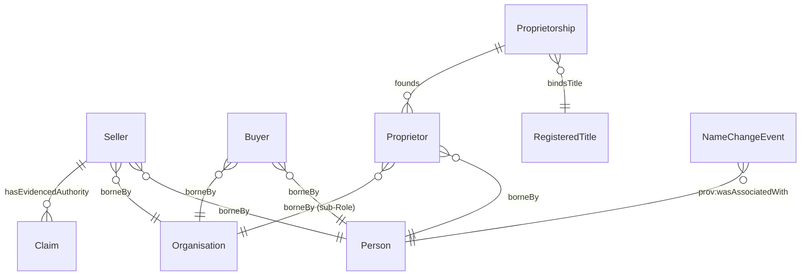

# Agent module

Substantial Agents (Person, Organisation), the anti-rigid Roles they play (Buyer, Seller, Proprietor), the Relator that mediates Property ownership (Proprietorship), and the lifecycle event that mutates Person identity (NameChangeEvent).

## Entity inventory

| Entity | UFO meta-category | Notes |
|---|---|---|
| [Buyer](./buyer.md) | RoleMixin | Cross-sortal — borne by Person OR Organisation; founded by Transaction |
| [NameChangeEvent](./name-change-event.md) | Event particular | Reified Person name-change event; identity PERSISTS |
| [Organisation](./organisation.md) | Substance Kind | FIBO LegalEntity pattern; subclass of `org:Organization` |
| [Person](./person.md) | Substance Kind | Natural person; PII anchor under DPV co-annotation |
| [Proprietor](./proprietor.md) | Role | Sortal — borne by Person (with named sub-Role for Organisation); founded by Proprietorship |
| [Proprietorship](./proprietorship.md) | Relator | Mediates Property + Proprietor against a RegisteredTitle |
| [Seller](./seller.md) | RoleMixin | Cross-sortal — borne by Person OR Organisation; founded by Transaction |

## Enumerations bound by this module

| Scheme | Used by attribute | Closed/Open |
|---|---|---|
| [OwnerTypeScheme](./enumerations/owner-type-scheme.md) | `Proprietor.ownerType` | Closed (2 members) |
| [ParticipantStatusScheme](./enumerations/participant-status-scheme.md) | Participant lifecycle (overlay profiles) | Closed (4 members) |
| [RoleScheme](./enumerations/role-scheme.md) | `RoleMixin.role` notation surface | Closed (11 members) |
| [SellersCapacityScheme](./enumerations/sellers-capacity-scheme.md) | `Seller.hasAssertedCapacity` | Closed (5 members) |

The agent module also reuses [`YesNoScheme`](../property/enumerations/yes-no-scheme.md) for the `Seller.hasOthersAged17OrOver` attribute.

## ER diagram

Source file: [`../diagrams/agent-er.mmd`](../diagrams/agent-er.mmd).
