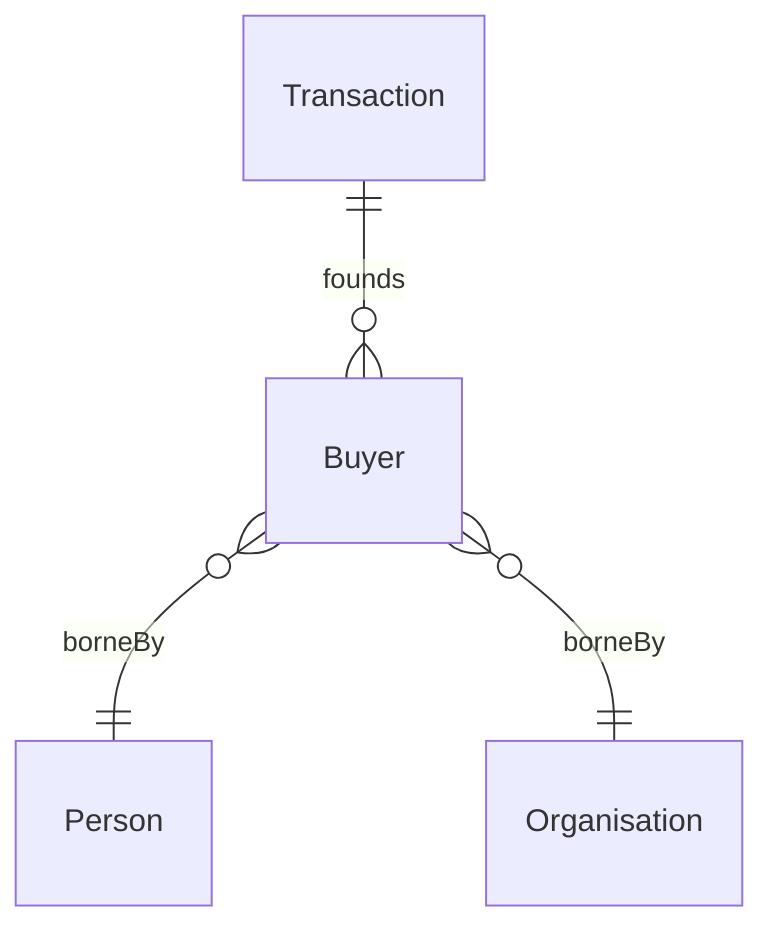

# Buyer

## Summary

Anti-rigid, cross-sortal Role borne by [Person](./person.md) OR [Organisation](./organisation.md). [RoleMixin; UFO RoleMixin]. Founded by a [Transaction](../transaction/transaction.md) Relator. The Buyer role of one transaction may correspond to the Seller role of the next in a [TransactionChain](../transaction/transaction-chain.md) (cf. chain-of-transactions exemplar). Mirror of [Seller](./seller.md) founded by the same Transaction.
[Concept tier →](../../concept/agent/buyer.md)

## Attributes

| Attribute | Type | Cardinality | Required | Identity-bearing | Description |
|---|---|---|---|---|---|
| `role` | `EnumScheme:RoleScheme` | `0..1` | N | N | Notation companion to the class-membership Role encoding (DASH editor ergonomics + SPARQL convenience) |

## Relationships

This entity declares no module-local object properties. Inbound predicates: `Transaction.founds` (Buyer side).

## Identity key

Buyer NEVER supplies its own identity (per ODR-0005 Anti-pattern §3). Identity = bearer identity (Person OR Organisation) + founding Transaction identity, parasitic on both. Cross-reference: Concept-tier [Buyer narrative](../../concept/agent/buyer.md).

## Constraints

No additional non-cardinality constraints emitted at this tier. The `role` notation must be drawn from `RoleScheme` (enforced via SHACL `sh:in` at the overlay-profile level).

## Derived attributes

None at this tier.

## ER diagram

## Source ODR + ADR

- [ODR-0006 — Agent + Roles + Relators](../../../ontology/odr/ODR-0006-agent-roles-relators.md), §Q2 Role layer
- [ADR-0011 — Module TBox emission](../../../adr/ADR-0011-module-tbox-emission.md) — implementation
