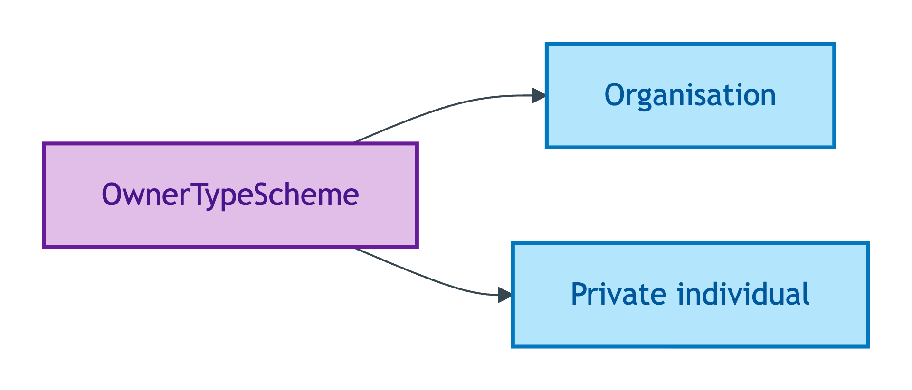
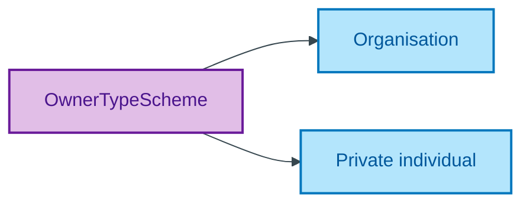

# OwnerTypeScheme

## Summary

Substance Kind labels discriminating Private individual (`opda:Person`) from Organisation (`opda:Organisation`) as legal owner. Distinct from `RoleScheme` (transactional role) and `TenureKindScheme` (sub-Kind of LegalEstate). [UFO Substance Kind label]. Each member binds to the corresponding UFO Substance Kind via `skos:exactMatch` (NEVER `owl:sameAs` per ODR-0005 Anti-pattern §5). Steward: Guizzardi (S006 Q1).
[Concept tier — Proprietor →](../../../concept/agent/proprietor.md)

## Members

| Notation | Label | Definition | Source |
|---|---|---|---|
| `Organisation` | Organisation | Legal owner is an organisation (`opda:Organisation` Substance Kind, e.g. company, trust, charity) | OPDA data dictionary |
| `Private individual` | Private individual | Legal owner is a natural person (`opda:Person` Substance Kind) | OPDA data dictionary |

## Cardinality discipline

Bound by [`Proprietor.ownerType`](../proprietor.md#attributes) (`0..1`, optional). Members bind to Substance Kind classes via `skos:exactMatch`. Closed scheme — strict two-member binary discriminating natural-person vs organisational legal ownership.

## Concept hierarchy

Mermaid Source

## Source ODR + ADR

- [ODR-0011 — Enumeration vocabularies](../../../ontology/odr/ODR-0011-enumeration-vocabularies.md), §8a UFO meta-category
- [ADR-0010 — SKOS vocabulary emission](../../../adr/ADR-0010-skos-vocabulary-emission.md) — implementation
