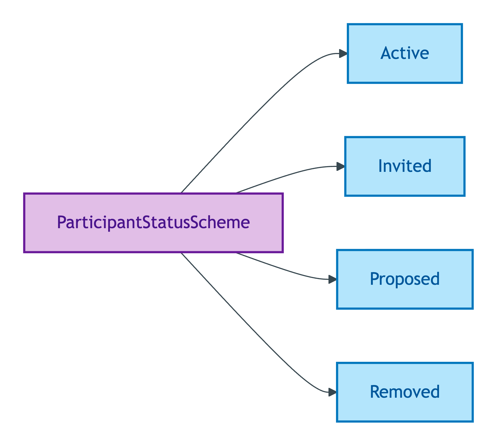
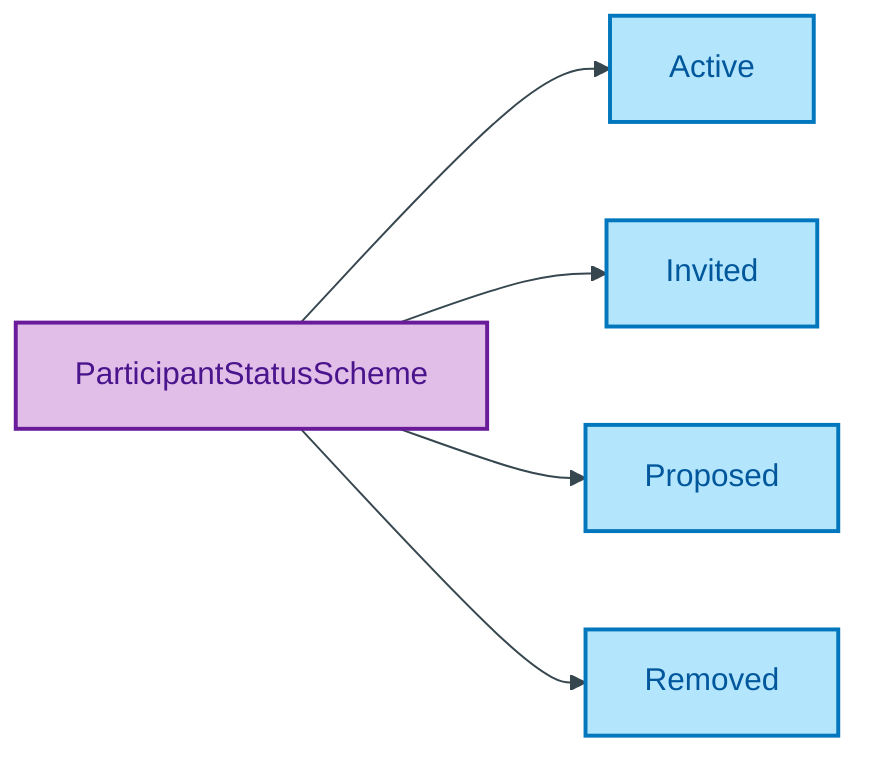

# ParticipantStatusScheme

## Summary

Phase labels for the lifecycle of a Participant Substance Kind (Active / Invited / Proposed / Removed). [UFO Phase label / DOLCE Stage of an Endurant]. Steward: Guizzardi (S006 Q7).
[Concept tier — Agent module →](../../../concept/agent/README.md)

## Members

| Notation | Label | Definition | Source |
|---|---|---|---|
| `Active` | Active | Participant is actively engaged in the transaction | OPDA data dictionary |
| `Invited` | Invited | Participant has been invited to join the transaction | OPDA data dictionary |
| `Proposed` | Proposed | Participant has been proposed but not yet invited | OPDA data dictionary |
| `Removed` | Removed | Participant has been removed from the transaction | OPDA data dictionary |

## Cardinality discipline

No core-tier attribute in the emitted TBox currently binds this scheme directly. Used by overlay-profile participant-status attributes (e.g. BASPI5 `participantStatus`). Closed scheme — strict four-member phase lifecycle.

## Concept hierarchy

Mermaid Source

## Source ODR + ADR

- [ODR-0011 — Enumeration vocabularies](/modelling/odr/odr-0011), §8a UFO meta-category
- [ADR-0010 — SKOS vocabulary emission](/modelling/adr/adr-0010) — implementation
