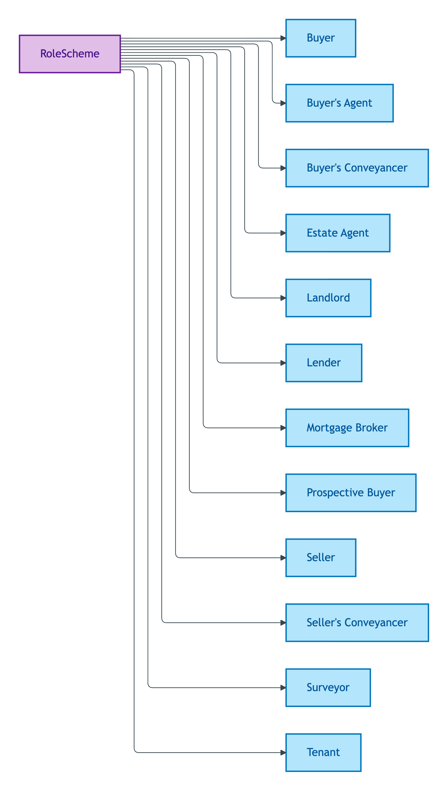
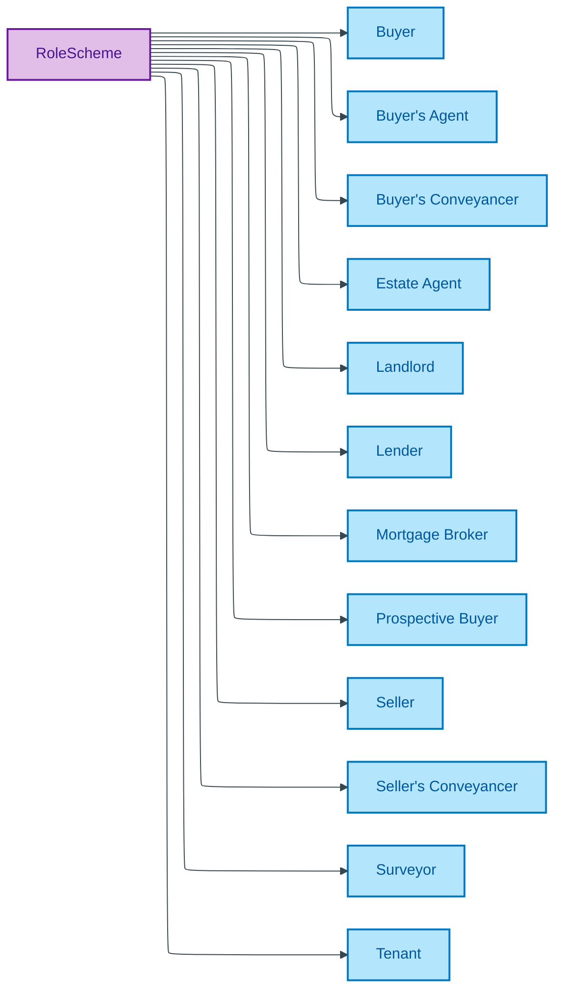

# RoleScheme

## Summary

Role labels for the anti-rigid Roles a Person / Organisation plays as a Participant in a Transaction Relator. [UFO Role label / DOLCE Endurant-played-role]. Steward: Guizzardi (RoleMixin steward per S006 Q2).
[Concept tier — RoleMixin →](../../../concept/foundation/role-mixin.md)

## Members

| Notation | Label | Definition | Source |
|---|---|---|---|
| `Buyer` | Buyer | Party acquiring legal title | OPDA data dictionary |
| `Buyer's Agent` | Buyer's Agent | Professional appointed by the Buyer to search for and negotiate on a property | OPDA data dictionary |
| `Buyer's Conveyancer` | Buyer's Conveyancer | Legal professional acting for the Buyer in the transaction | OPDA data dictionary |
| `Estate Agent` | Estate Agent | Professional appointed by the Seller to market the property | OPDA data dictionary |
| `Landlord` | Landlord | Party granting a tenancy over the property | OPDA data dictionary |
| `Lender` | Lender | Institution providing mortgage finance to the Buyer | OPDA data dictionary |
| `Mortgage Broker` | Mortgage Broker | Intermediary arranging mortgage finance for the Buyer | OPDA data dictionary |
| `Prospective Buyer` | Prospective Buyer | Party with intent to acquire legal title (pre-offer) | OPDA data dictionary |
| `Seller` | Seller | Party transferring legal title | OPDA data dictionary |
| `Seller's Conveyancer` | Seller's Conveyancer | Legal professional acting for the Seller in the transaction | OPDA data dictionary |
| `Surveyor` | Surveyor | Professional performing a survey or valuation on behalf of a party | OPDA data dictionary |
| `Tenant` | Tenant | Party occupying the property under a tenancy | OPDA data dictionary |

## Cardinality discipline

Bound by [`RoleMixin.role`](../seller.md#attributes) notation surface (`0..1` on Seller, Buyer, Proprietor). Constrained by per-overlay profile shapes via SHACL `sh:in` over the scheme members. The typed encoding (`?s a opda:Seller`) is the canonical IC; this enum is the notation surface for DASH / SPARQL convenience. Closed scheme — new roles require Council ratification.

## Concept hierarchy

Mermaid Source

## Source ODR + ADR

- [ODR-0006 — Agent + Roles + Relators](../../../ontology/odr/ODR-0006-agent-roles-relators.md), §Q2 RoleMixin discipline
- [ODR-0011 — Enumeration vocabularies](../../../ontology/odr/ODR-0011-enumeration-vocabularies.md), §8a UFO meta-category
- [ADR-0010 — SKOS vocabulary emission](../../../adr/ADR-0010-skos-vocabulary-emission.md) — implementation
