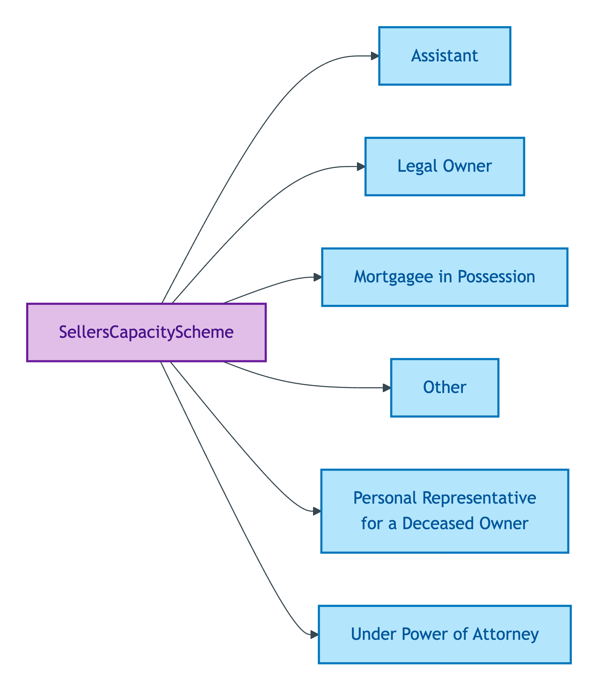
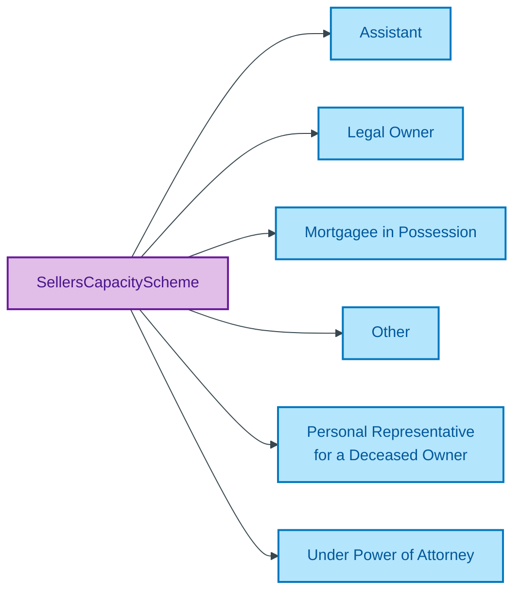

# SellersCapacityScheme

## Summary

Method/plan codes for the capacity under which a Seller is authorised to act in a sale. [UFO Method/plan code]. Codes authorise the Seller's Activity (the act of selling) under a defined legal arrangement. Steward: Guizzardi (S006 Q4).
[Concept tier — Seller →](../../../concept/agent/seller.md)

## Members

| Notation | Label | Definition | Source |
|---|---|---|---|
| `Assistant` | Assistant | Seller acts in an assisting capacity (e.g. legal assistant) | OPDA data dictionary |
| `Legal Owner` | Legal Owner | Seller is the legal owner of the property | OPDA data dictionary |
| `Mortgagee in Possession` | Mortgagee in Possession | Seller is a mortgagee that has taken possession of the property | OPDA data dictionary |
| `Other` | Other | Capacity falling outside the standard categories | OPDA data dictionary |
| `Personal Representative for a Deceased Owner` | Personal Representative for a Deceased Owner | Seller acts as personal representative for a deceased owner | OPDA data dictionary |
| `Under Power of Attorney` | Under Power of Attorney | Seller acts under a power of attorney on behalf of the legal owner | OPDA data dictionary |

## Cardinality discipline

Bound by [`Seller.hasAssertedCapacity`](../seller.md#attributes) (`0..1`, optional). The notation lives on the Sales side; the evidence link lives on the Conveyancing side via `Seller.hasEvidencedAuthority` per the two-predicate Capacity/Authority split (ODR-0006 §Q4). Closed scheme.

## Concept hierarchy

Mermaid Source

## Source ODR + ADR

- [ODR-0006 — Agent + Roles + Relators](../../../ontology/odr/ODR-0006-agent-roles-relators.md), §Q4 Capacity/Authority split
- [ADR-0010 — SKOS vocabulary emission](../../../adr/ADR-0010-skos-vocabulary-emission.md) — implementation
