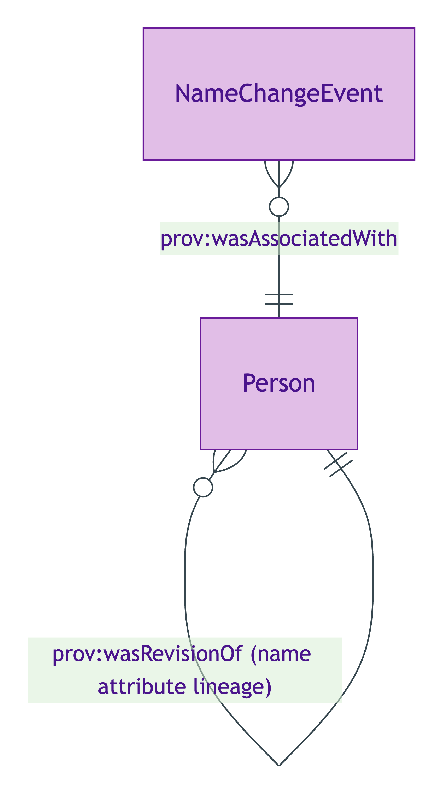
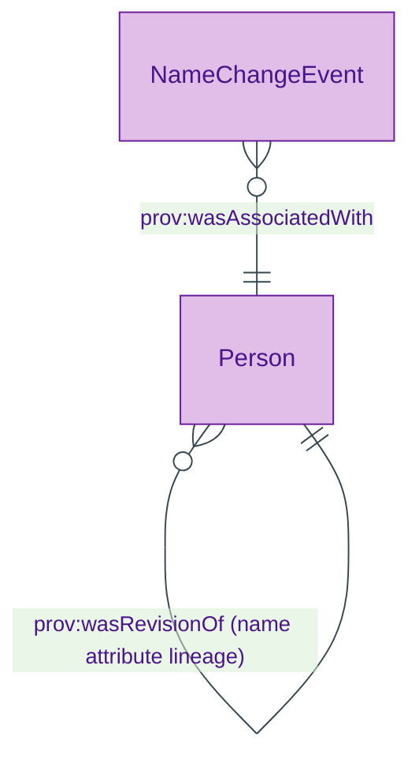

# Name Change Event

## Summary

Reified PROV-O activity recording a [Person](./person.md)'s name change (deed-poll, marriage, gender recognition, etc.). [Event particular; UFO Event particular / DOLCE Achievement]. The Person's identity PERSISTS through the name change per S006 Q1 — one Person individual with a name-attribute provenance chain via `prov:wasRevisionOf`, NOT two distinct Persons. Anti-pattern: `owl:sameAs` across the former/current names (cross-context inference propagation).
[Concept tier →](../../concept/agent/name-change-event.md)

## Attributes

This entity declares no module-local datatype properties. Timestamp lives on the inherited `prov:Activity` predicate.

## Relationships

This entity declares no module-local object properties. The event references the Person it associates via the inherited PROV-O predicate `prov:wasAssociatedWith`.

## Identity key

Identity key = `(Person, prov-timestamp)` tuple. The reified event has its own URI; identity is established by the (person-affected, name-change-timestamp) pair.

## Constraints

No SHACL Violation/Warning shapes emitted on NameChangeEvent at this tier. PROV-O lifecycle constraints are inherited from upstream W3C PROV-O.

## Derived attributes

None on the event itself — the materialised back-reference `Person.hasIdentifierSuccessionEvent` is on the Person side (see [`Person.derived-attributes`](./person.md#derived-attributes)).

## ER diagram

Mermaid Source

## Source ODR + ADR

- [ODR-0006 — Agent + Roles + Relators](../../../ontology/odr/ODR-0006-agent-roles-relators.md), §Q1 Person IC + name-change discipline
- [ADR-0011 — Module TBox emission](../../../adr/ADR-0011-module-tbox-emission.md) — implementation
- [ADR-0012 — SHACL + DPV annotation emission](../../../adr/ADR-0012-shacl-and-dpv-annotation-emission.md) — IdentifierSuccessionRule
