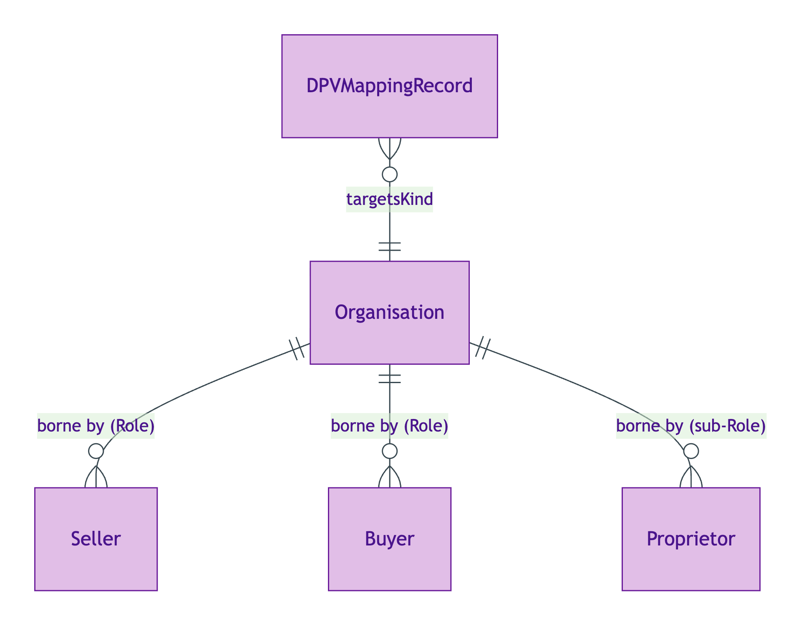
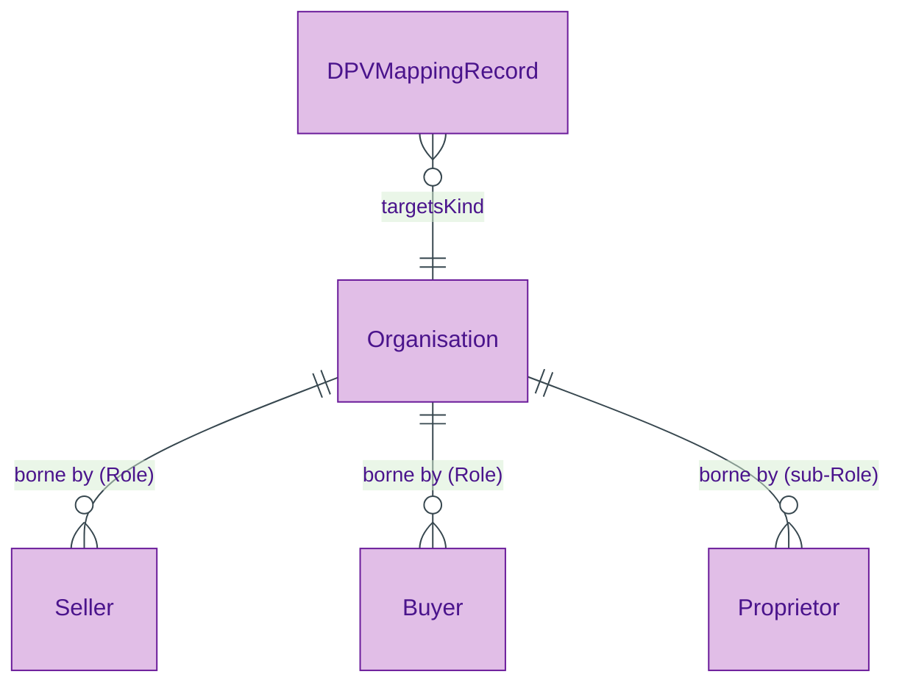

# Organisation

## Summary

Corporate or unincorporated organisation. [Substance Kind; UFO Substance Kind / DOLCE NonPhysicalEndurant — Searle 1995 legal-institutional object]. Identity criterion over merger / demerger / dissolution hard cases: FIBO LegalEntity pattern with multiple jurisdiction-issued identifiers (CRN, LEI) for one Kind; entity-merger produces a new individual via `prov:wasDerivedFrom`. Subclass of `org:Organization` per S006 Q6 9-1 verdict (Allemang held-as-live).
[Concept tier →](../../concept/agent/organisation.md)

## Attributes

| Attribute | Type | Cardinality | Required | Identity-bearing | Description |
|---|---|---|---|---|---|
| `hasAssertedCapacity` | `string` | `0..1` | N | Y | Surface identity-key element |

## Relationships

This entity declares no module-local object properties. Inbound predicates: `Seller.borneBy`, `Buyer.borneBy`, `Proprietor.borneBy` (under named Organisation sub-Role specialisation).

## Identity key

Identity key = registration-record bundle (LEI / Companies House number) per ODR-0006 §Q6. The surface IC element is `hasAssertedCapacity`; the full IC is borne by the registration-record. Subclass relationship to `org:Organization` preserves cross-vocabulary identity. Cross-reference: Concept-tier [Organisation IC narrative](../../concept/agent/organisation.md#identity-criterion).

## Constraints

- `hasAssertedCapacity` MUST be a single `string` value when present (`Violation`, `OrganisationIdentityKeyShape`)

## Derived attributes

None at this tier.

## ER diagram

Mermaid Source

## Source ODR + ADR

- [ODR-0006 — Agent + Roles + Relators](../../../ontology/odr/ODR-0006-agent-roles-relators.md), §Q4 Organisation IC; §Q6 org:Organization alignment
- [ADR-0011 — Module TBox emission](../../../adr/ADR-0011-module-tbox-emission.md) — implementation
- [ADR-0012 — SHACL + DPV annotation emission](../../../adr/ADR-0012-shacl-and-dpv-annotation-emission.md) — shapes
