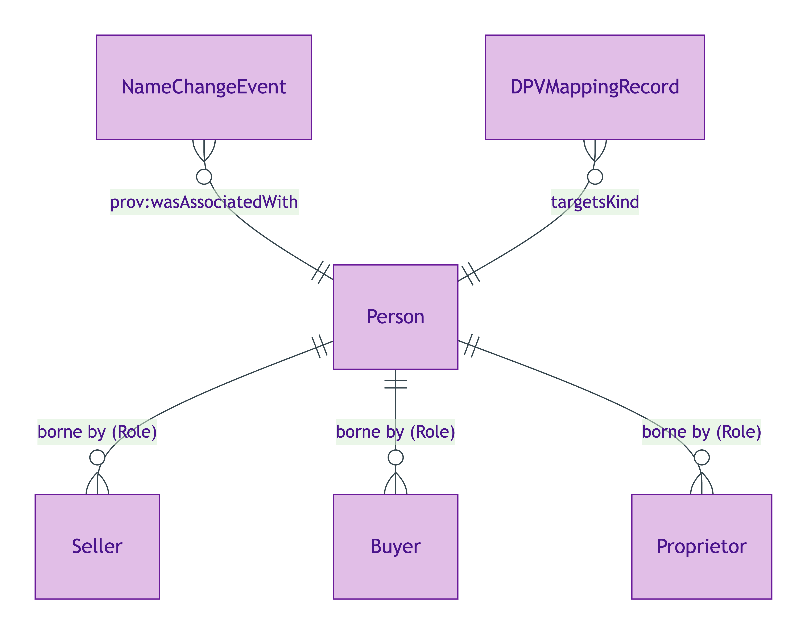
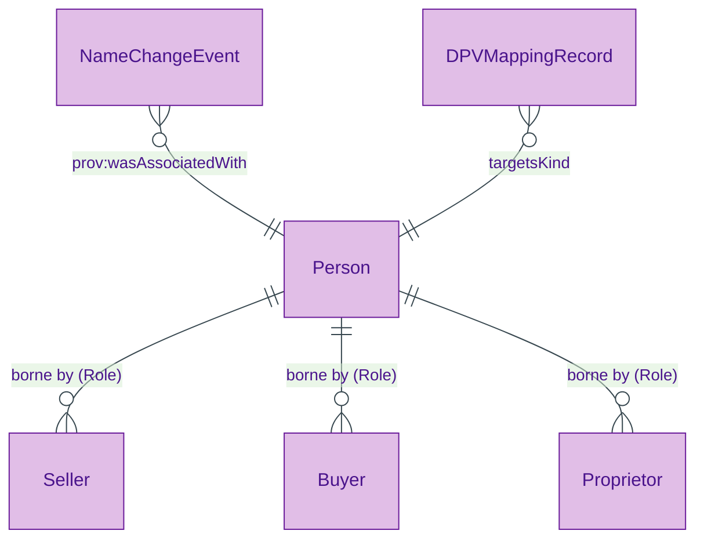
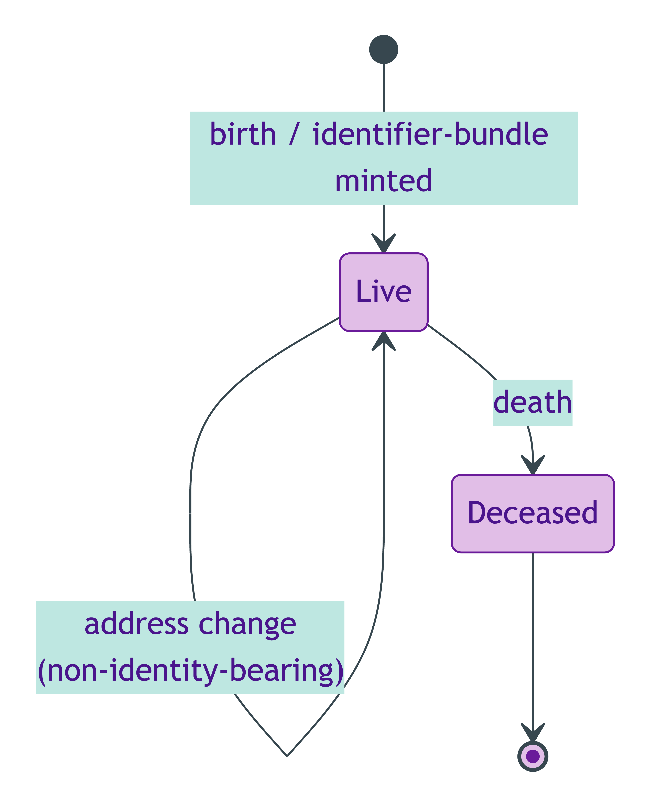

# Person

## Summary

Natural person. [Substance Kind; UFO Substance Kind (Sortal, Rigid) / DOLCE Endurant + Agent]. Identity criterion is FIBO-style multi-identifier persistence (date-of-birth + state-issued ID + name) over name-change, gender-recognition, and death hard cases. Anchors PII regimes — DPV co-annotation per ODR-0018; baseline category `dpv-pd:Name`.
[Concept tier →](../../concept/agent/person.md)

## Attributes

| Attribute | Type | Cardinality | Required | Identity-bearing | Description |
|---|---|---|---|---|---|
| `hasAssertedCapacity` | `string` | `0..1` | N | Y | Sales-side asserted capacity (surface identity-key element); typically constrained by `SellersCapacityScheme` when borne by a Seller Role |
| `hasSpecialCategoryData` | `boolean` | `0..1` | N | N | Flag indicating GDPR Article 9/10 special-category personal data (race, religion, health, etc.); triggers Cat 4 lawful-basis SHACL shape |

## Relationships

This entity declares no module-local object properties. Inbound predicates: `Seller.borneBy`, `Buyer.borneBy`, `Proprietor.borneBy`, `NameChangeEvent.wasAssociatedWith`.

## Identity key

Identity key = FIBO-style multi-identifier bundle (NI number / passport / driving-licence + name + date of birth). The surface IC element is `hasAssertedCapacity` (when present); the full IC is borne by the identifier-bundle and persists through `NameChangeEvent` via PROV-O. Cross-reference: Concept-tier [Person IC narrative](../../concept/agent/person.md#identity-criterion).

## Constraints

- `hasAssertedCapacity` MUST be a single `string` value when present (`Violation`, `PersonIdentityKeyShape`)
- A Person bearing `hasSpecialCategoryData = true` MUST also carry a `dpv:hasLegalBasis` triple (`Violation`, `SpecialCategoryPIIWithoutLawfulBasisShape`)

## Derived attributes

| Attribute | Derived from | Rule summary | Severity |
|---|---|---|---|
| `hasIdentifierSuccessionEvent` | `NameChangeEvent` named via `prov:wasAssociatedWith` | Materialises a back-reference to every NameChangeEvent that associates the Person | `Info` |
| `hasCapacityAuthorityMatchStatus` | `hasAssertedCapacity` + `hasEvidencedAuthority` | `matched` when an evidenced authority is present; `unevidenced-capacity` otherwise | `Info` |

## ER diagram

Mermaid Source

## Lifecycle state-transition diagram

Person identity persists through name-change, gender-recognition, and other identifier-mutating events per S006 Q1. Each lifecycle event reifies as a PROV Activity with `prov:wasRevisionOf` on the affected attribute.

```mermaid
%%{init: {"theme": "base", "themeVariables": {"primaryColor": "#E1BEE7", "primaryTextColor": "#4A148C", "primaryBorderColor": "#6A1B9A", "lineColor": "#37474F"}}}%%
stateDiagram-v2
    accTitle: Person — Lifecycle State-Transition Diagram
    accDescr: Person identity persists through name-change (deed poll, marriage, gender recognition) and other identifier-mutating events. Identity terminates only on death; the deceased Person retains a PROV-O lineage from prior name-attribute revisions.

    [*] --> Live : birth / identifier-bundle minted
    Live --> Live : NameChangeEvent<br/>(name attribute revised<br/>via prov:wasRevisionOf)
    Live --> Live : gender recognition<br/>(identity persists)
    Live --> Live : address change<br/>(non-identity-bearing)
    Live --> Deceased : death
    Deceased --> [*]
```

Mermaid Source

## Source ODR + ADR

- [ODR-0006 — Agent + Roles + Relators](/modelling/odr/odr-0006), §Q1 Person IC
- [ODR-0018 — DPV co-annotation](/modelling/odr/odr-0018), §Rule 4 baseline
- [ADR-0011 — Module TBox emission](/modelling/adr/adr-0011) — implementation
- [ADR-0012 — SHACL + DPV annotation emission](/modelling/adr/adr-0012) — Cat 4 lawful-basis shape
