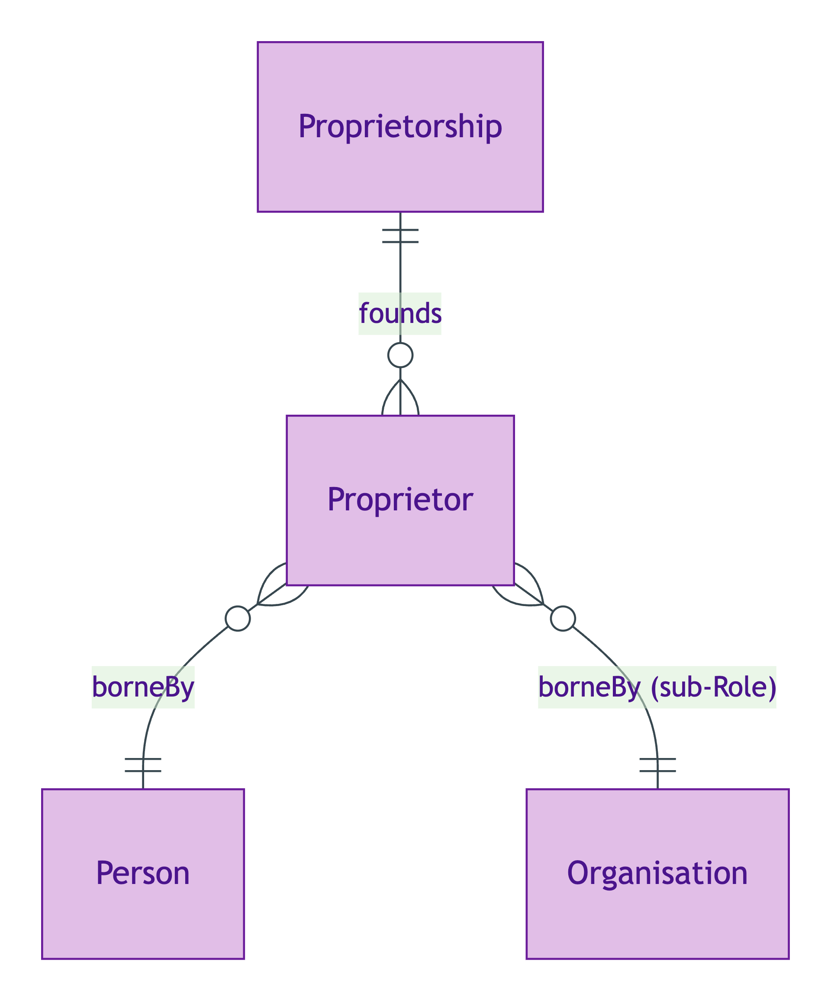
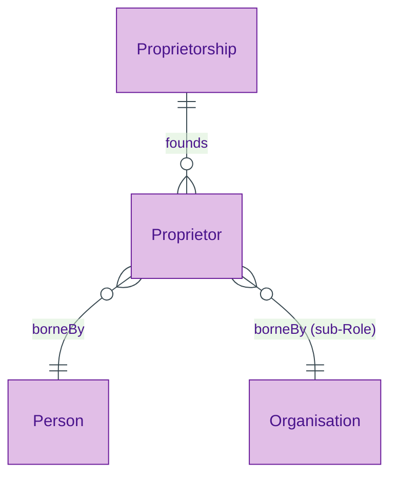

# Proprietor

## Summary

Anti-rigid, sortal Role — borne by [Person](./person.md) (with named sub-Role for Organisation-proprietorship). [Role; UFO Role]. Founded by a [Proprietorship](./proprietorship.md) Relator per ODR-0006 §Q3 Role layer. NEVER keyed (per ODR-0005 Anti-pattern §3) — a Proprietor has no identity qua Proprietor; identity borrows from bearer.
[Concept tier →](../../concept/agent/proprietor.md)

## Attributes

| Attribute | Type | Cardinality | Required | Identity-bearing | Description |
|---|---|---|---|---|---|
| `ownerType` | `EnumScheme:OwnerTypeScheme` | `0..1` | N | N | Substance Kind label discriminating Private individual (Person) from Organisation as legal owner |
| `role` | `EnumScheme:RoleScheme` | `0..1` | N | N | Notation companion to the class-membership Role encoding |

## Relationships

This entity declares no module-local object properties. Inbound predicates: `Proprietorship.founds`.

## Identity key

Proprietor NEVER supplies its own identity (per ODR-0005 Anti-pattern §3). Identity = bearer identity (Person OR Organisation under named sub-Role) + founding Proprietorship identity. The `ownerType` attribute is a Substance Kind discriminator that resolves the cross-Kind bearer; it is NOT identity-bearing on its own.

## Constraints

No additional non-cardinality constraints emitted at this tier. The `ownerType` enum binding is enforced via SHACL `sh:in` at the overlay-profile level.

## Derived attributes

None at this tier.

## ER diagram

Mermaid Source

## Source ODR + ADR

- [ODR-0006 — Agent + Roles + Relators](../../../ontology/odr/ODR-0006-agent-roles-relators.md), §Q2 Role layer; §Q3 Proprietorship founding
- [ADR-0011 — Module TBox emission](../../../adr/ADR-0011-module-tbox-emission.md) — implementation
