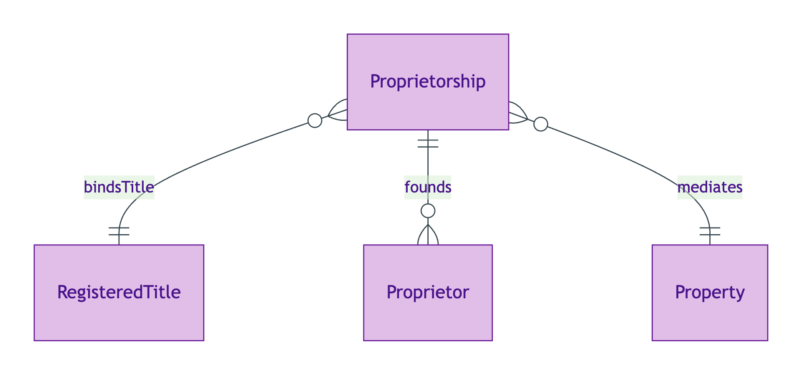
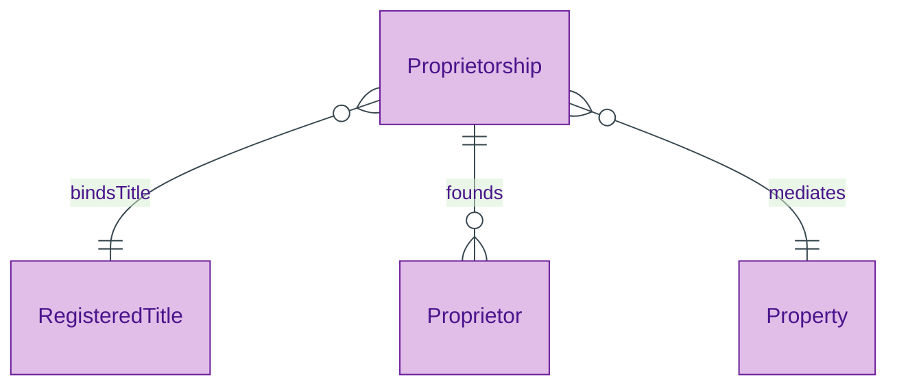

# Proprietorship

## Summary

UFO Relator (relational endurant) mediating [Property](../property/property.md) + [Proprietor](./proprietor.md) instances against a [RegisteredTitle](../property/registered-title.md). [Relator; UFO Relator]. Identity criterion = the `(Title, Persons-set)` tuple per S006 Q3. Joint-tenancy vs tenants-in-common is a property of the Relator, NOT of the Roles. Founding event recorded via `prov:wasGeneratedBy` on the registration activity.
[Concept tier →](../../concept/agent/proprietorship.md)

## Attributes

This entity declares no module-local datatype properties. The joint-tenancy / tenants-in-common discriminator is carried as a property of the Relator instance via the inherited PROV-O qualified-form predicates (`prov:qualifiedAssociation` → `prov:Association` → `prov:hadRole`).

## Relationships

This entity declares no module-local object properties beyond the meta-class `Relator` predicates. The Proprietorship binds a RegisteredTitle (carries the title-record context) and founds Proprietor Roles (the bearer set).

## Identity key

Identity key = `(RegisteredTitle, Persons-set)` tuple per ODR-0006 §Q3. The Relator's identity is independent of any single Proprietor Role's identity but is parasitic on the title-record and the founding-event context. Cross-reference: Concept-tier [Proprietorship IC narrative](../../concept/agent/proprietorship.md#identity-criterion).

## Constraints

No SHACL Violation/Warning shapes emitted on Proprietorship at this tier. The meta-class `Relator` discipline (mediates ≥2 bearers; founded by an event) is enforced by inspection of the bearer set + founding-event link rather than by an emitted shape.

## Derived attributes

None at this tier.

## ER diagram

Mermaid Source

## Source ODR + ADR

- [ODR-0006 — Agent + Roles + Relators](../../../ontology/odr/ODR-0006-agent-roles-relators.md), §Q3 Proprietorship Relator
- [ADR-0011 — Module TBox emission](../../../adr/ADR-0011-module-tbox-emission.md) — implementation
