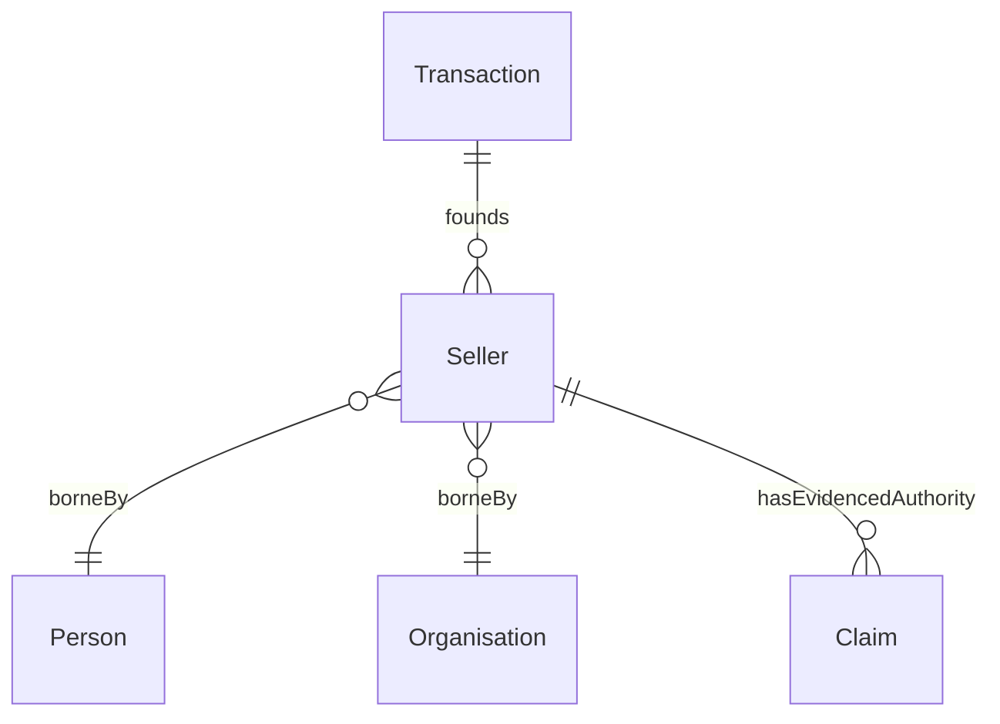

# Seller

## Summary

Anti-rigid, cross-sortal Role borne by [Person](./person.md) OR [Organisation](./organisation.md). [RoleMixin; UFO RoleMixin]. Founded by a [Transaction](../transaction/transaction.md) Relator. An instance is borne by a specific bearer in the context of a specific Transaction; role identity is parasitic on the (Transaction, bearer) tuple. Sub-Roles `PersonSeller` / `OrganisationSeller` may sortalise the RoleMixin where downstream use requires.
[Concept tier →](../../concept/agent/seller.md)

## Attributes

| Attribute | Type | Cardinality | Required | Identity-bearing | Description |
|---|---|---|---|---|---|
| `hasAssertedCapacity` | `EnumScheme:SellersCapacityScheme` | `0..1` | N | N | Seller-side asserted capacity (sales-context seam in the two-predicate Capacity/Authority split per S006 Q4) |
| `hasOthersAged17OrOver` | `EnumScheme:YesNoScheme` | `0..1` | N | N | Yes/No: does the Seller's household include occupiers aged 17 or over (other than the Seller)? |
| `role` | `EnumScheme:RoleScheme` | `0..1` | N | N | Notation companion to the class-membership Role encoding |

## Relationships

| Predicate | Target entity | Cardinality | Inverse | Description |
|---|---|---|---|---|
| `hasEvidencedAuthority` | `Claim` | `0..*` | — | Conveyancing-side seam linking a Seller's asserted capacity to a Claim of authority (e.g. probate, power of attorney). The founding grant is modelled as the missing Relator per ODR-0006 §Capacity split + ODR-0009 §Claim |

Inbound predicates: `Transaction.founds` (Seller side).

## Identity key

Seller NEVER supplies its own identity. Identity = bearer identity (Person OR Organisation) + founding Transaction identity. The two-predicate Capacity/Authority split places the assertion on the Sales side (`hasAssertedCapacity`) and the evidence link on the Conveyancing side (`hasEvidencedAuthority`).

## Constraints

No additional non-cardinality constraints emitted at this tier. The `hasAssertedCapacity` enum binding is enforced via SHACL `sh:in` at the overlay-profile level.

## Derived attributes

The `hasCapacityAuthorityMatchStatus` derived attribute lives on the bearer Person (see [`Person.derived-attributes`](./person.md#derived-attributes)) since the rule's `sh:targetClass` is Person, not Seller.

## ER diagram

## Source ODR + ADR

- [ODR-0006 — Agent + Roles + Relators](../../../ontology/odr/ODR-0006-agent-roles-relators.md), §Q2 Role layer; §Q4 Capacity/Authority split
- [ADR-0011 — Module TBox emission](../../../adr/ADR-0011-module-tbox-emission.md) — implementation
