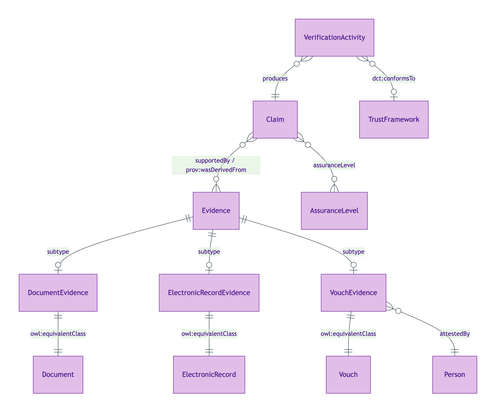
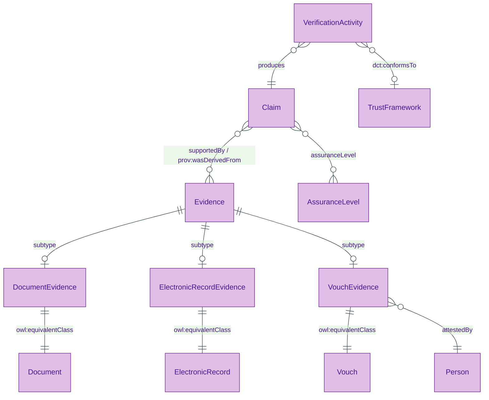
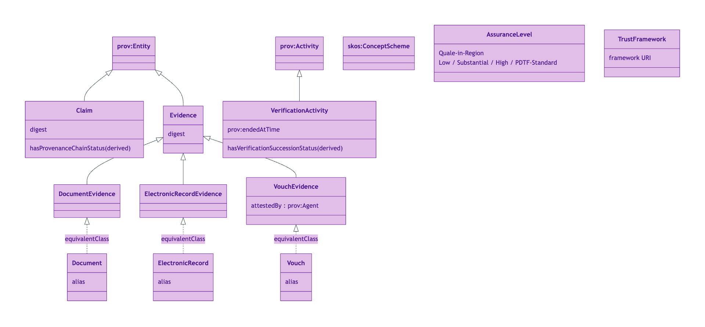
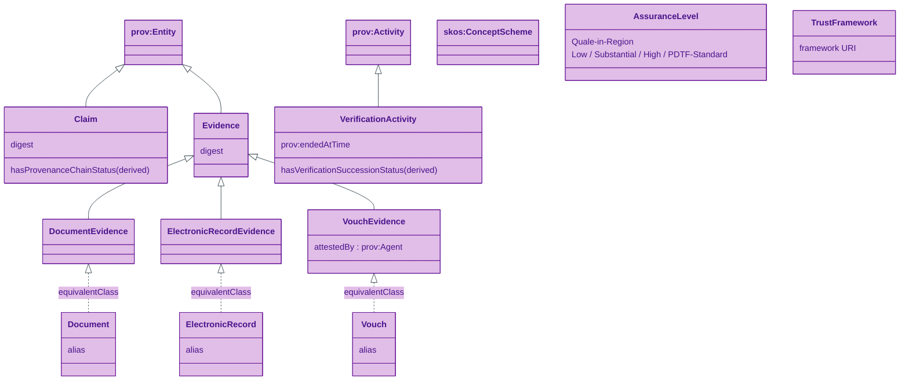
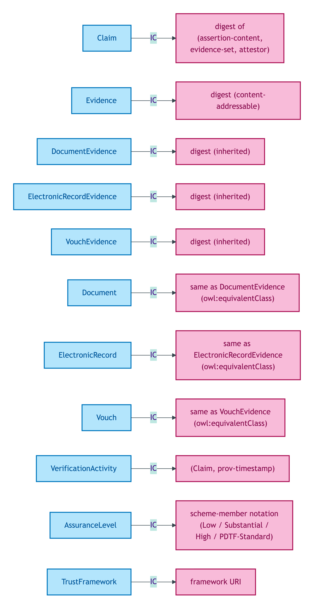
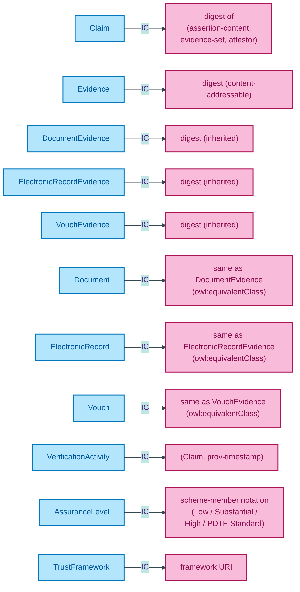

# Claim module

Verifiable claims (Claim), the three categories of evidence supporting them (DocumentEvidence, ElectronicRecordEvidence, VouchEvidence with short-name aliases Document, ElectronicRecord, Vouch), the verification activity that produces a verified claim (VerificationActivity), the assurance-level quality judgement (AssuranceLevel), and the trust-framework citation (TrustFramework).

## Entity inventory

| Entity | UFO meta-category | Notes |
|---|---|---|
| [Claim](./claim.md) | Information particular | PROV-O Entity; S009 Q1 80%-PROV-O mapping |
| [Document](./document.md) | Substance Kind (informational; alias) | `owl:equivalentClass` of DocumentEvidence |
| [DocumentEvidence](./document-evidence.md) | Substance Kind (informational) | Paper / scanned artefacts issued by authoritative source |
| [ElectronicRecord](./electronic-record.md) | Substance Kind (informational; alias) | `owl:equivalentClass` of ElectronicRecordEvidence |
| [ElectronicRecordEvidence](./electronic-record-evidence.md) | Substance Kind (informational) | API-retrieved structured records from authoritative source |
| [Evidence](./evidence.md) | Substance Kind (informational) | Generic Evidence supertype; three named subtypes per S009 Rule 5 |
| [TrustFramework](./trust-framework.md) | Information particular | Governance regime that scopes claim validity |
| [VerificationActivity](./verification-activity.md) | Event particular | PROV-O Activity producing a verified claim |
| [Vouch](./vouch.md) | Substance Kind (informational; alias) | `owl:equivalentClass` of VouchEvidence |
| [VouchEvidence](./vouch-evidence.md) | Substance Kind (informational) | Formal attestation by a regulated professional |

## Enumerations bound by this module

| Scheme | Used by attribute | Closed/Open |
|---|---|---|
| [EvidenceMethodScheme](./enumerations/evidence-method-scheme.md) | Evidence-method notation | Closed (3 members per OIDC4IDA) |

## ER diagram

Mermaid Source

Source file: [`../diagrams/claim-er.mmd`](../diagrams/claim-er.mmd).

## Class hierarchy

OWL/RDFS subclass relationships. Claim and Evidence specialise `prov:Entity`. Three Evidence subtypes (DocumentEvidence, ElectronicRecordEvidence, VouchEvidence) each have a short-name `owl:equivalentClass` alias. VerificationActivity specialises `prov:Activity`.

Mermaid Source

## Identity-key summary

Mermaid Source

