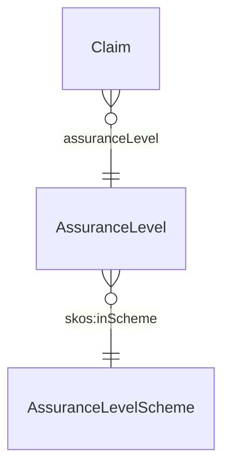

# Assurance Level

## Summary

Quality judgement on a [Claim](./claim.md)'s verification — eIDAS Level of Assurance (Low / Substantial / High) per OIDC trust tiering, plus the OPDA-specific PDTF-Standard intermediate level per ODR-0009 §Q3. [Quale-in-Region; UFO Quale-in-Region]. Backed by [AssuranceLevelScheme](./enumerations/assurance-level-scheme.md). Local term per S009 5-residue (PROV-O carries no notion of assurance grading).
[Concept tier →](../../concept/claim/assurance-level.md)

## Attributes

This entity is itself a Quale-in-Region — its instances are the four scheme members (Low / Substantial / High / PDTF-Standard). It declares no module-local datatype properties beyond those inherited from the scheme members (`skos:notation`, `skos:prefLabel`, etc.).

## Relationships

This entity declares no module-local object properties. The binding from a Claim to its AssuranceLevel uses the inherited `skos:related` / overlay-profile-specific predicates rather than a core-tier predicate.

## Identity key

Identity = scheme-member notation (one of `Low`, `Substantial`, `High`, `PDTF-Standard`). Each member is identified by its URI fragment within `AssuranceLevelScheme`.

## Constraints

No SHACL Violation/Warning shapes emitted on AssuranceLevel itself at this tier. Vouch-only Evidence caps the AssuranceLevel at `Low` regardless of voucher quality (S009 Q3 hard rule; enforced at the overlay-profile level).

## Derived attributes

None.

## ER diagram

## Source ODR + ADR

- [ODR-0009 — Claims + Evidence + Verification](../../../ontology/odr/ODR-0009-claims-evidence-verification.md), §Q3 AssuranceLevel
- [ADR-0010 — SKOS vocabulary emission](../../../adr/ADR-0010-skos-vocabulary-emission.md) — scheme implementation
- [ADR-0011 — Module TBox emission](../../../adr/ADR-0011-module-tbox-emission.md) — class declaration
