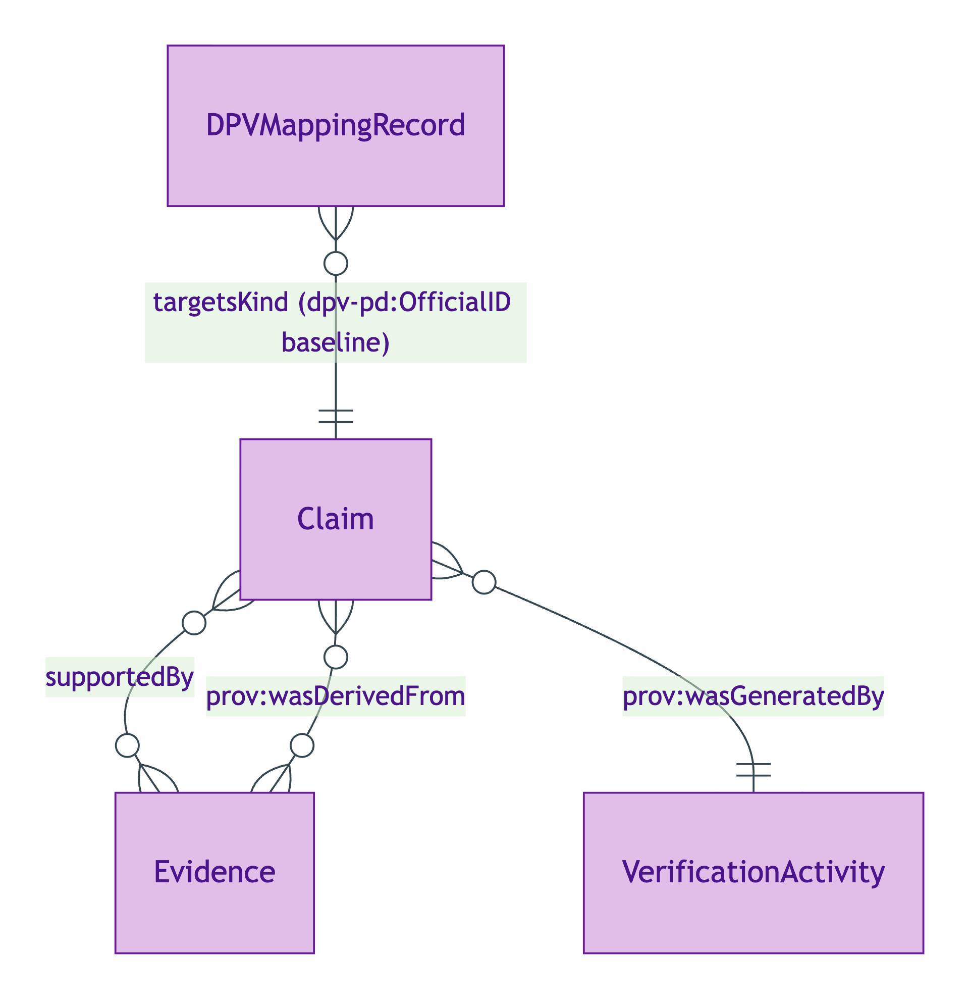
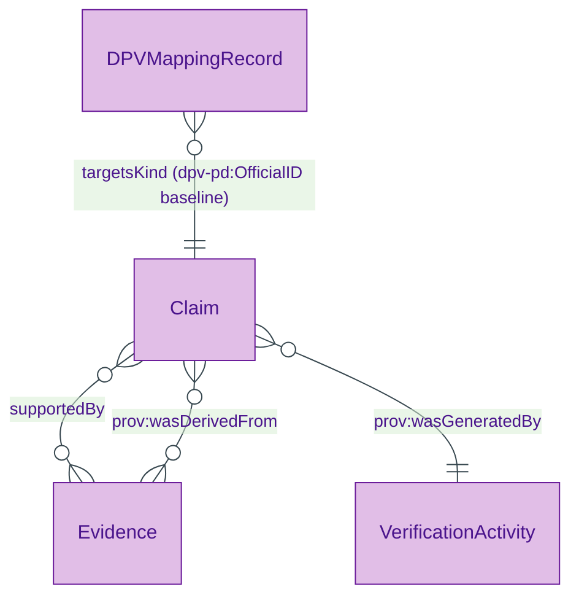

# Claim

## Summary

Verifiable claim entity. [Information particular; UFO Information particular / PROV-O Entity]. Per S009 Q1 80%-PROV-O mapping. Hard cases: contested assertion (multiple verifications with divergent verdicts); multi-method verification (electronic-record + vouch corroboration); assurance-level downgrade (vouch-only evidence caps at eIDAS Low). The verified claim (claim plus verification bundle) is a derived entity per S009 Rule 1.
[Concept tier →](../../concept/claim/claim.md)

## Attributes

| Attribute | Type | Cardinality | Required | Identity-bearing | Description |
|---|---|---|---|---|---|
| `digest` | `string` | `0..1` | N | Y | Cryptographic digest of the claim assertion (algorithm + value, e.g. `sha256:e3b0...`); local term per S009 5-residue |

## Relationships

| Predicate | Target entity | Cardinality | Inverse | Description |
|---|---|---|---|---|
| `supportedBy` | `Evidence` | `0..*` | — | Claim → Evidence join; convenience predicate alongside the canonical PROV-O `prov:wasDerivedFrom` chain |

The Claim is also linked to its verification activity via the inherited `prov:wasGeneratedBy` predicate and MUST carry `prov:wasDerivedFrom` to its source Evidence (`1..*`, enforced by `UnprovenancedClaimShape`).

## Identity key

Identity key = `digest` of the `(assertion-content, evidence-set, attestor)` tuple per ODR-0009 §Q1. Two Claims with identical digests are the same Claim.

## Constraints

- Claim MUST carry `prov:wasDerivedFrom` (or be explicitly marked unverified per Moreau S009 amendment) — Cat 2 IC breach (`Violation`, `UnprovenancedClaimShape`)
- `digest` MUST be a single `string` value when present (`Violation`, `ClaimIdentityKeyShape`)

## Derived attributes

| Attribute | Derived from | Rule summary | Severity |
|---|---|---|---|
| `hasProvenanceChainStatus` | `prov:wasDerivedFrom` + `prov:wasGeneratedBy` | `chain-present` when either source or activity is bound; `chain-absent` otherwise | `Info` |

## ER diagram

Mermaid Source

## Source ODR + ADR

- [ODR-0009 — Claims + Evidence + Verification](/modelling/odr/odr-0009), §Q1 Claim IC
- [ODR-0013 — Severity tiering](/modelling/odr/odr-0013), Cat 2 unprovenanced-claim
- [ADR-0011 — Module TBox emission](/modelling/adr/adr-0011) — implementation
- [ADR-0012 — SHACL + DPV annotation emission](/modelling/adr/adr-0012) — shapes
