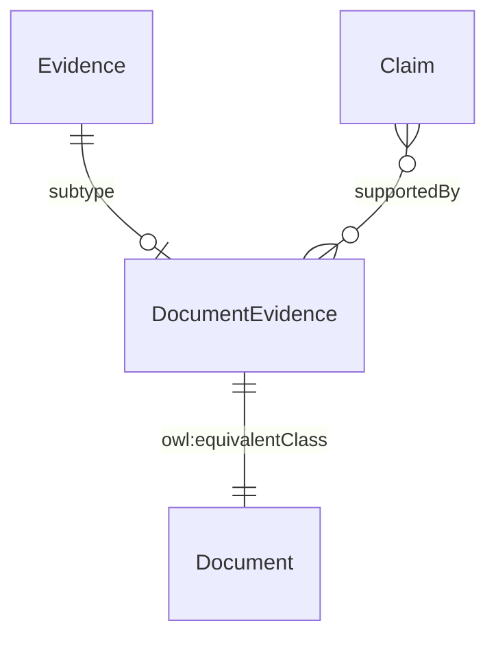

# Document Evidence

## Summary

Document-evidence subtype — paper or scanned artefacts issued by an authoritative source (e.g. grant of probate by HMCTS). [Substance Kind (informational); PROV-O Entity]. eIDAS Substantial-tier assurance for court-issued instruments. Equivalent class: [Document](./document.md) (short-name used by exemplars).
[Concept tier →](../../concept/claim/document-evidence.md)

## Attributes

Inherits `digest` from [Evidence](./evidence.md). Declares no additional subtype-specific datatype properties at this tier.

## Relationships

This entity declares no module-local object properties beyond those inherited from `Evidence`.

## Identity key

Identity key = `digest` (inherited from Evidence). Per-Evidence-instance, content-addressable.

## Constraints

Inherits `EvidenceIdentityKeyShape` constraint on `digest` from Evidence. No additional non-cardinality constraints emitted at this tier.

## Derived attributes

None.

## ER diagram

## Source ODR + ADR

- [ODR-0009 — Claims + Evidence + Verification](../../../ontology/odr/ODR-0009-claims-evidence-verification.md), §Q1 + Rule 5 three-subtype discipline
- [ADR-0011 — Module TBox emission](../../../adr/ADR-0011-module-tbox-emission.md) — implementation
