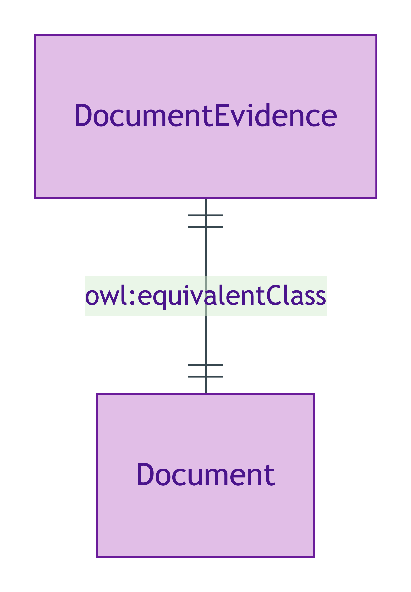
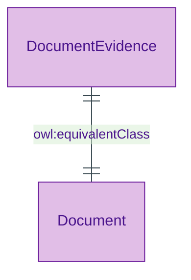

# Document

## Summary

Short-name alias for [DocumentEvidence](./document-evidence.md) retained for exemplar compatibility (the diagnostic exemplar set uses the short name). [Substance Kind (informational; alias)]. `owl:equivalentClass` binding ensures one OWL identity; downstream shapes + annotations target the long name `DocumentEvidence` for clarity.
[Concept tier →](../../concept/claim/document.md)

## Attributes

Inherits all attributes from `DocumentEvidence` via `owl:equivalentClass` binding.

## Relationships

Inherits all relationships from `DocumentEvidence` via `owl:equivalentClass` binding.

## Identity key

Same identity as `DocumentEvidence` (`owl:equivalentClass` enforces one OWL identity).

## Constraints

Inherits all constraints from `DocumentEvidence`. SHACL shapes target the long-name `DocumentEvidence` class; the equivalence binding ensures shapes apply transitively to `Document` instances.

## Derived attributes

None.

## ER diagram

Mermaid Source

## Source ODR + ADR

- [ODR-0009 — Claims + Evidence + Verification](/modelling/odr/odr-0009), §Q1 + ADR-0011 short-name alias pattern (option b)
- [ADR-0011 — Module TBox emission](/modelling/adr/adr-0011) — implementation
