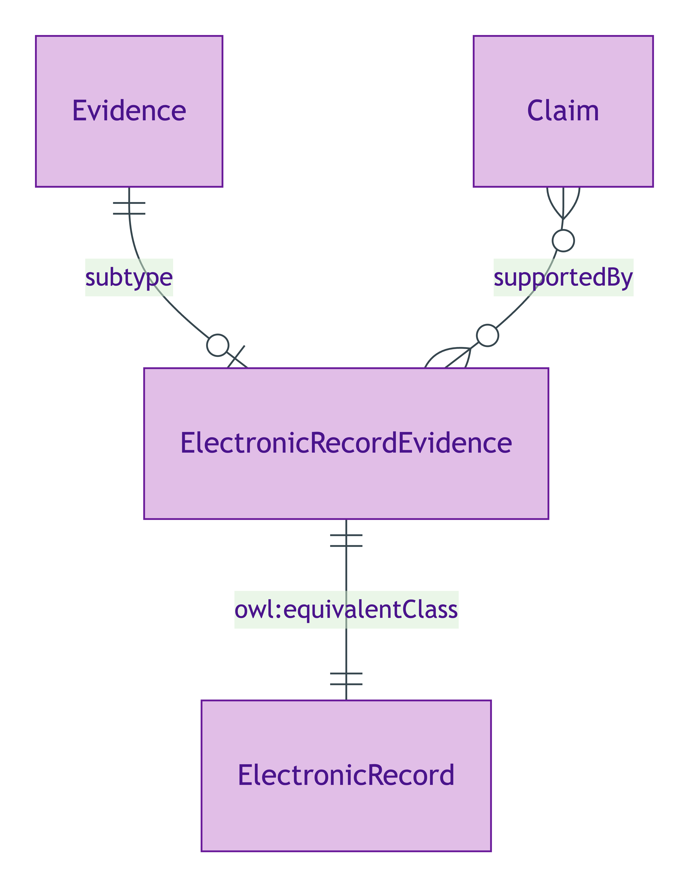
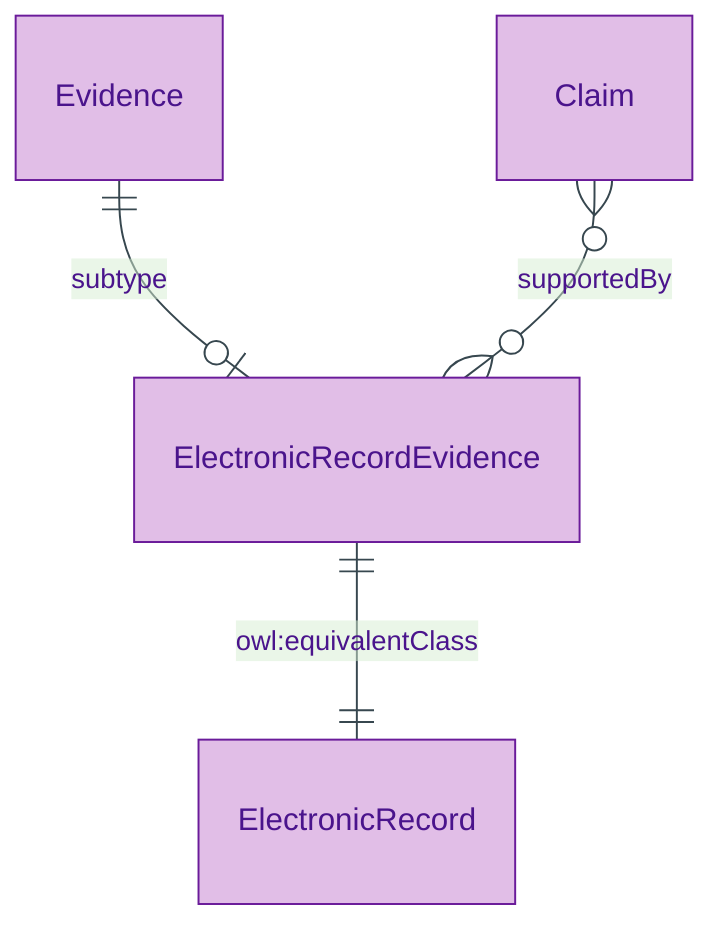

# Electronic Record Evidence

## Summary

Electronic-record evidence subtype — API-retrieved structured records from authoritative source (e.g. HMRC tax-record API). [Substance Kind (informational); PROV-O Entity]. eIDAS Substantial-tier assurance via real-time API verification. Equivalent class: [ElectronicRecord](./electronic-record.md) (short-name used by exemplars).
[Concept tier →](../../concept/claim/electronic-record-evidence.md)

## Attributes

Inherits `digest` from [Evidence](./evidence.md). Declares no additional subtype-specific datatype properties at this tier.

## Relationships

This entity declares no module-local object properties beyond those inherited from `Evidence`.

## Identity key

Identity key = `digest` (inherited from Evidence). Content-addressable.

## Constraints

Inherits `EvidenceIdentityKeyShape` constraint on `digest` from Evidence. No additional non-cardinality constraints emitted at this tier.

## Derived attributes

None.

## ER diagram

Mermaid Source

## Source ODR + ADR

- [ODR-0009 — Claims + Evidence + Verification](/modelling/odr/odr-0009), §Q1 + Rule 5 three-subtype discipline
- [ADR-0011 — Module TBox emission](/modelling/adr/adr-0011) — implementation
