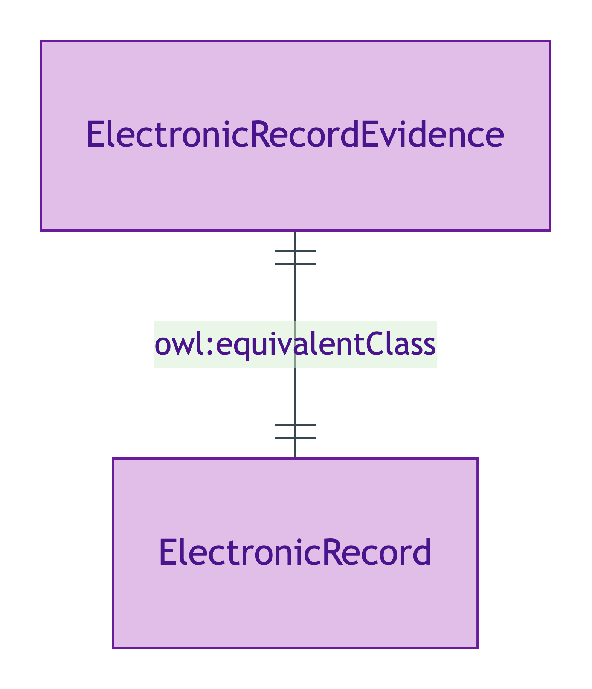
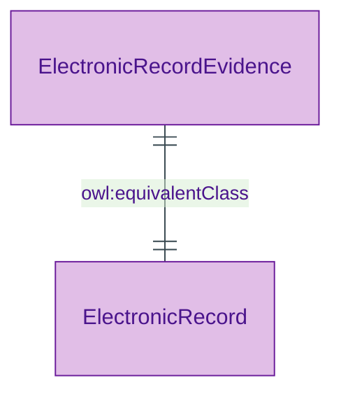

# Electronic Record

## Summary

Short-name alias for [ElectronicRecordEvidence](./electronic-record-evidence.md) retained for exemplar compatibility. [Substance Kind (informational; alias)]. `owl:equivalentClass` binding ensures one OWL identity; downstream shapes + annotations target the long name.
[Concept tier →](../../concept/claim/electronic-record.md)

## Attributes

Inherits all attributes from `ElectronicRecordEvidence` via `owl:equivalentClass` binding.

## Relationships

Inherits all relationships from `ElectronicRecordEvidence` via `owl:equivalentClass` binding.

## Identity key

Same identity as `ElectronicRecordEvidence`.

## Constraints

Inherits all constraints from `ElectronicRecordEvidence`.

## Derived attributes

None.

## ER diagram

Mermaid Source

## Source ODR + ADR

- [ODR-0009 — Claims + Evidence + Verification](../../../ontology/odr/ODR-0009-claims-evidence-verification.md), §Q1 + ADR-0011 short-name alias pattern (option b)
- [ADR-0011 — Module TBox emission](../../../adr/ADR-0011-module-tbox-emission.md) — implementation
