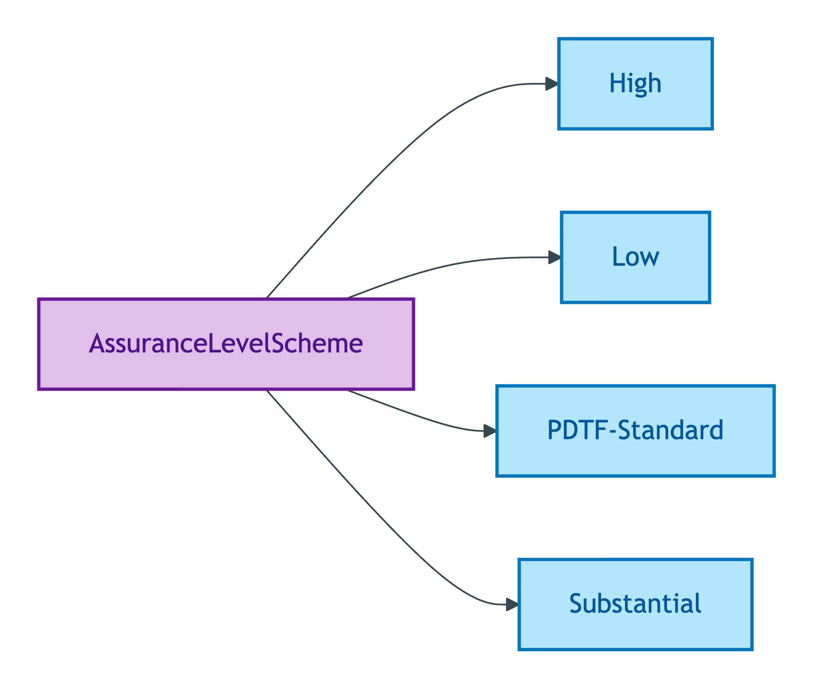
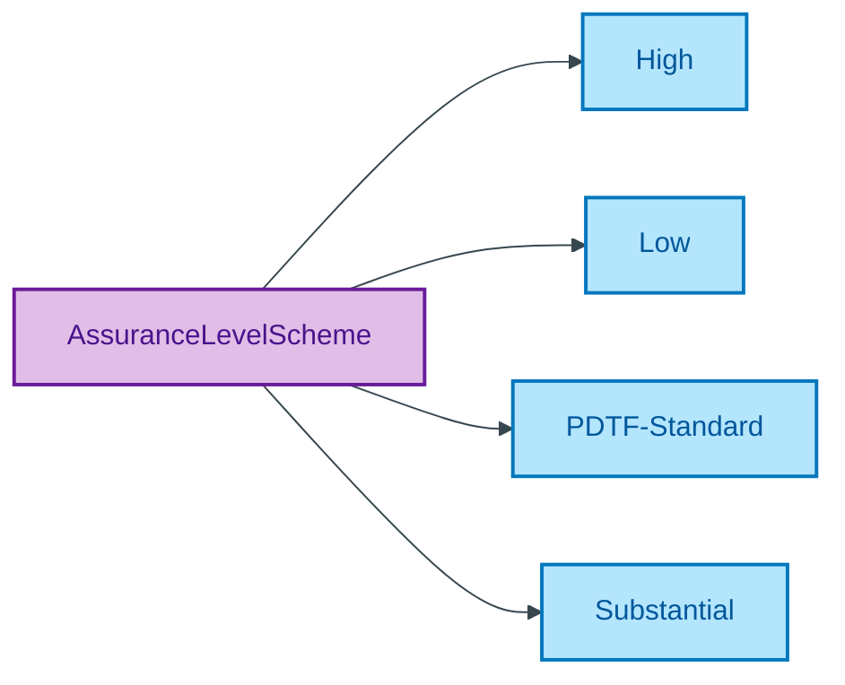

# AssuranceLevelScheme

## Summary

Quality Values for the eIDAS Levels of Assurance (Low, Substantial, High) plus the OPDA-specific PDTF-Standard intermediate level per ODR-0009 §Q3, applied to identity-verification claims. [UFO Quality Value]. Low/Substantial/High inherit verbatim from Regulation (EU) No 910/2014 (eIDAS) Article 8 per ODR-0011 §4a regulator-citation discipline. PDTF-Standard ratified by ODR-0009 §Q3 as an OPDA-specific intermediate level. Steward: Moreau (S009 Q3).
[Concept tier — AssuranceLevel →](../../../concept/claim/assurance-level.md)

## Members

| Notation | Label | Definition | Source |
|---|---|---|---|
| `High` | High | High degree of confidence in the claimed or asserted identity of a person (eIDAS Article 8(2)(c) High) | [eIDAS Article 8](https://eur-lex.europa.eu/legal-content/EN/TXT/?uri=CELEX:32014R0910) |
| `Low` | Low | Limited degree of confidence in the claimed or asserted identity of a person (eIDAS Article 8(2)(a) Low) | [eIDAS Article 8](https://eur-lex.europa.eu/legal-content/EN/TXT/?uri=CELEX:32014R0910) |
| `PDTF-Standard` | PDTF-Standard | OPDA-specific intermediate assurance level per ODR-0009 §Q3, applicable to PDTF transactions where eIDAS LoA mapping is not directly available | [ODR-0009 §Q3](../../../ontology/odr/ODR-0009-claims-evidence-verification.md) |
| `Substantial` | Substantial | Substantial degree of confidence in the claimed or asserted identity of a person (eIDAS Article 8(2)(b) Substantial) | [eIDAS Article 8](https://eur-lex.europa.eu/legal-content/EN/TXT/?uri=CELEX:32014R0910) |

## Cardinality discipline

Members are the instances of [AssuranceLevel](../assurance-level.md). The scheme is closed at the eIDAS three plus the OPDA-specific PDTF-Standard. eIDAS members track upstream regulator changes; PDTF-Standard is governed by ODR-0009.

## Concept hierarchy

Mermaid Source

## Source ODR + ADR

- [ODR-0009 — Claims + Evidence + Verification](../../../ontology/odr/ODR-0009-claims-evidence-verification.md), §Q3 PDTF-Standard
- [ODR-0011 — Enumeration vocabularies](../../../ontology/odr/ODR-0011-enumeration-vocabularies.md), §4a regulator-citation discipline
- [ADR-0010 — SKOS vocabulary emission](../../../adr/ADR-0010-skos-vocabulary-emission.md) — implementation
