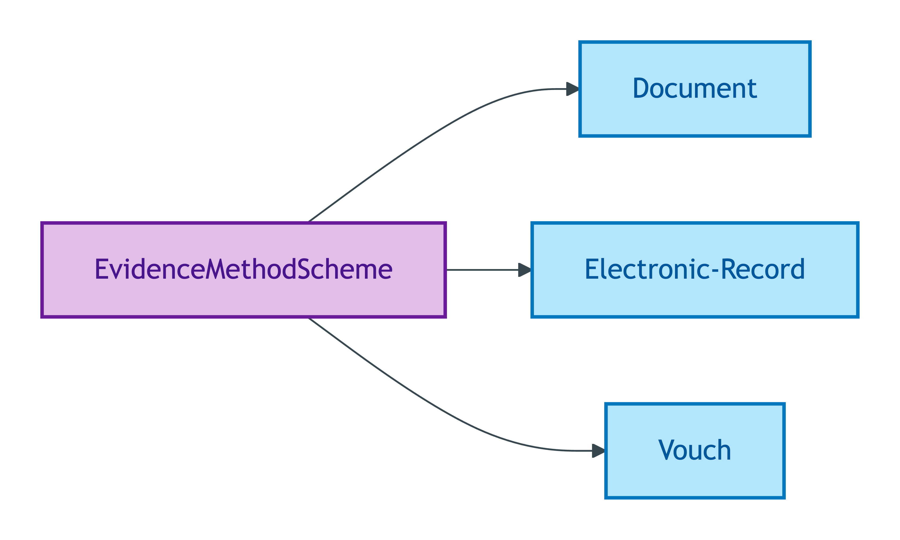
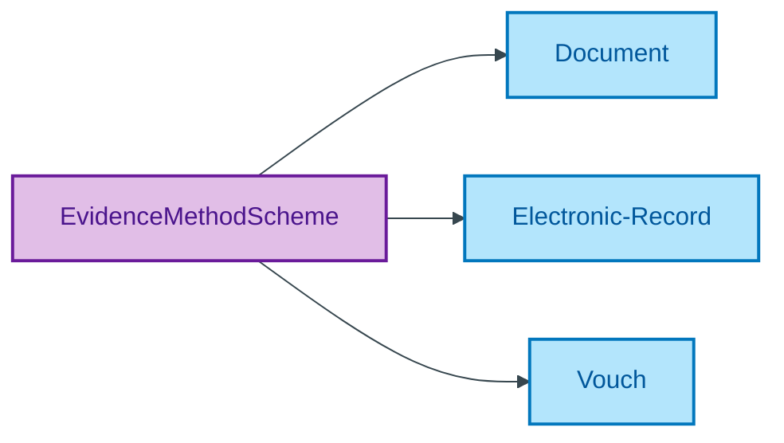

# EvidenceMethodScheme

## Summary

Quality Values for the method by which identity evidence was obtained, per the OIDC4IDA `evidence` taxonomy. [UFO Quality Value]. Members inherited verbatim from OpenID Connect for Identity Assurance 1.0 `evidence` type per ODR-0011 §4a regulator-citation discipline. Steward: Moreau (S009 Q3).
[Concept tier — Evidence →](../../../concept/claim/evidence.md)

## Members

| Notation | Label | Definition | Source |
|---|---|---|---|
| `Document` | Document | OIDC4IDA Document evidence: identity evidence obtained by inspecting a physical or digital identity document (passport, driving licence, identity card, etc.) | [OIDC4IDA spec](https://openid.net/specs/openid-connect-4-identity-assurance-1_0.html) |
| `Electronic-Record` | Electronic-Record | OIDC4IDA ElectronicRecord evidence: identity evidence obtained from a verified electronic record held by an authoritative source | [OIDC4IDA spec](https://openid.net/specs/openid-connect-4-identity-assurance-1_0.html) |
| `Vouch` | Vouch | OIDC4IDA Vouch evidence: identity evidence obtained through attestation by a trusted third party | [OIDC4IDA spec](https://openid.net/specs/openid-connect-4-identity-assurance-1_0.html) |

## Cardinality discipline

No core-tier attribute in the emitted TBox currently binds this scheme directly. Used by [Evidence](../evidence.md) subtypes to discriminate the OIDC4IDA evidence category at the typed-class level (each scheme member binds to one of `DocumentEvidence` / `ElectronicRecordEvidence` / `VouchEvidence` via `skos:exactMatch`). Closed scheme — OIDC4IDA-governed; members track upstream spec changes only.

## Concept hierarchy

Mermaid Source

## Source ODR + ADR

- [ODR-0009 — Claims + Evidence + Verification](/modelling/odr/odr-0009), Rule 5 three-subtype discipline
- [ODR-0011 — Enumeration vocabularies](/modelling/odr/odr-0011), §4a regulator-citation discipline
- [ADR-0010 — SKOS vocabulary emission](/modelling/adr/adr-0010) — implementation
