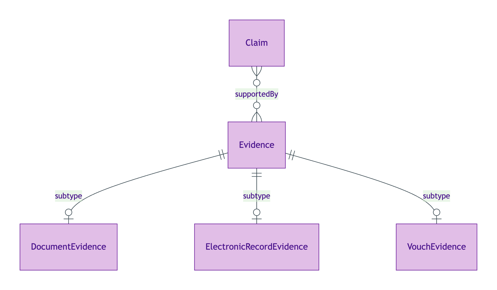
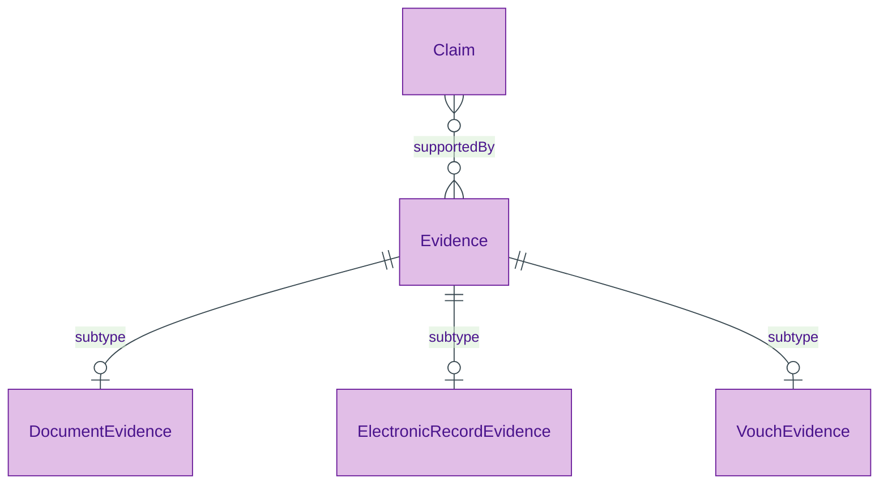

# Evidence

## Summary

Generic evidence supertype. [Substance Kind (informational); PROV-O Entity]. Three named subtypes per S009 Rule 5 (do NOT collapse): [DocumentEvidence](./document-evidence.md) (paper or scanned artefacts), [ElectronicRecordEvidence](./electronic-record-evidence.md) (API-retrieved structured records), [VouchEvidence](./vouch-evidence.md) (formal attestations by regulated professionals). Each subtype carries type-specific facets; SHACL `sh:xone` dispatches on subtype at validation time.
[Concept tier →](../../concept/claim/evidence.md)

## Attributes

| Attribute | Type | Cardinality | Required | Identity-bearing | Description |
|---|---|---|---|---|---|
| `digest` | `string` | `0..1` | N | Y | Cryptographic digest of the evidence content; provides content-addressable provenance per ODR-0009 §Q1 |

## Relationships

This entity declares no module-local object properties on the supertype. Subtypes add type-specific predicates (e.g. `VouchEvidence.attestedBy`).

## Identity key

Identity key = `digest`. Content-addressable: two Evidence instances with identical digests are the same Evidence.

## Constraints

- `digest` MUST be a single `string` value when present (`Violation`, `EvidenceIdentityKeyShape`)
- Each Evidence instance MUST be typed as exactly one of the three subtypes (DocumentEvidence / ElectronicRecordEvidence / VouchEvidence) — enforced via SHACL `sh:xone` at validation time

## Derived attributes

None on the supertype.

## ER diagram

Mermaid Source

## Source ODR + ADR

- [ODR-0009 — Claims + Evidence + Verification](../../../ontology/odr/ODR-0009-claims-evidence-verification.md), §Q1 Evidence supertype; Rule 5 three-subtype discipline
- [ADR-0011 — Module TBox emission](../../../adr/ADR-0011-module-tbox-emission.md) — implementation
