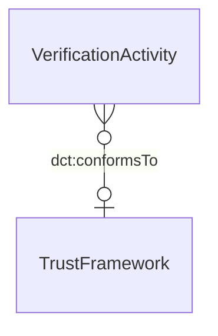

# Trust Framework

## Summary

Trust framework citation — a governance regime that scopes claim validity (e.g. the UK Property Data Trust Framework). [Information particular; UFO Information Particular]. Per S009 5-residue mapped to `dct:conformsTo` on the verification activity (NOT a PROV-O primitive). Authoritative within scope per Session 003c Item 3 (OPDA TF authoritative scope).
[Concept tier →](../../concept/claim/trust-framework.md)

## Attributes

This entity declares no module-local datatype properties. The trust-framework's identity is borne by its dereferenceable URI.

## Relationships

This entity declares no module-local object properties. Inbound predicates: [VerificationActivity](./verification-activity.md) cites the TrustFramework via `dct:conformsTo`.

## Identity key

Identity = framework URI. Each TrustFramework is identified by a single dereferenceable URI (e.g. the OPDA TF root URI).

## Constraints

No SHACL Violation/Warning shapes emitted on TrustFramework at this tier.

## Derived attributes

None.

## ER diagram

## Source ODR + ADR

- [ODR-0009 — Claims + Evidence + Verification](../../../ontology/odr/ODR-0009-claims-evidence-verification.md), §Q5 TrustFramework
- [ADR-0011 — Module TBox emission](../../../adr/ADR-0011-module-tbox-emission.md) — implementation
