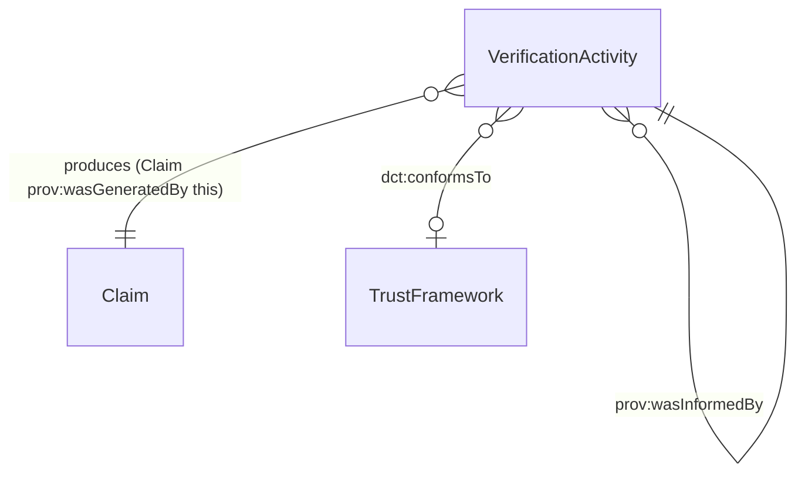

# Verification Activity

## Summary

Verification activity recording the production of a verified [Claim](./claim.md) from [Evidence](./evidence.md). [Event particular; PROV-O Activity / UFO Event particular]. The OIDC4IDA single `time` is the completion instant → `prov:endedAtTime`. Uses qualified form `prov:qualifiedAttribution` → `prov:Attribution` with `prov:hadRole` so `validation_method` / `verification_method` are not discarded.
[Concept tier →](../../concept/claim/verification-activity.md)

## Attributes

This entity declares no module-local datatype properties. Completion timestamp lives on the inherited `prov:Activity` predicate (`prov:endedAtTime`).

## Relationships

This entity declares no module-local object properties. Inbound predicates: the Claim is `prov:wasGeneratedBy` the VerificationActivity. Trust-framework citation uses the inherited `dct:conformsTo` predicate to a [TrustFramework](./trust-framework.md) instance.

## Identity key

Identity key = `(Claim, prov-timestamp)` tuple — each verification has its own URI; identity is established by the (claim-produced, completion-timestamp) pair. Per S009 5-residue mapping the verification context (`conformsTo` a TrustFramework) further qualifies the activity.

## Constraints

No SHACL Violation/Warning shapes emitted on VerificationActivity at this tier. PROV-O lifecycle constraints (a `prov:Activity` requires either `prov:atTime` or both `prov:startedAtTime` + `prov:endedAtTime`) are inherited from upstream W3C PROV-O.

## Derived attributes

| Attribute | Derived from | Rule summary | Severity |
|---|---|---|---|
| `hasVerificationSuccessionStatus` | `prov:wasInformedBy` chain to prior VerificationActivity | `re-verified` when prior activity is named; `initial-verification` otherwise | `Info` |

## ER diagram

## Source ODR + ADR

- [ODR-0009 — Claims + Evidence + Verification](../../../ontology/odr/ODR-0009-claims-evidence-verification.md), §Q1 PROV-O mapping; §Q2 qualified-form; §Q7 succession rule
- [ADR-0011 — Module TBox emission](../../../adr/ADR-0011-module-tbox-emission.md) — implementation
- [ADR-0012 — SHACL + DPV annotation emission](../../../adr/ADR-0012-shacl-and-dpv-annotation-emission.md) — VerificationActivitySuccessionRule
