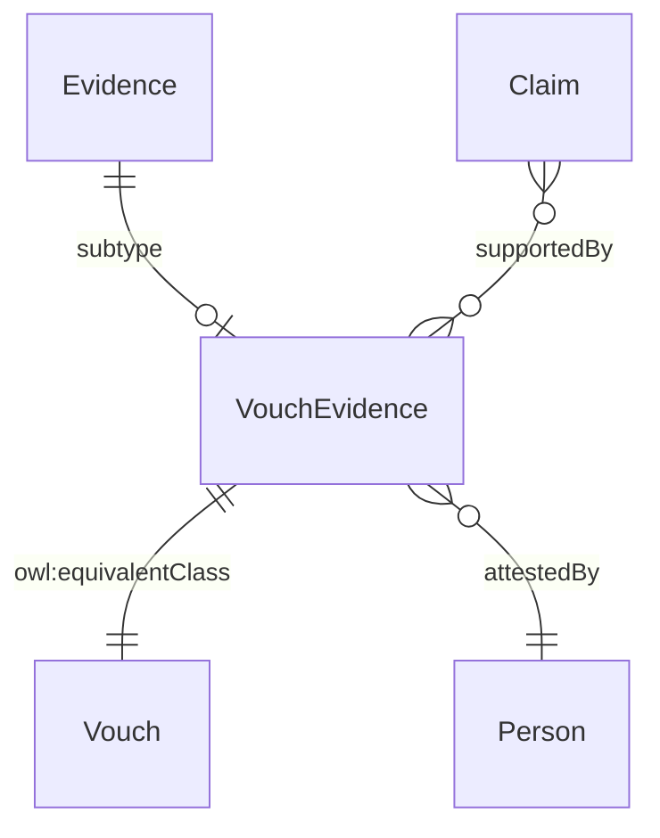

# Vouch Evidence

## Summary

Vouch evidence subtype — formal attestation by a regulated professional (e.g. SRA-licensed solicitor). [Substance Kind (informational); PROV-O Entity]. Qualitatively weaker than document or electronic-record evidence; eIDAS Low assurance regardless of voucher quality. The vouch is `prov:wasAttributedTo` an Agent — an attestation, not a document derivation. Equivalent class: [Vouch](./vouch.md).
[Concept tier →](../../concept/claim/vouch-evidence.md)

## Attributes

Inherits `digest` from [Evidence](./evidence.md). Declares no additional subtype-specific datatype properties at this tier.

## Relationships

| Predicate | Target entity | Cardinality | Inverse | Description |
|---|---|---|---|---|
| `attestedBy` | `prov:Agent` (typically Person) | `1..1` | — | Vouch → Agent attestation join (mirror of `prov:wasAttributedTo` for vouch-specific use). The voucher's role is captured via `prov:qualifiedAttribution` → `prov:Attribution` → `prov:hadRole` per S009 Q2 qualified-form discipline |

## Identity key

Identity key = `digest` (inherited from Evidence). Content-addressable.

## Constraints

Inherits `EvidenceIdentityKeyShape` constraint on `digest` from Evidence. No additional non-cardinality constraints emitted at this tier.

## Derived attributes

None.

## ER diagram

## Source ODR + ADR

- [ODR-0009 — Claims + Evidence + Verification](../../../ontology/odr/ODR-0009-claims-evidence-verification.md), §Q1 + §Q2 qualified-form; Rule 5 three-subtype discipline
- [ADR-0011 — Module TBox emission](../../../adr/ADR-0011-module-tbox-emission.md) — implementation
