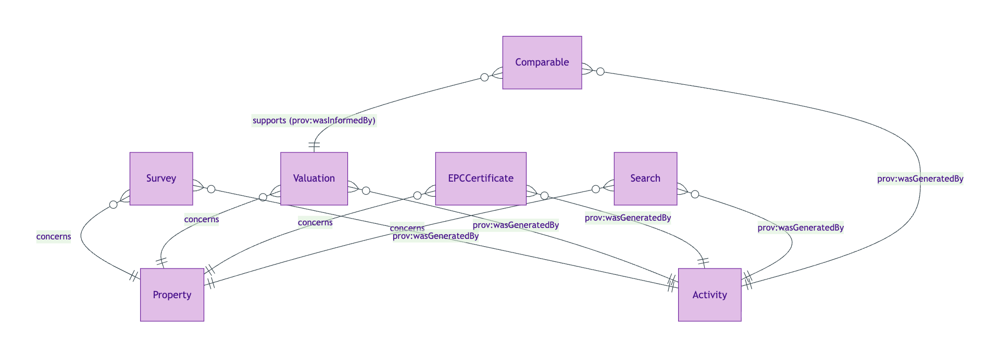
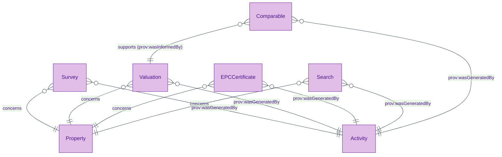
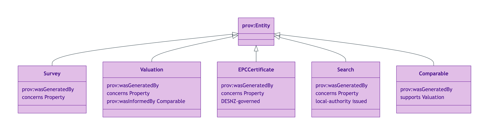
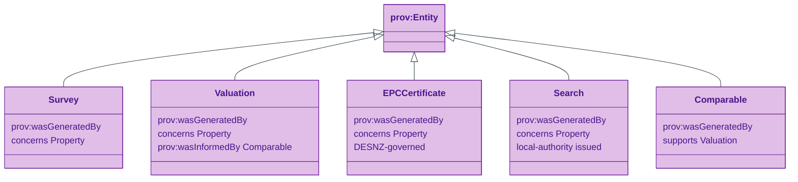
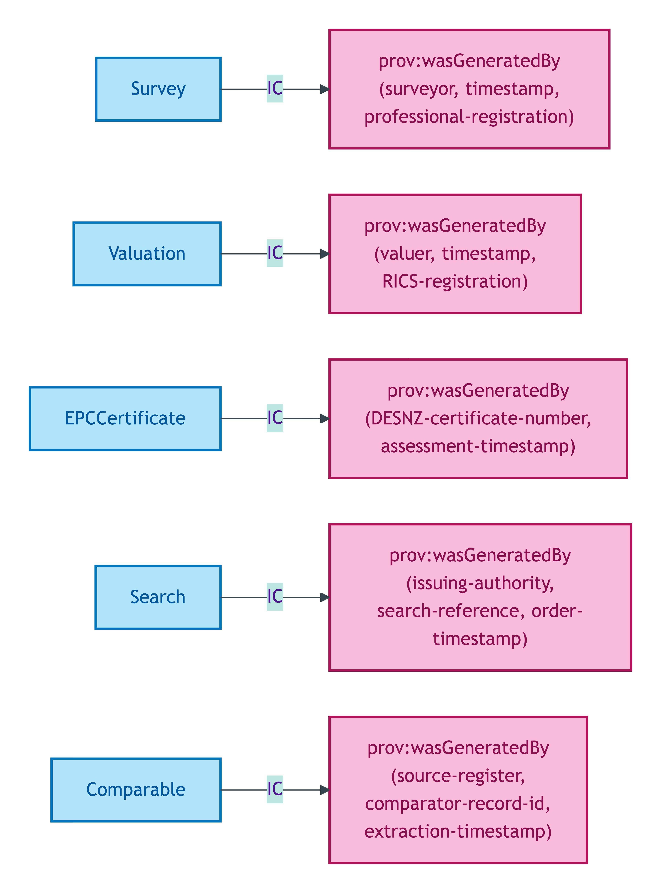
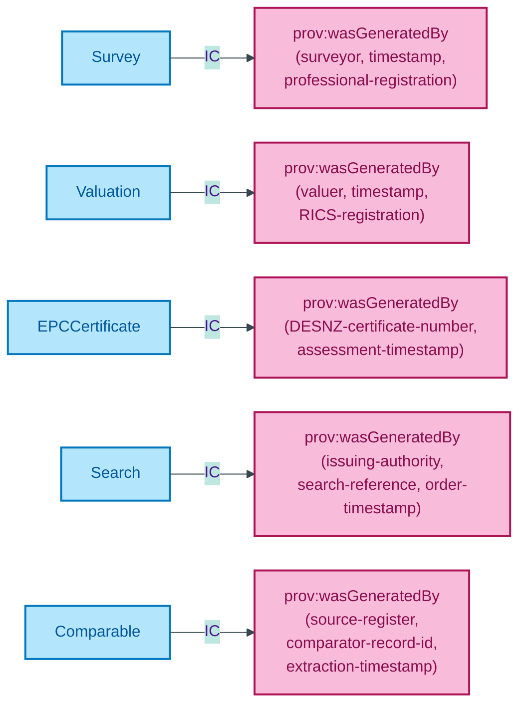

# Descriptive module

Class-promoted descriptive Kinds: Survey, Valuation, EPCCertificate, Search, Comparable. Each is class-promoted per S008 Q4 three-criterion test: authority-retrieved provenance, distinct lifecycle, distinct PII regime (where applicable).

## Entity inventory

| Entity | UFO meta-category | Notes |
|---|---|---|
| [Comparable](./comparable.md) | Substance Kind (informational) | Land Registry / VOA-sourced comparable-sale or comparable-rental record |
| [EPCCertificate](./epc-certificate.md) | Substance Kind (informational) | DESNZ-governed Energy Performance Certificate; 10-year validity; address + owner-identifiable PII |
| [Search](./search.md) | Substance Kind (informational) | Local-authority or environmental search result (CON29R / LLC1 etc.) |
| [Survey](./survey.md) | Substance Kind (informational) | Authority-retrieved professional survey report |
| [Valuation](./valuation.md) | Substance Kind (informational) | RICS-regulated professional or automated-model valuation output |

## Enumerations bound by this module

None directly bound at the core-tier scope. Descriptive Kinds bind enumeration schemes (e.g. `CouncilTaxBandSchemeEW`) at the overlay-profile level rather than via core-tier datatype properties.

## ER diagram

Mermaid Source

Source file: [`../diagrams/descriptive-er.mmd`](../diagrams/descriptive-er.mmd).

## Class hierarchy

OWL/RDFS subclass relationships. All five descriptive Kinds specialise `prov:Entity` and carry PROV-O attribution to their issuing Activity.

Mermaid Source

## Identity-key summary

Mermaid Source

