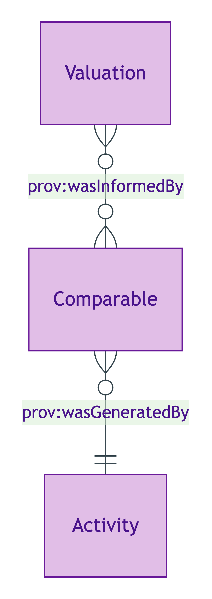
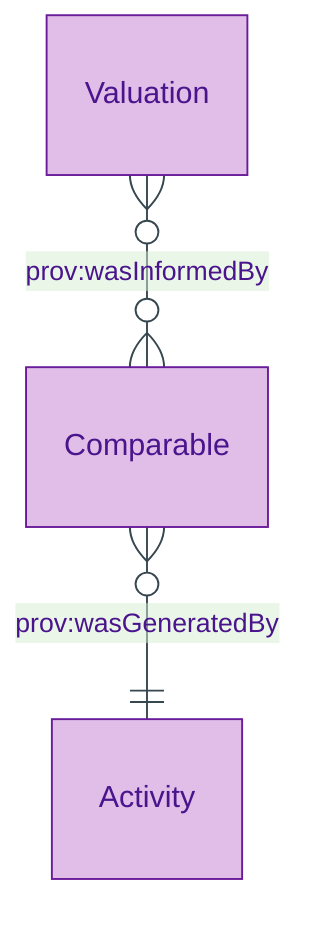

# Comparable

## Summary

Comparable-sale or comparable-rental record supporting a [Valuation](./valuation.md). [Substance Kind (informational); UFO Substance Kind / PROV-O Entity]. Class-promoted per S008 Q4 three-criterion test (Land Registry or VOA-sourced provenance; supports `prov:wasInformedBy` chains from Valuation to its underlying market data).
[Concept tier →](../../concept/descriptive/comparable.md)

## Attributes

This entity declares no module-local datatype properties. Comparable-specific facets (sale price, sale date, source register, comparator address etc.) are emitted via overlay profiles or via the inherited PROV-O qualified-attribution chain.

## Relationships

This entity declares no module-local object properties. The class-promotion IC requires that each Comparable carries `prov:wasGeneratedBy` to its issuing activity (typically a Land Registry Price Paid Data extraction Activity or a VOA-records extraction Activity). Comparables are referenced from Valuations via the inherited PROV-O `prov:wasInformedBy` predicate.

## Identity key

Identity key = `prov:wasGeneratedBy` to the issuing activity. The Activity carries the (source-register, comparator-record-id, extraction-timestamp) tuple that disambiguates Comparable instances.

## Constraints

- Comparable MUST carry `prov:wasGeneratedBy` to its issuing activity per ODR-0008 §Q4a three-criterion test (`Violation`, `ComparableIdentityKeyShape`)

## Derived attributes

None.

## ER diagram

Mermaid Source

## Source ODR + ADR

- [ODR-0008 — Descriptive attributes](../../../ontology/odr/ODR-0008-descriptive-attributes.md), §Q4a three-criterion class-promotion test
- [ADR-0011 — Module TBox emission](../../../adr/ADR-0011-module-tbox-emission.md) — implementation
- [ADR-0012 — SHACL + DPV annotation emission](../../../adr/ADR-0012-shacl-and-dpv-annotation-emission.md) — IdentityKey shape
