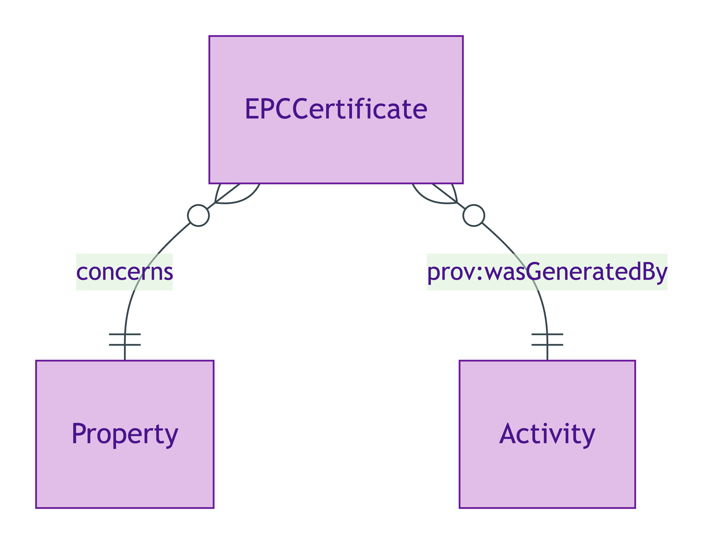
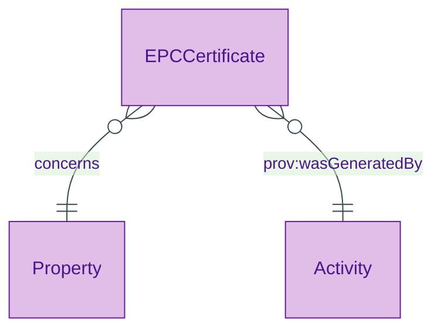
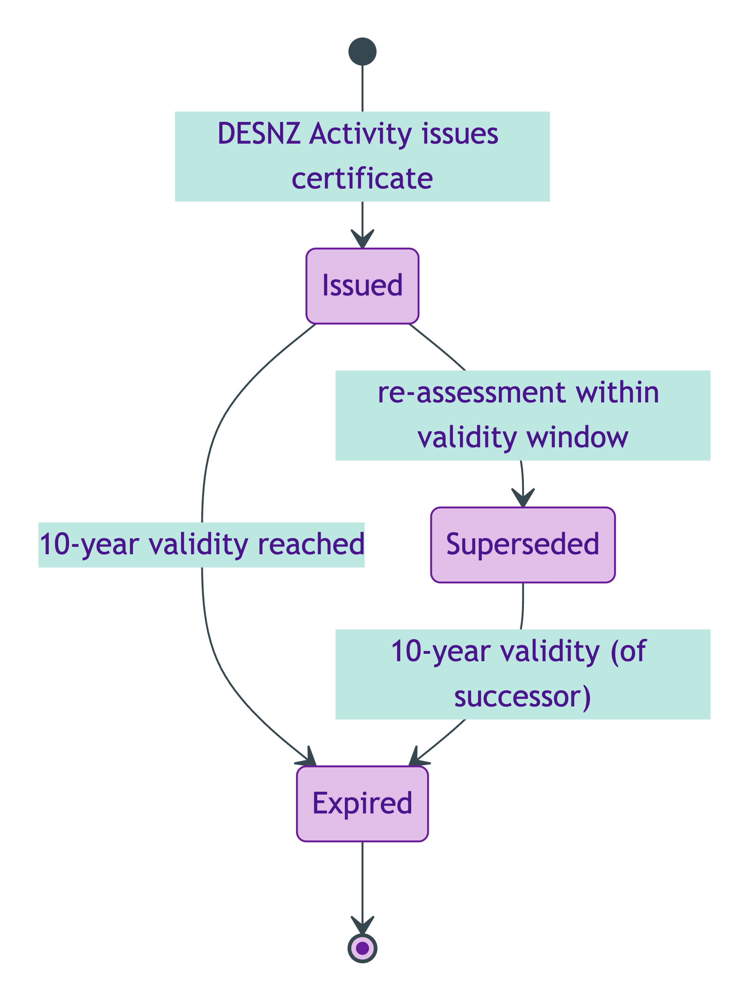
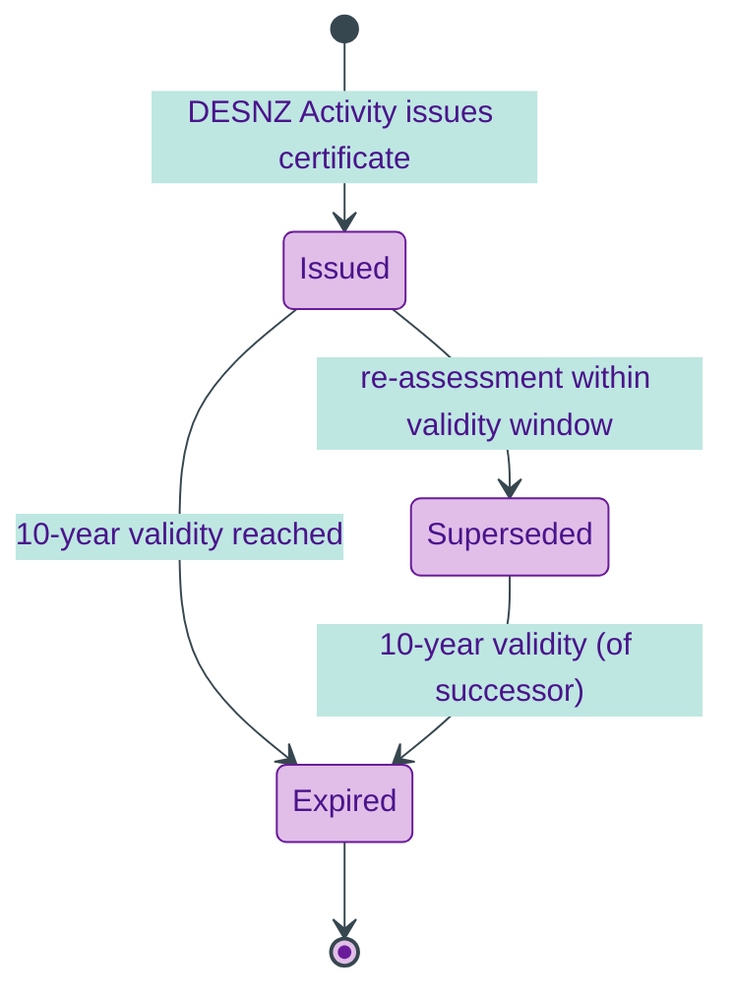

# EPC Certificate

## Summary

Energy Performance Certificate — DESNZ-governed authority-retrieved artefact. [Substance Kind (informational); UFO Substance Kind / PROV-O Entity]. Class-promoted per S008 Q4 three-criterion test: authority-retrieved provenance (DESNZ register); distinct lifecycle (10-year validity; supersession on re-assessment); distinct PII regime per ODR-0018 (address + owner-identifiable).
[Concept tier →](../../concept/descriptive/epc-certificate.md)

## Attributes

This entity declares no module-local datatype properties. EPC-specific facets (current-energy-rating, potential-energy-rating, certificate URL etc.) are bound to overlay profiles; current-energy-rating is also bound on the [Property](../property/property.md) side via [`Property.currentEnergyRating`](../property/property.md#attributes).

## Relationships

This entity declares no module-local object properties. The class-promotion IC requires that each EPCCertificate carries `prov:wasGeneratedBy` to its issuing activity (typically a DESNZ register-issuance Activity).

## Identity key

Identity key = `prov:wasGeneratedBy` to the issuing activity. The Activity carries the (DESNZ-certificate-number, assessment-timestamp) tuple that disambiguates EPCCertificate instances.

## Constraints

- EPCCertificate MUST carry `prov:wasGeneratedBy` to its issuing activity per ODR-0008 §Q4a three-criterion test (`Violation`, `EPCCertificateIdentityKeyShape`)

## Derived attributes

None.

## ER diagram

Mermaid Source

## Lifecycle state-transition diagram

EPC certificates follow DESNZ-governed lifecycle — issued with a 10-year validity, optionally superseded by a re-assessment within the validity window, expired at the 10-year boundary.

Mermaid Source

## Source ODR + ADR

- [ODR-0008 — Descriptive attributes](../../../ontology/odr/ODR-0008-descriptive-attributes.md), §Q4a three-criterion class-promotion test
- [ADR-0011 — Module TBox emission](../../../adr/ADR-0011-module-tbox-emission.md) — implementation
- [ADR-0012 — SHACL + DPV annotation emission](../../../adr/ADR-0012-shacl-and-dpv-annotation-emission.md) — IdentityKey shape
