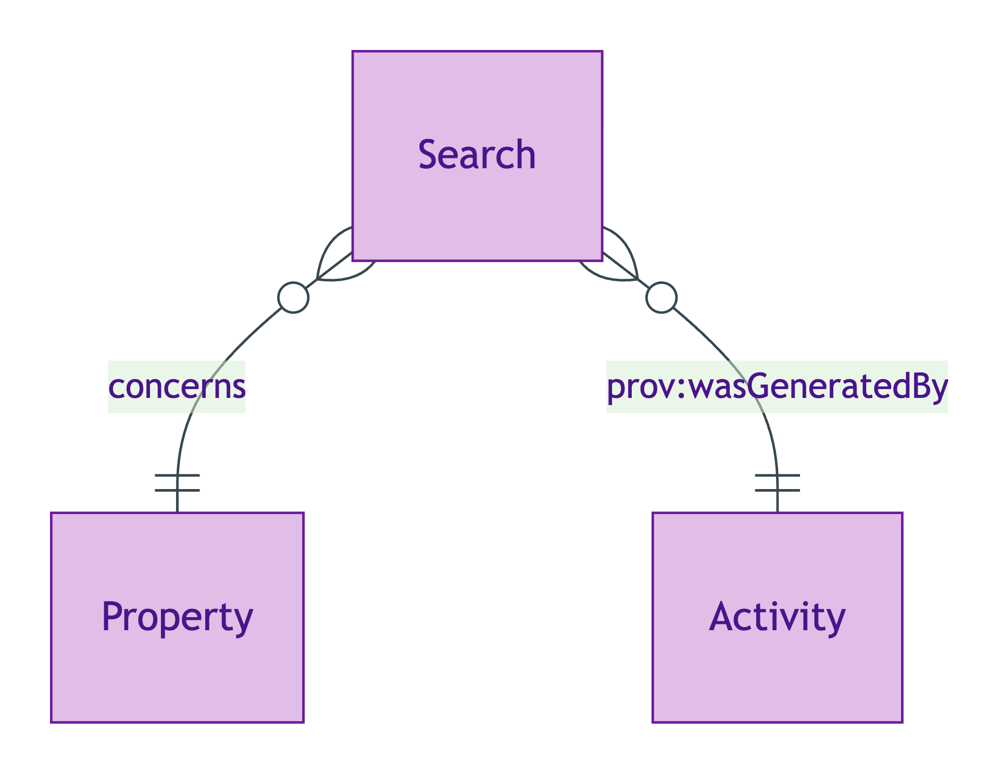
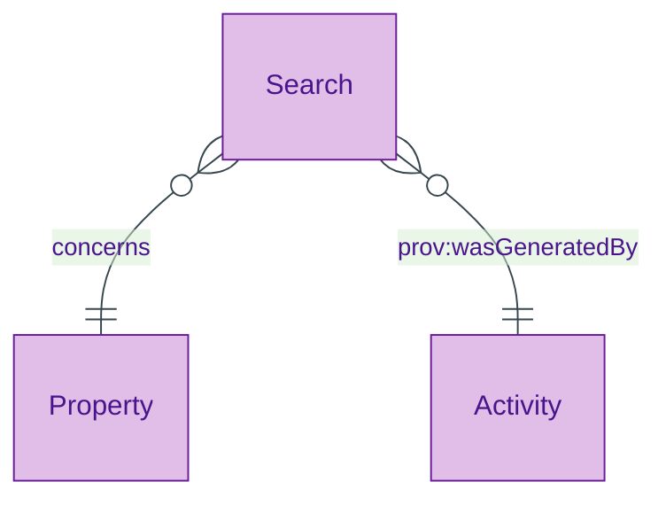
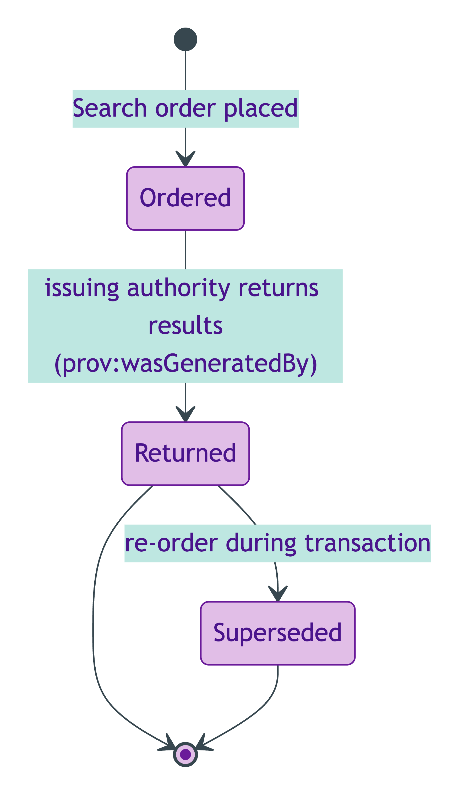
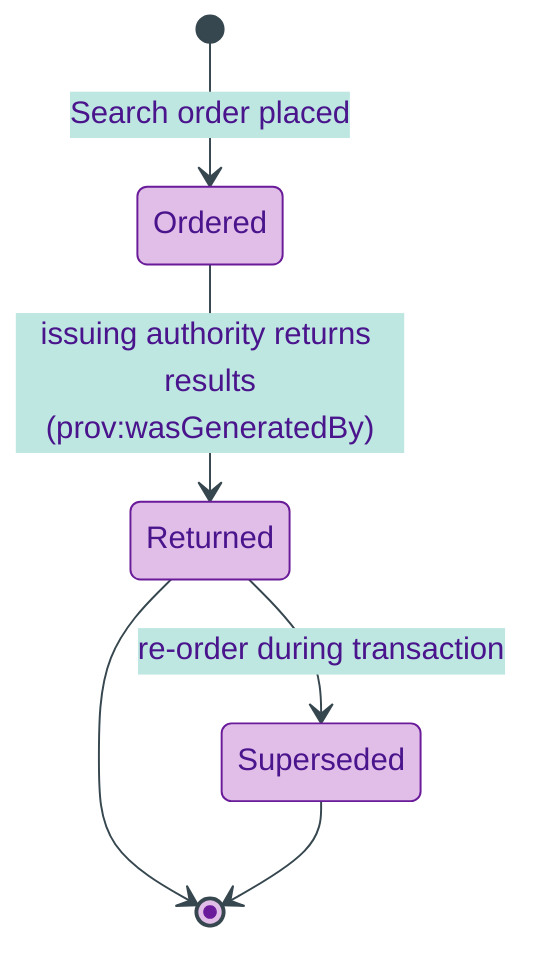

# Search

## Summary

Local-authority or environmental search result (CON29R, LLC1, etc.). [Substance Kind (informational); UFO Substance Kind / PROV-O Entity]. Class-promoted per S008 Q4 three-criterion test (local-authority issuance chain; distinct lifecycle: ordered / returned / superseded; not a flat datatype bag). Covers CON29R / LLC1 / environmental / flood / coal-mining searches per PDTF v3 `propertyPack.localSearches`.
[Concept tier →](../../concept/descriptive/search.md)

## Attributes

This entity declares no module-local datatype properties. Search-specific facets (search type, issuing-authority, response URL etc.) are emitted via overlay profiles or via the inherited PROV-O qualified-attribution chain.

## Relationships

This entity declares no module-local object properties. The class-promotion IC requires that each Search carries `prov:wasGeneratedBy` to its issuing activity (typically a local-authority issuance Activity).

## Identity key

Identity key = `prov:wasGeneratedBy` to the issuing activity. The Activity carries the (issuing-authority, search-reference, order-timestamp) tuple that disambiguates Search instances.

## Constraints

- Search MUST carry `prov:wasGeneratedBy` to its issuing activity per ODR-0008 §Q4a three-criterion test (`Violation`, `SearchIdentityKeyShape`)

## Derived attributes

None.

## ER diagram

Mermaid Source

## Lifecycle state-transition diagram

Search lifecycle per S008 Q4 — ordered with the issuing authority, returned (with results), optionally superseded by a re-order.

Mermaid Source

## Source ODR + ADR

- [ODR-0008 — Descriptive attributes](../../../ontology/odr/ODR-0008-descriptive-attributes.md), §Q4a three-criterion class-promotion test
- [ADR-0011 — Module TBox emission](../../../adr/ADR-0011-module-tbox-emission.md) — implementation
- [ADR-0012 — SHACL + DPV annotation emission](../../../adr/ADR-0012-shacl-and-dpv-annotation-emission.md) — IdentityKey shape
