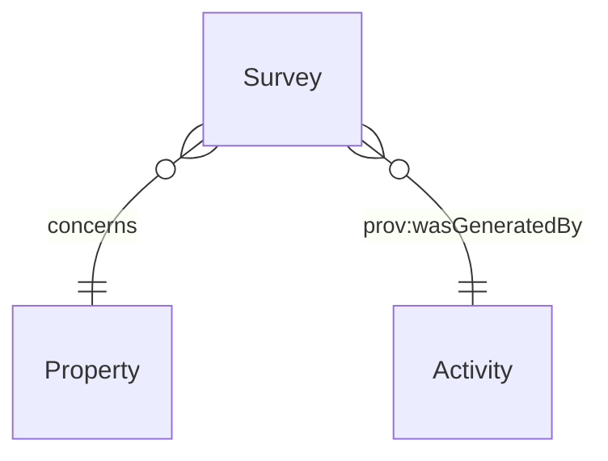

# Survey

## Summary

Authority-retrieved professional survey report. [Substance Kind (informational); UFO Substance Kind / DOLCE NonPhysicalEndurant / PROV-O Entity]. Identity criterion: distinct provenance chain per S008 Q4 three-criterion test (authority-retrieved provenance via `prov:wasGeneratedBy` chain to professional-issued activity; distinct lifecycle — issued / superseded / re-issued / withdrawn). Hard cases: re-survey; supersession; withdrawal.
[Concept tier →](../../concept/descriptive/survey.md)

## Attributes

This entity declares no module-local datatype properties. Survey-specific facets (survey type, surveyor identity, report URL etc.) are emitted via overlay profiles or via the inherited PROV-O qualified-attribution chain.

## Relationships

This entity declares no module-local object properties. The class-promotion IC requires that each Survey carries `prov:wasGeneratedBy` to its issuing activity (typically a professional-survey Activity).

## Identity key

Identity key = `prov:wasGeneratedBy` to the issuing activity. The Activity carries the (surveyor, timestamp, professional-registration) tuple that disambiguates Survey instances. Cross-reference: Concept-tier [Survey IC narrative](../../concept/descriptive/survey.md#identity-criterion).

## Constraints

- Survey MUST carry `prov:wasGeneratedBy` to its issuing activity per ODR-0008 §Q4a three-criterion test (`Violation`, `SurveyIdentityKeyShape`)

## Derived attributes

None.

## ER diagram

## Source ODR + ADR

- [ODR-0008 — Descriptive attributes](../../../ontology/odr/ODR-0008-descriptive-attributes.md), §Q4a three-criterion class-promotion test
- [ADR-0011 — Module TBox emission](../../../adr/ADR-0011-module-tbox-emission.md) — implementation
- [ADR-0012 — SHACL + DPV annotation emission](../../../adr/ADR-0012-shacl-and-dpv-annotation-emission.md) — IdentityKey shape
