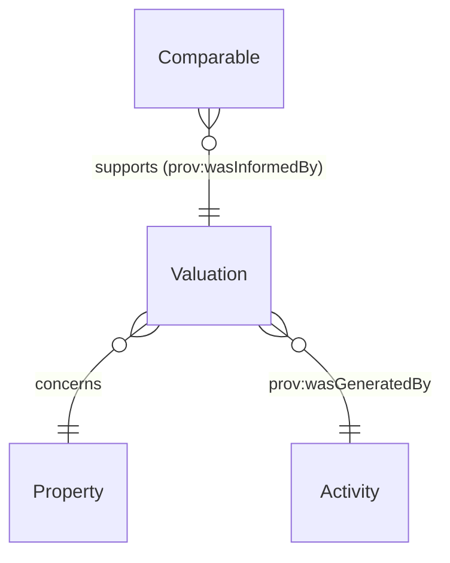

# Valuation

## Summary

Property valuation — RICS-regulated professional or automated-model output. [Substance Kind (informational); UFO Substance Kind / PROV-O Entity]. Class-promoted per S008 Q4 three-criterion test (RICS-regulated provenance chain; distinct lifecycle: instructed / delivered / superseded).
[Concept tier →](../../concept/descriptive/valuation.md)

## Attributes

This entity declares no module-local datatype properties. Valuation-specific facets (amount, model identifier, RICS classification etc.) are emitted via overlay profiles or via the inherited PROV-O qualified-attribution chain.

## Relationships

This entity declares no module-local object properties. The class-promotion IC requires that each Valuation carries `prov:wasGeneratedBy` to its issuing activity (typically a RICS-regulated valuation Activity). Valuations may be informed by [Comparable](./comparable.md) instances via `prov:wasInformedBy`.

## Identity key

Identity key = `prov:wasGeneratedBy` to the issuing activity. The Activity carries the (valuer, timestamp, RICS-registration) tuple that disambiguates Valuation instances.

## Constraints

- Valuation MUST carry `prov:wasGeneratedBy` to its issuing activity per ODR-0008 §Q4a three-criterion test (`Violation`, `ValuationIdentityKeyShape`)

## Derived attributes

None.

## ER diagram

## Source ODR + ADR

- [ODR-0008 — Descriptive attributes](../../../ontology/odr/ODR-0008-descriptive-attributes.md), §Q4a three-criterion class-promotion test
- [ADR-0011 — Module TBox emission](../../../adr/ADR-0011-module-tbox-emission.md) — implementation
- [ADR-0012 — SHACL + DPV annotation emission](../../../adr/ADR-0012-shacl-and-dpv-annotation-emission.md) — IdentityKey shape
