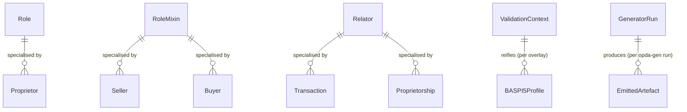

# Foundation module

Cross-cutting entities used by every other module: the three UFO meta-classes (Role, RoleMixin, Relator); the validation-context reification used by overlay profiles; the generator-run provenance unit used by CI byte-identity checks; and the diagnostic exemplar entity used by the A9 per-kind discipline.

## Entity inventory

| Entity | UFO meta-category | Purpose |
|---|---|---|
| [DiagnosticExemplar](./diagnostic-exemplar.md) | Substance Kind (informational) | Named hard case exposing one IC-bearing surface to a Council session |
| [GeneratorRun](./generator-run.md) | Information particular | Provenance unit for byte-identity CI; one record per opda-gen execution |
| [Relator](./relator.md) | Meta-class (UFO Relator) | Relational endurant mediating two or more bearers; founded by an event |
| [Role](./role.md) | Meta-class (UFO Role) | Anti-rigid, sortal role borne by a single substantial Kind |
| [RoleMixin](./role-mixin.md) | Meta-class (UFO RoleMixin) | Anti-rigid, cross-sortal role pattern borne by more than one Kind |
| [ValidationContext](./validation-context.md) | Substance Kind (informational) | Reified overlay-profile context per ODR-0010 §Q1 |

The foundation module also declares one DatatypeProperty whose domain is intentionally unconstrained (so any Kind may bear it):

- `opda:hasSpecialCategoryData` — flag indicating GDPR Article 9/10 special-category personal data. Range: `boolean`. Targeted by the `SpecialCategoryPIIWithoutLawfulBasisShape` SHACL shape in the [agent module](../agent/person.md#constraints).

This module has no SKOS enumerations of its own; downstream modules import the foundation graph and bind their attributes to schemes in [`../property/enumerations/`](../property/enumerations/), [`../agent/enumerations/`](../agent/enumerations/), etc.

## ER diagram

The foundation classes are largely standalone — they are meta-classes referenced by per-module Kinds rather than peers in entity-relationship networks. The diagram below shows the meta-class subclass spine (which downstream Roles and Relators specialise).

Source file: [`../diagrams/foundation-er.mmd`](../diagrams/foundation-er.mmd).
