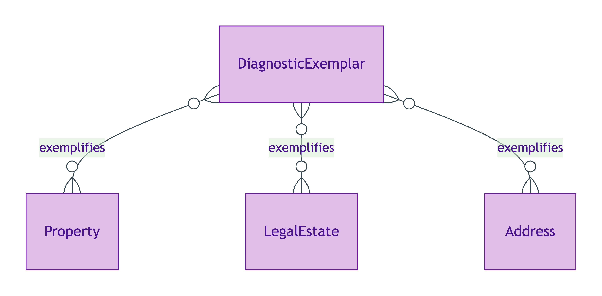
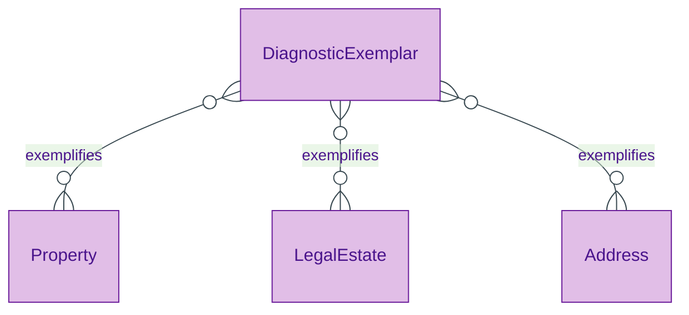

# Diagnostic Exemplar

## Summary

Informational endurant representing a named hard case — a minimal Turtle fragment exposing one IC-bearing surface as input to a Council session's identity-criterion validation. [Substance Kind (informational); UFO Substance Kind].
[Concept tier →](../../concept/foundation/diagnostic-exemplar.md)

## Attributes

This entity declares no module-local datatype properties; instances carry their hard-case content via inline Turtle (Property + Address + LegalEstate triples as appropriate). No identity-key shape is emitted at the Logical tier for this entity.

## Relationships

No module-local object properties. Instances reference downstream Kinds (e.g. `opda:Property`, `opda:LegalEstate`) by direct typing as required by the hard case being exemplified.

## Identity key

The exemplar's name (URI fragment) identifies the hard case (e.g. `#registered-freehold-house`; `#unregistered-house-pre-first-registration`; `#flat-with-split-uprn`). No additional identity surfaces declared at this tier.

## Constraints

No SHACL constraints emitted at this tier. Exemplars are validation inputs to Council sessions; they are not validated themselves.

## Derived attributes

None.

## ER diagram

Mermaid Source

## Source ODR + ADR

- [ODR-0004 — generator-first discipline](../../../ontology/odr/ODR-0004-generator-first-discipline.md), §8a Diagnostic Exemplars
- [ADR-0009 — Foundation TBox emission](../../../adr/ADR-0009-foundation-tbox-emission.md) — implementation
