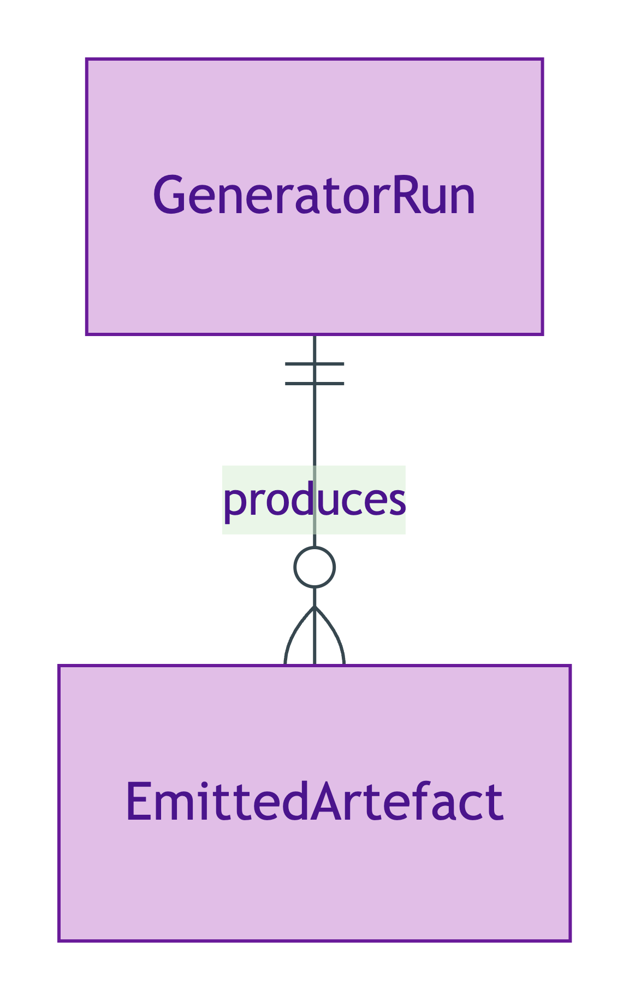
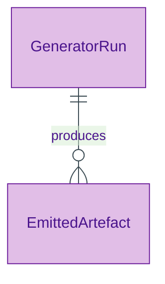

# Generator Run

## Summary

Provenance record for a single execution of the `opda-gen` pipeline that produced a specific set of emitted TTL artefacts. Carries the generator version, the source commit SHA, and the emission timestamp. [Information particular; UFO Information Particular]. Per ODR-0004 §6a, every emission is reproducible from the recorded `(version, commit)` pair.
[Concept tier →](../../concept/foundation/generator-run.md)

## Attributes

| Attribute | Type | Cardinality | Required | Identity-bearing | Description |
|---|---|---|---|---|---|
| `generatorVersion` | `string` | `1..1` | Y | Y | Semver string of the `opda-gen` build that produced the artefact (e.g. `opda-gen-1.0.0`) |
| `sourceCommit` | `string` | `1..1` | Y | Y | Git commit SHA pinned by the ratifying ADR |
| `emittedAt` | `dateTime` | `1..1` | Y | N | Timestamp when the artefact set was emitted |

## Relationships

This entity declares no module-local object properties. Emitted artefacts (TTL files) are linked via the standard PROV-O `prov:wasGeneratedBy` predicate from the artefact to the GeneratorRun instance.

## Identity key

Identity key = `generatorVersion` + `sourceCommit`. The pair is sufficient to reproduce the exact emission byte-for-byte; the `emittedAt` timestamp is informational only.

## Constraints

No SHACL Violation/Warning shapes emitted at this tier — instances are minted by the build pipeline and validated by CI byte-identity checks rather than runtime shapes.

## Derived attributes

None.

## ER diagram

Mermaid Source

## Source ODR + ADR

- [ODR-0004 — generator-first discipline](/modelling/odr/odr-0004), §6a generator-first reproducibility
- [ADR-0009 — Foundation TBox emission](/modelling/adr/adr-0009) — implementation
