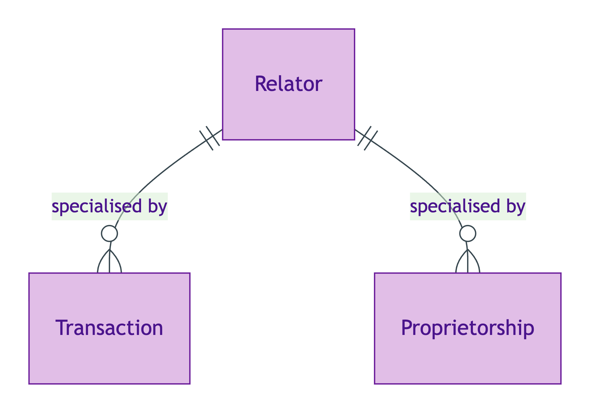
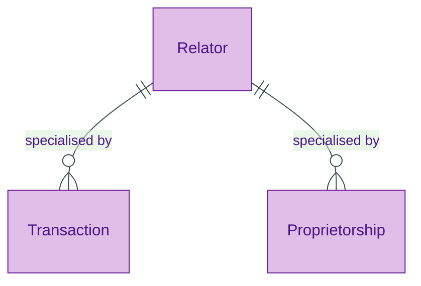

# Relator

## Summary

UFO meta-class for relational endurants that mediate two or more bearers and are founded by an external event. The Relator carries its own identity (the `(mediated-bearers, founding-event)` tuple) and bears properties that don't belong to any single mediated Kind. [Meta-class; UFO Relator]. In scope OPDA Relators: [Transaction](../transaction/transaction.md) and [Proprietorship](../agent/proprietorship.md).
[Concept tier →](../../concept/foundation/relator.md)

## Attributes

Relator is a meta-class — it declares no attributes of its own. Concrete Relators (Transaction, Proprietorship) declare their own attribute sets in their respective module pages.

## Relationships

Relator is a meta-class — concrete Relators specialise it via `Ref:Relator` subclass relationships. The Relator pattern itself requires:

| Predicate | Target entity | Cardinality | Inverse | Description |
|---|---|---|---|---|
| `mediates` | (concrete bearer Kind) | `2..*` | — | A Relator mediates two or more bearers; the bearer Kinds vary per concrete Relator |
| `foundedBy` | (founding event) | `1..1` | — | A Relator is founded by an external event; the event Kind varies per concrete Relator |

## Identity key

Identity key = `(mediated-bearers-set, founding-event)` tuple. Concrete Relators may add further identity surfaces (e.g. `Transaction` adds a transaction-id lineage); see their module pages.

## Constraints

No SHACL constraints emitted on the meta-class itself. Concrete Relator subclasses bear their own Cat 1 IdentityKey shapes.

## Derived attributes

None at the meta-class level.

## ER diagram

Mermaid Source

## Source ODR + ADR

- [ODR-0006 — Agent + Roles + Relators](../../../ontology/odr/ODR-0006-agent-roles-relators.md), §Q3
- [ADR-0009 — Foundation TBox emission](../../../adr/ADR-0009-foundation-tbox-emission.md) — implementation
