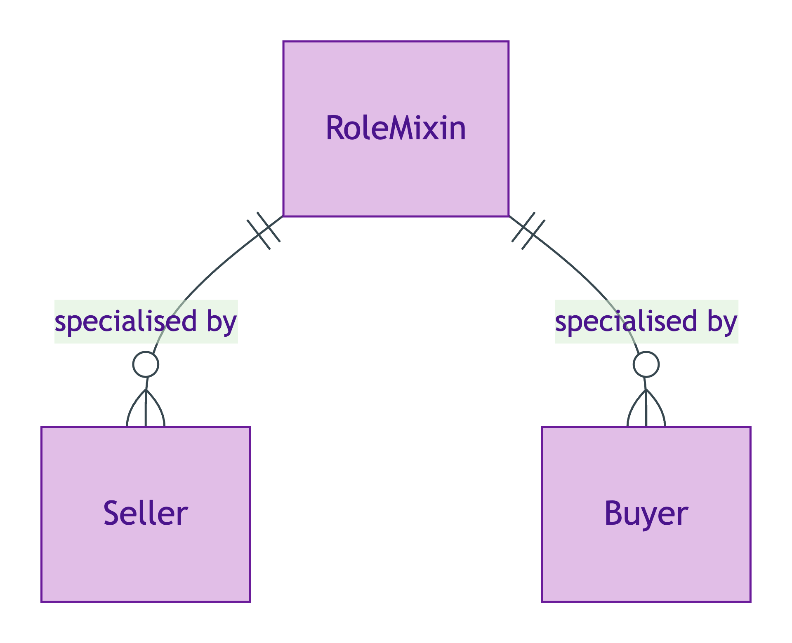
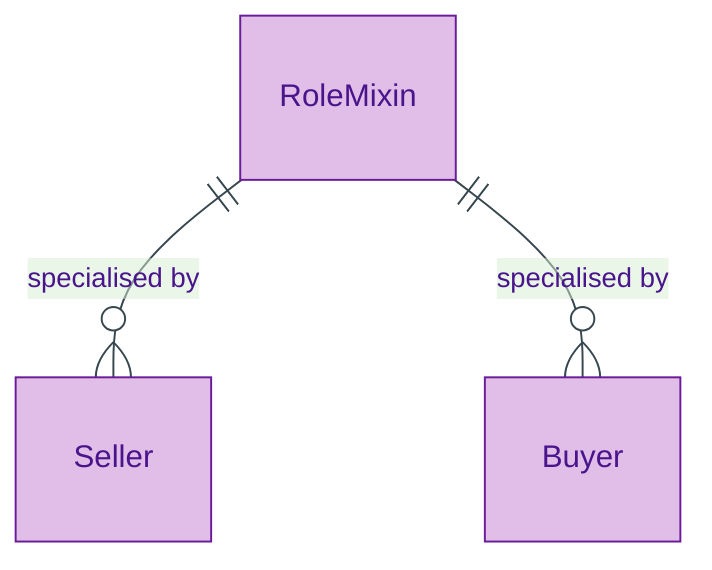

# Role Mixin

## Summary

UFO meta-class for anti-rigid, cross-sortal role patterns. An instance of a RoleMixin is borne by a bearer drawn from more than one substantial Kind (e.g. Seller may be borne by Person OR Organisation). Distinguished from [Role](./role.md) (which is sortal — borne by a single Kind). [Meta-class; UFO RoleMixin]. In scope OPDA RoleMixins: [Seller](../agent/seller.md), [Buyer](../agent/buyer.md).
[Concept tier →](../../concept/foundation/role-mixin.md)

## Attributes

RoleMixin is a meta-class — it declares no attributes of its own. Concrete RoleMixins declare their own attribute sets in their module pages.

## Relationships

RoleMixin is a meta-class — concrete RoleMixins specialise it via `Ref:RoleMixin` subclass relationships. The RoleMixin pattern itself requires:

| Predicate | Target entity | Cardinality | Inverse | Description |
|---|---|---|---|---|
| `borneBy` | (multiple bearer Kinds, disjunctively) | `1..1` | — | A RoleMixin instance is borne by exactly one bearer at a time, but the bearer may be drawn from any of multiple Kinds (e.g. Person OR Organisation) |
| `foundedBy` | (founding Relator) | `1..1` | — | A RoleMixin is founded by a Relator (its origination event); the Relator Kind varies per concrete RoleMixin |

## Identity key

RoleMixin NEVER supplies its own identity (same anti-pattern as Role per ODR-0005 Anti-pattern §3). Identity = bearer identity + Relator identity. The `borneBy` predicate at instance-time resolves to exactly one Kind.

## Constraints

No SHACL constraints emitted on the meta-class itself. Concrete RoleMixin subclasses (Seller, Buyer) bear constraints inherited from their founding Relator.

## Derived attributes

None at the meta-class level.

## ER diagram

Mermaid Source

## Source ODR + ADR

- [ODR-0006 — Agent + Roles + Relators](/modelling/odr/odr-0006), §Q2
- [ADR-0009 — Foundation TBox emission](/modelling/adr/adr-0009) — implementation
