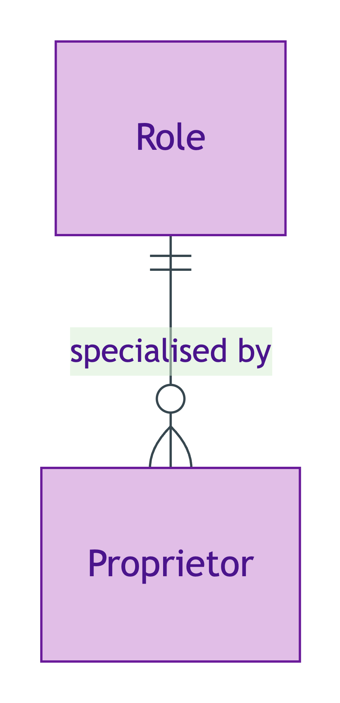
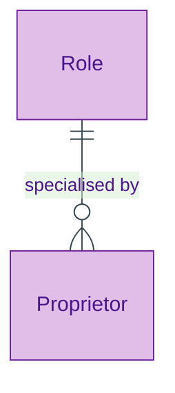

# Role

## Summary

UFO meta-class for anti-rigid, sortal roles. An instance of a Role is borne by a bearer drawn from a single substantial Kind. A Role NEVER supplies its own identity — it borrows identity from its bearer. [Meta-class; UFO Role]. In scope OPDA Role: [Proprietor](../agent/proprietor.md).
[Concept tier →](../../concept/foundation/role.md)

## Attributes

Role is a meta-class — it declares no attributes of its own. Concrete Roles declare their own attribute sets in their module pages.

## Relationships

Role is a meta-class — concrete Roles specialise it via `Ref:Role` subclass relationships. The Role pattern itself requires:

| Predicate | Target entity | Cardinality | Inverse | Description |
|---|---|---|---|---|
| `borneBy` | (single bearer Kind) | `1..1` | — | A Role is borne by exactly one substantial Kind; the bearer Kind varies per concrete Role |
| `foundedBy` | (founding Relator) | `1..1` | — | A Role is founded by a Relator (its origination event); the Relator Kind varies per concrete Role |

## Identity key

Role NEVER supplies its own identity (per ODR-0005 Anti-pattern §3). Identity = bearer identity + Relator identity, parasitic on both.

## Constraints

No SHACL constraints emitted on the meta-class itself. Concrete Role subclasses bear constraints inherited from their bearer Kind's identity-key shape and from their founding Relator.

## Derived attributes

None at the meta-class level.

## ER diagram

Mermaid Source

## Source ODR + ADR

- [ODR-0006 — Agent + Roles + Relators](../../../ontology/odr/ODR-0006-agent-roles-relators.md), §Q2
- [ADR-0009 — Foundation TBox emission](../../../adr/ADR-0009-foundation-tbox-emission.md) — implementation
