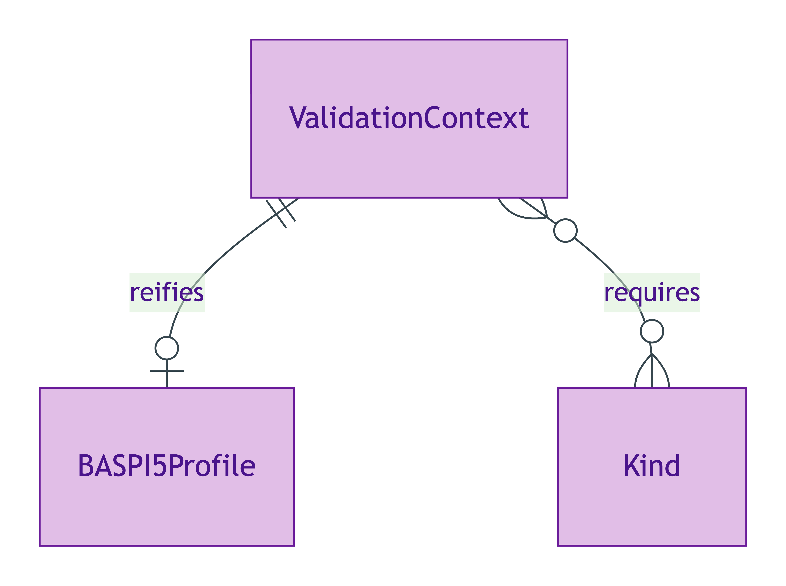
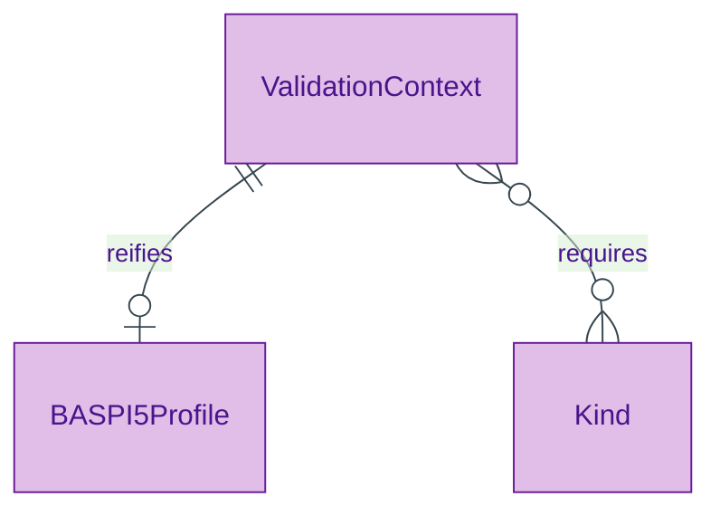

# Validation Context

## Summary

Reification of an overlay-profile validation context per ODR-0010 §Q1 (Guarino withdrawal condition). Each instance carries five properties anchoring per-profile cardinality / enum constraints to a named context — converting conditionality from "required (depending)" to "required relative to a named, dereferenceable context". [Substance Kind (informational); UFO Substance Kind]. ADR-0013 emits per-profile instances (e.g. for BASPI5).
[Concept tier →](../../concept/foundation/validation-context.md)

## Attributes

| Attribute | Type | Cardinality | Required | Identity-bearing | Description |
|---|---|---|---|---|---|
| `profileURI` | `uri` | `1..1` | Y | Y | Dereferenceable URI naming the overlay profile (e.g. the BASPI5 profile graph URI) |
| `requires` | `Ref:owl:Class` | `0..*` | N | N | Kinds whose instances the profile additionally requires |
| `overlaysContext` | `string` | `0..1` | N | N | Human-readable label naming the context the profile overlays |
| `sourcedFrom` | `uri` | `0..1` | N | N | Source artefact the profile derives from (e.g. a PDTF schema URI) |
| `formVersion` | `string` | `0..1` | N | N | Form-version identifier (e.g. `baspi5-2026-05`) |

## Relationships

This entity declares no module-local object properties beyond the typed `requires` predicate above. Profile shapes reference the ValidationContext instance directly from their `sh:NodeShape` declarations in the Physical-Ontology tier.

## Identity key

Identity key = `profileURI`. Each profile graph instantiates exactly one ValidationContext; the URI is the dereferenceable name for that context.

## Constraints

No additional non-cardinality constraints emitted at the Logical tier. The five-property structure is itself the constraint — every ValidationContext instance must carry the full set (per ODR-0010 §Q1).

## Derived attributes

None.

## ER diagram

Mermaid Source

## Source ODR + ADR

- [ODR-0010 — overlay profile architecture](/modelling/odr/odr-0010), §Q1 Guarino withdrawal condition
- [ADR-0013 — overlay profile emission](/modelling/adr/adr-0013) — implementation
