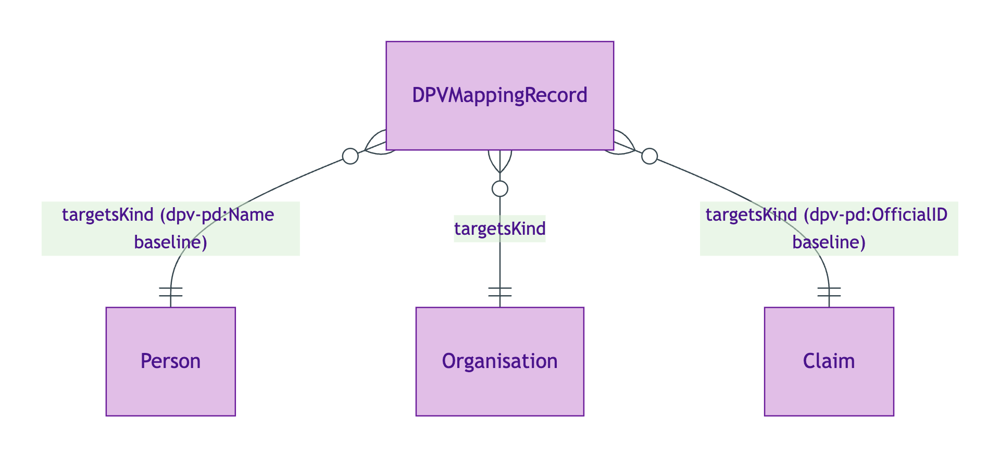
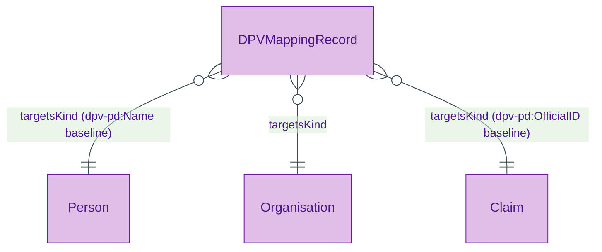
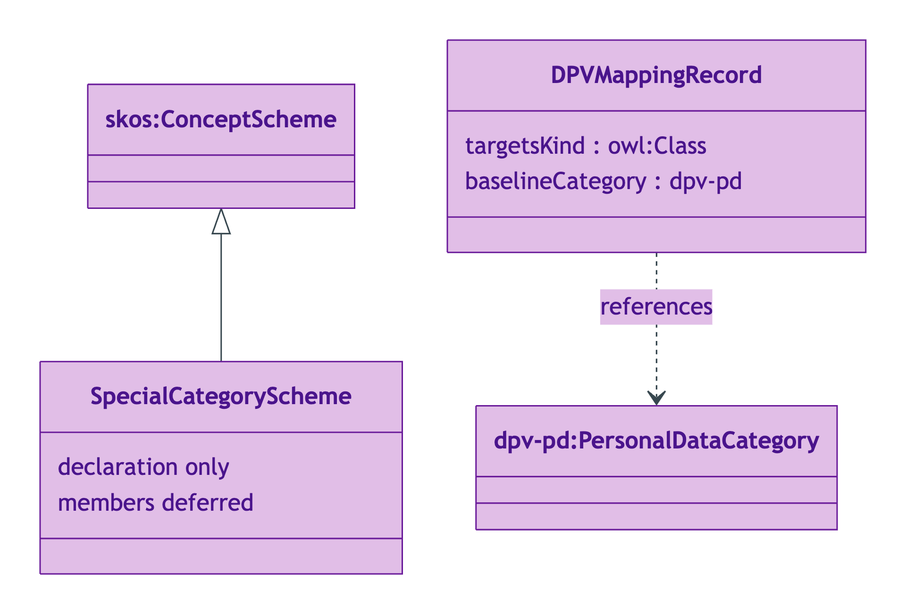
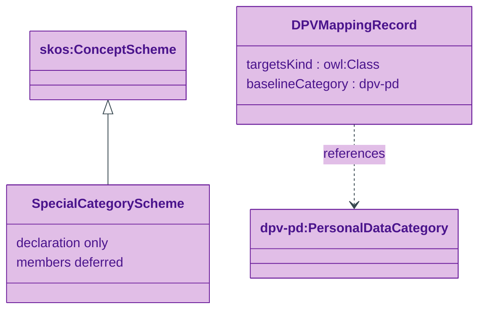
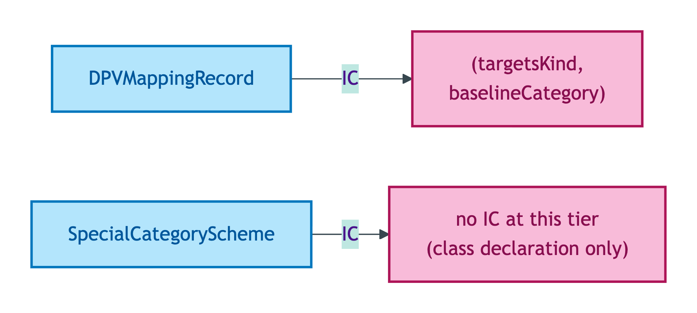
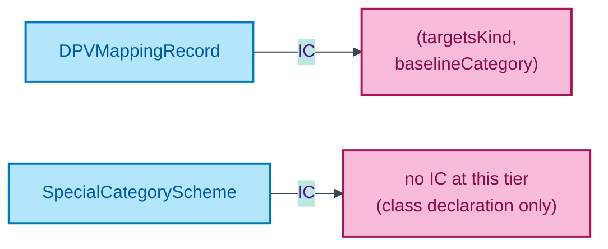

# Governance module

DPV (Data Privacy Vocabulary) mapping records that bind OPDA Kinds to their baseline personal-data categories, plus the SpecialCategoryScheme class declaration for GDPR Article 10 special-category personal data.

## Entity inventory

| Entity | UFO meta-category | Notes |
|---|---|---|
| [DPVMappingRecord](./dpv-mapping-record.md) | Information particular | Mapping-record-as-resource pattern per ODR-0018 §3a |
| [SpecialCategoryScheme](./special-category-scheme.md) | Information particular (declaration only) | Subclass of `skos:ConceptScheme`; members emit when ADR-0010 scope-expansion activates |

## Enumerations bound by this module

None — the SpecialCategoryScheme is itself a class declaration awaiting member emission; the three concrete `DPVMappingRecord` instances (`ClaimDPVMapping`, `OrganisationDPVMapping`, `PersonDPVMapping`) cite DPV-PD categories directly rather than via an OPDA-internal scheme.

## ER diagram

Mermaid Source

Source file: [`../diagrams/governance-er.mmd`](../diagrams/governance-er.mmd).

## Class hierarchy

OWL/RDFS subclass relationships. DPVMappingRecord is an Information particular at root. SpecialCategoryScheme subclasses `skos:ConceptScheme`. Both reference DPV-PD URIs by citation only (not import).

Mermaid Source

## Identity-key summary

Mermaid Source

