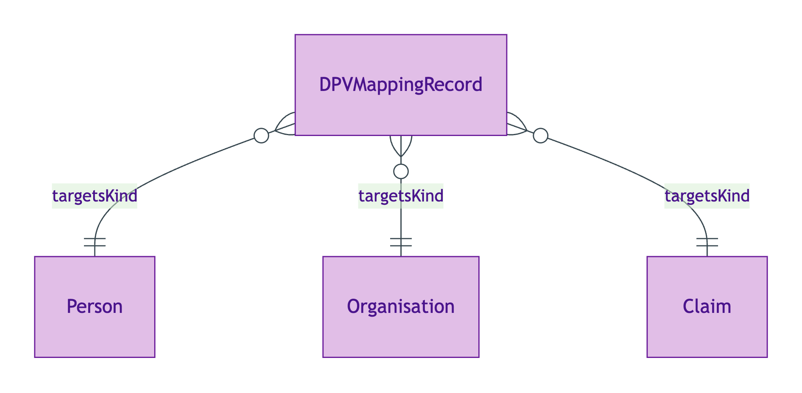
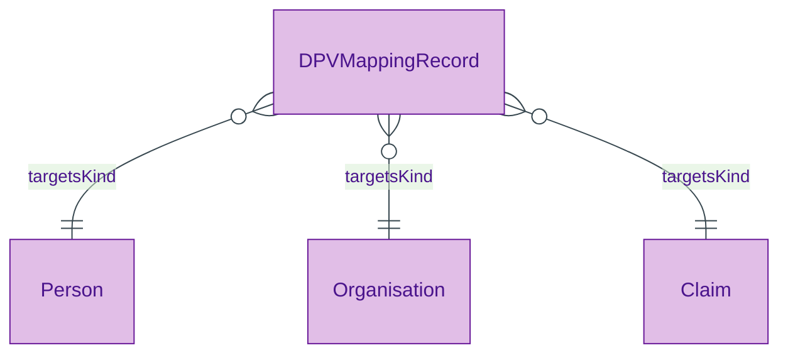

# DPV Mapping Record

## Summary

Mapping record from an OPDA Kind class to its DPV baseline personal-data category and optional variant-conditional refinements. [Information particular; UFO Information Particular]. Mapping-record-as-resource pattern per ODR-0018 §3a. Per ODR-0018 §Rule 4 + ODR-0012 §Evidence co-annotation, ODR-0012 is the authoring authority — this module emits the mapping records; ADR-0012 emits the resulting DPV co-annotation triples into the annotations graph (three-graph separation per ODR-0004 §3a).
[Concept tier →](../../concept/governance/dpv-mapping-record.md)

## Attributes

This entity declares no module-local datatype properties. The mapping content is borne entirely by the object properties below.

## Relationships

| Predicate | Target entity | Cardinality | Inverse | Description |
|---|---|---|---|---|
| `targetsKind` | `Ref:owl:Class` | `1..1` | — | The OPDA Kind class whose instances bear the personal-data category named by `baselineCategory` (with optional variant refinements) |
| `baselineCategory` | `Ref:dpv-pd:PersonalDataCategory` | `0..1` | — | Reference to a DPV-PD category that all instances of the target Kind bear by default; cited but DPV is NOT imported per ODR-0012 §Reference-not-import |

## Identity key

Identity key = `(targetsKind, baselineCategory)` tuple. Each Kind has at most one baseline mapping; variant refinements are emitted as additional mapping records.

## Constraints

- `targetsKind` MUST be exactly one IRI-valued reference (`Violation`, `DPVMappingRecordIdentityKeyShape`)
- DPV-PD URIs are cited via reference; DPV is NOT imported (ODR-0012 §Reference-not-import discipline; reference-without-import enforced by the foundation `targetsClassGraph` declaration)

## Derived attributes

None.

## ER diagram

Mermaid Source

## Source ODR + ADR

- [ODR-0018 — DPV co-annotation](../../../ontology/odr/ODR-0018-dpv-co-annotation.md), §Rule 4 baseline; §3a mapping-record-as-resource
- [ODR-0012 — SHACL + DPV annotation](../../../ontology/odr/ODR-0012-shacl-dpv-annotation.md), §Phase 1 reference-not-import discipline
- [ADR-0011 — Module TBox emission](../../../adr/ADR-0011-module-tbox-emission.md) — implementation
- [ADR-0012 — SHACL + DPV annotation emission](../../../adr/ADR-0012-shacl-and-dpv-annotation-emission.md) — co-annotation triples
