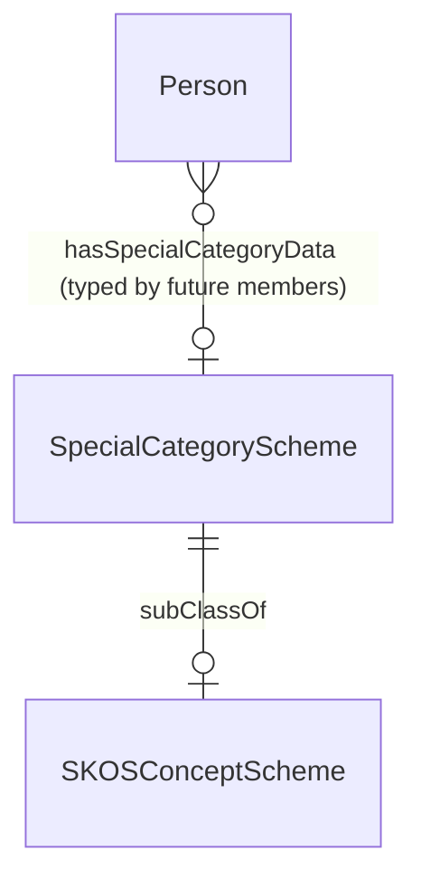

# Special Category Scheme

## Summary

GDPR Article 10 / DPA 2018 special-category personal-data scheme — flags PII categories with elevated lawful-basis discipline (caution-or-conviction; AML-result; etc.). [Information particular (declaration only); subclass of `skos:ConceptScheme`]. Per S012 Q3 (Baker) the scheme structure is class-declared here; the scheme instance + members emit via ADR-0010 SKOS substrate when downstream demand materialises. Currently a class declaration only — member emission deferred per ODR-0011 §Operational specifications (no S012 Q3 enum currently scoped).
[Concept tier →](../../concept/governance/special-category-scheme.md)

## Attributes

This entity declares no module-local datatype properties at the class-declaration scope. Once instantiated, the scheme will carry the standard SKOS predicates (`skos:prefLabel`, `skos:definition`, etc.) inherited from `skos:ConceptScheme`.

## Relationships

This entity declares no module-local object properties at the class-declaration scope.

## Identity key

No identity key emitted at this tier — the entity is a class declaration awaiting instance + member emission via a future Council session.

## Constraints

No SHACL Violation/Warning shapes emitted at this tier. When the scheme is instantiated, the GDPR Article 10 special-category list will be enumerated per upstream regulator citation.

## Derived attributes

None.

## ER diagram

## Source ODR + ADR

- GDPR Article 10 (regulator-cited source)
- [ODR-0011 — Enumeration vocabularies](../../../ontology/odr/ODR-0011-enumeration-vocabularies.md), §Operational specifications (deferred member emission)
- [ADR-0011 — Module TBox emission](../../../adr/ADR-0011-module-tbox-emission.md) — implementation
