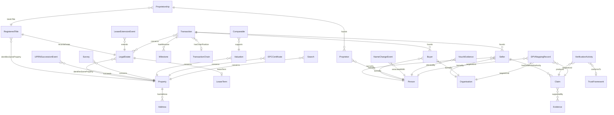

# Logical model — entity index

OPDA's Logical-tier inventory: 41 entities (including three short-name aliases under `owl:equivalentClass`) across seven modules + 23 enumeration schemes. See [`README.md`](./README.md) for reading order and per-entity section shape.

## Module catalogue

| Module | Entities | Schemes used | Description |
|---|---|---|---|
| [foundation](./foundation/) | 6 | — | UFO meta-classes (Role, RoleMixin, Relator); ValidationContext; generator provenance (GeneratorRun); diagnostic exemplars |
| [property](./property/) | 7 | 15 | Physical Property + Address + LegalEstate + RegisteredTitle + LeaseTerm + lifecycle events |
| [agent](./agent/) | 7 | 4 | Person + Organisation as substances; Buyer/Seller/Proprietor as Roles; Proprietorship Relator |
| [transaction](./transaction/) | 3 | 2 | Transaction Relator; lifecycle Milestones; TransactionChain aggregate |
| [claim](./claim/) | 11 | 2 | Verifiable Claims + Evidence subtypes + VerificationActivity + AssuranceLevel + TrustFramework |
| [governance](./governance/) | 2 | — | DPV mapping records (PII baseline + variants); special-category data scheme |
| [descriptive](./descriptive/) | 5 | — | Class-promoted descriptive Kinds: Survey, Valuation, EPC, Search, Comparable |

## Entity index (alphabetical)

| Entity | Module | UFO meta-category |
|---|---|---|
| [Address](./property/address.md) | property | Substance Kind |
| [AssuranceLevel](./claim/assurance-level.md) | claim | Quale-in-Region |
| [Buyer](./agent/buyer.md) | agent | RoleMixin |
| [Claim](./claim/claim.md) | claim | Information particular |
| [Comparable](./descriptive/comparable.md) | descriptive | Substance Kind (informational) |
| [DiagnosticExemplar](./foundation/diagnostic-exemplar.md) | foundation | Substance Kind (informational) |
| [Document](./claim/document.md) | claim | Substance Kind (informational; alias) |
| [DocumentEvidence](./claim/document-evidence.md) | claim | Substance Kind (informational) |
| [DPVMappingRecord](./governance/dpv-mapping-record.md) | governance | Information particular |
| [ElectronicRecord](./claim/electronic-record.md) | claim | Substance Kind (informational; alias) |
| [ElectronicRecordEvidence](./claim/electronic-record-evidence.md) | claim | Substance Kind (informational) |
| [EPCCertificate](./descriptive/epc-certificate.md) | descriptive | Substance Kind (informational) |
| [Evidence](./claim/evidence.md) | claim | Substance Kind (informational) |
| [GeneratorRun](./foundation/generator-run.md) | foundation | Information particular |
| [LeaseExtensionEvent](./property/lease-extension-event.md) | property | Event particular |
| [LeaseTerm](./property/lease-term.md) | property | Information particular |
| [LegalEstate](./property/legal-estate.md) | property | Substance Kind |
| [Milestone](./transaction/milestone.md) | transaction | Event particular |
| [NameChangeEvent](./agent/name-change-event.md) | agent | Event particular |
| [Organisation](./agent/organisation.md) | agent | Substance Kind |
| [Person](./agent/person.md) | agent | Substance Kind |
| [Property](./property/property.md) | property | Substance Kind |
| [Proprietor](./agent/proprietor.md) | agent | Role |
| [Proprietorship](./agent/proprietorship.md) | agent | Relator |
| [RegisteredTitle](./property/registered-title.md) | property | Substance Kind (informational) |
| [Relator](./foundation/relator.md) | foundation | Meta-class (UFO Relator) |
| [Role](./foundation/role.md) | foundation | Meta-class (UFO Role) |
| [RoleMixin](./foundation/role-mixin.md) | foundation | Meta-class (UFO RoleMixin) |
| [Search](./descriptive/search.md) | descriptive | Substance Kind (informational) |
| [Seller](./agent/seller.md) | agent | RoleMixin |
| [SpecialCategoryScheme](./governance/special-category-scheme.md) | governance | Information particular (declaration only) |
| [Survey](./descriptive/survey.md) | descriptive | Substance Kind (informational) |
| [Transaction](./transaction/transaction.md) | transaction | Relator |
| [TransactionChain](./transaction/transaction-chain.md) | transaction | Aggregate |
| [TrustFramework](./claim/trust-framework.md) | claim | Information particular |
| [UPRNSuccessionEvent](./property/uprn-succession-event.md) | property | Event particular |
| [Valuation](./descriptive/valuation.md) | descriptive | Substance Kind (informational) |
| [ValidationContext](./foundation/validation-context.md) | foundation | Substance Kind (informational) |
| [VerificationActivity](./claim/verification-activity.md) | claim | Event particular |
| [Vouch](./claim/vouch.md) | claim | Substance Kind (informational; alias) |
| [VouchEvidence](./claim/vouch-evidence.md) | claim | Substance Kind (informational) |

## Master ER diagram

The diagram below shows the cross-module relationships at a glance. Per-module ER diagrams (showing within-module detail) live in the module READMEs and in [`diagrams/`](./diagrams/).

Source file: [`diagrams/master-er.mmd`](./diagrams/master-er.mmd).
