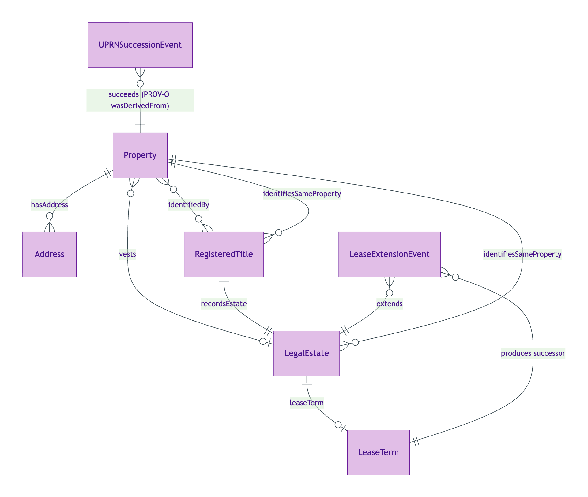
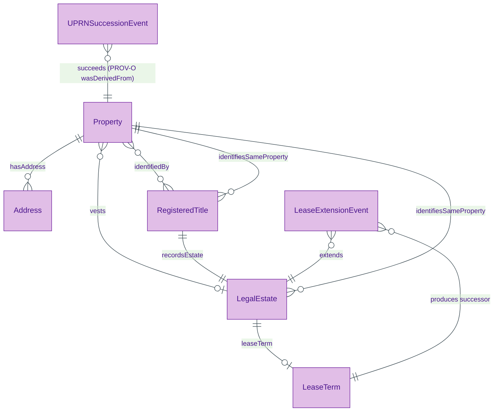
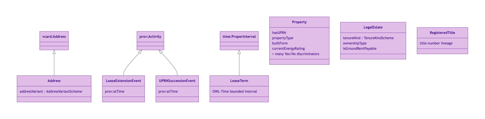
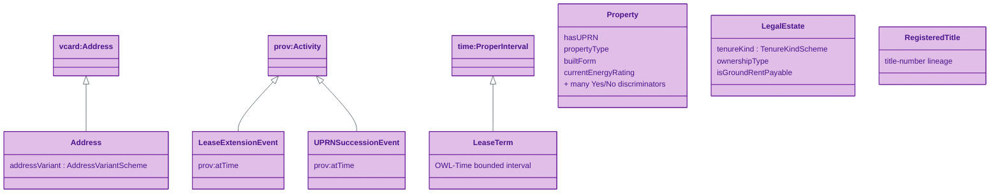
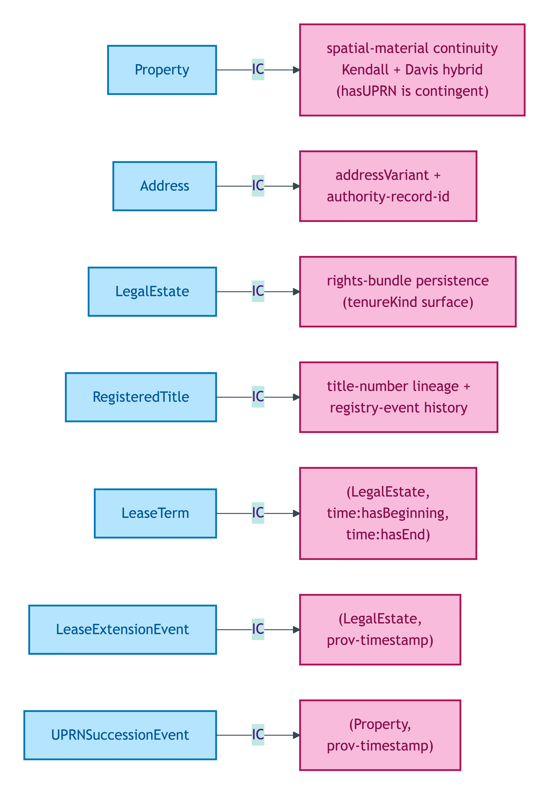
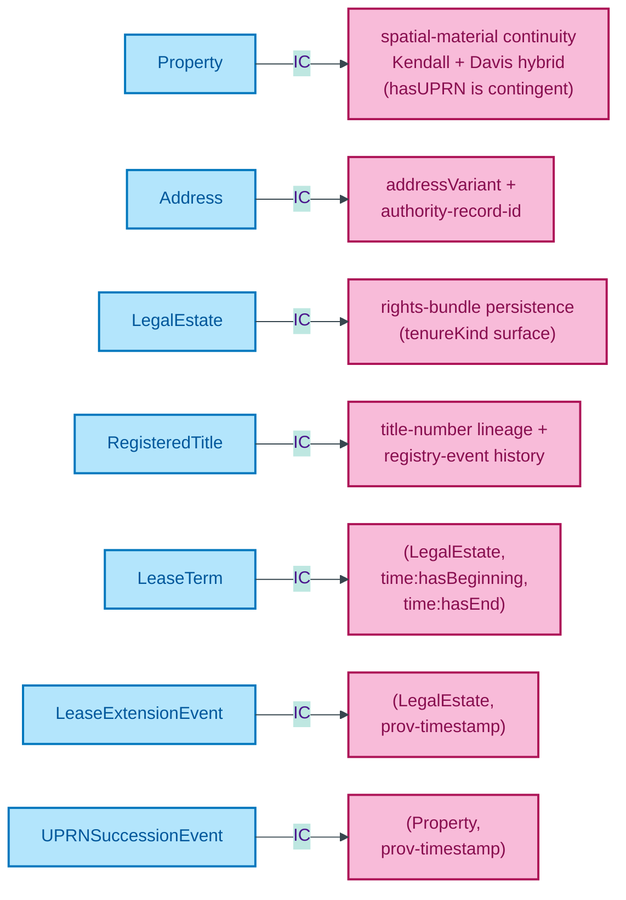

# Property module

The physical Property, its socially-recognised Address(es), the legal rights-bundle (LegalEstate) vested in it, the HMLR record (RegisteredTitle) documenting that estate, and the lifecycle events that mutate them (LeaseExtensionEvent, UPRNSuccessionEvent). This is OPDA's structural spine — all other modules attach to it.

## Entity inventory

| Entity | UFO meta-category | Identity criterion |
|---|---|---|
| [Address](./address.md) | Substance Kind | Authority-record persistence across cosmetic re-format and authority succession |
| [LeaseExtensionEvent](./lease-extension-event.md) | Event particular | Reified statutory lease extension event |
| [LeaseTerm](./lease-term.md) | Information particular | OWL-Time ProperInterval bounding a leasehold tenure |
| [LegalEstate](./legal-estate.md) | Substance Kind | Rights-bundle persistence through grant / transfer / registration / discharge |
| [Property](./property.md) | Substance Kind | Spatial-material continuity (Kendall + Davis legal-record-discontinuity-override hybrid) |
| [RegisteredTitle](./registered-title.md) | Substance Kind (informational) | Title-number lineage + reified registry-event history |
| [UPRNSuccessionEvent](./uprn-succession-event.md) | Event particular | Reified administrative UPRN re-numbering event |

## Enumerations bound by this module

| Scheme | Used by attribute | Closed/Open |
|---|---|---|
| [AddressVariantScheme](./enumerations/address-variant-scheme.md) | `Address.addressVariant` | Closed (4 members) |
| [BuiltFormScheme](./enumerations/built-form-scheme.md) | `Property.builtForm` | Closed (5 members) |
| [CentralHeatingFuelTypeScheme](./enumerations/central-heating-fuel-type-scheme.md) | `Property.centralHeatingFuelType` | Closed (6 members) |
| [CouncilTaxBandSchemeEW](./enumerations/council-tax-band-scheme-ew.md) | Council-tax attributes (E&W) | Closed (8 members) |
| [CouncilTaxBandSchemeScotland](./enumerations/council-tax-band-scheme-scotland.md) | Council-tax attributes (Scotland) | Closed (9 members) |
| [CurrentEnergyRatingScheme](./enumerations/current-energy-rating-scheme.md) | `Property.currentEnergyRating` | Closed (7 members) |
| [HeatingTypeScheme](./enumerations/heating-type-scheme.md) | `Property.heatingType` | Closed (4 members) |
| [OffMainsDrainageSystemTypeScheme](./enumerations/off-mains-drainage-system-type-scheme.md) | `Property.offMainsDrainageSystemType` | Closed (6 members) |
| [OwnershipTypeScheme](./enumerations/ownership-type-scheme.md) | `LegalEstate.ownershipType` | Closed (4 members) |
| [PropertyTypeScheme](./enumerations/property-type-scheme.md) | `Property.propertyType` | Closed (6 members) |
| [TenureKindScheme](./enumerations/tenure-kind-scheme.md) | `LegalEstate.tenureKind` | Closed (3 members) |
| [YesNoScheme](./enumerations/yes-no-scheme.md) | Many Yes/No discriminators | Closed (2 members) |
| [YesNoNotApplicableScheme](./enumerations/yes-no-not-applicable-scheme.md) | BASPI5 conditional questions | Closed (3 members) |
| [YesNoNotKnownScheme](./enumerations/yes-no-not-known-scheme.md) | BASPI5 not-known-admissible questions | Closed (3 members) |
| [YesNoNotRequiredScheme](./enumerations/yes-no-not-required-scheme.md) | BASPI5 not-required-admissible questions | Closed (3 members) |

## ER diagram

Mermaid Source

Source file: [`../diagrams/property-er.mmd`](../diagrams/property-er.mmd).

## Class hierarchy

OWL/RDFS subclass relationships in the property module. Property, LegalEstate, and Address are Substance Kinds at root level. Address inherits from `vcard:Address`. Events specialise the foundation `Event particular` shape via PROV-O Activity.

Mermaid Source

## Identity-key summary

Mermaid Source

