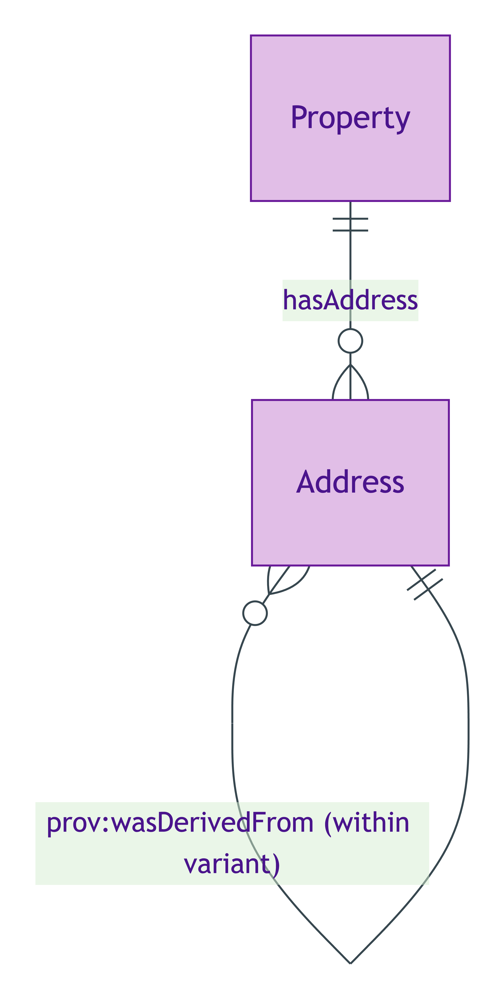
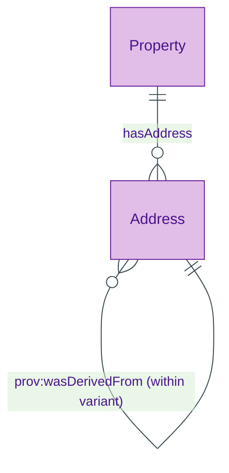

# Address

## Summary

Socially-recognised locator constructed by an authority (Royal Mail / OS AddressBase / HMLR / INSPIRE) and persisting as a record-entity in that authority's stewardship. [Substance Kind; UFO Substance Kind / DOLCE NonPhysicalEndurant — Searle 1995 institutional fact grounding]. Identity criterion holds over five hard cases per ODR-0015 §3a: cosmetic re-format, authority-internal succession, cross-variant identity-claim never collapses, Property-side change, INSPIRE-only locatedness. Subclass of `vcard:Address` for structural compatibility with vCard consumers.
[Concept tier →](../../concept/property/address.md)

## Attributes

| Attribute | Type | Cardinality | Required | Identity-bearing | Description |
|---|---|---|---|---|---|
| `addressVariant` | `EnumScheme:AddressVariantScheme` | `1..1` | Y | Y | Required tag naming the authority and lifecycle for this Address instance (`title` / `marketing` / `inspire` / `postal`) |

Additional structural attributes (street / locality / postcode / etc.) are inherited from the `vcard:Address` superclass and are not re-emitted at this tier.

## Relationships

This entity declares no module-local object properties. Inbound predicates: `Property.hasAddress`.

## Identity key

Identity key = `addressVariant` + authority-record identifier (within the variant's authority lifecycle). Per ODR-0015 Rule 6 the variant is the typed surface that determines the authority context against which the rest of the address record is interpreted. Cross-variant identity-claims are forbidden: a title-variant Address and an inspire-variant Address may co-refer to the same physical Property but they are distinct Address individuals. Cross-reference: Concept-tier [Address IC narrative](../../concept/property/address.md#identity-criterion).

## Constraints

- `addressVariant` MUST be a single `string` value drawn from `AddressVariantScheme` (`Violation`, `AddressIdentityKeyShape`)
- An Address is NOT a UFO Mode (S015 Q1 commitment — distinct from Property modes / Property qualities)

## Derived attributes

| Attribute | Derived from | Rule summary | Severity |
|---|---|---|---|
| `hasINSPIRESuccessionStatus` | `addressVariant = "inspire"` + `prov:wasDerivedFrom` chain | `inspire-re-issued` when a prior inspire-variant Address is named via prov; `inspire-primary` otherwise | `Info` |

## ER diagram

Mermaid Source

## Source ODR + ADR

- [ODR-0015 — Address](/modelling/odr/odr-0015), §2a Address IC; §Rule 6 variant discipline
- [ADR-0011 — Module TBox emission](/modelling/adr/adr-0011) — implementation
- [ADR-0012 — SHACL + DPV annotation emission](/modelling/adr/adr-0012) — shapes
