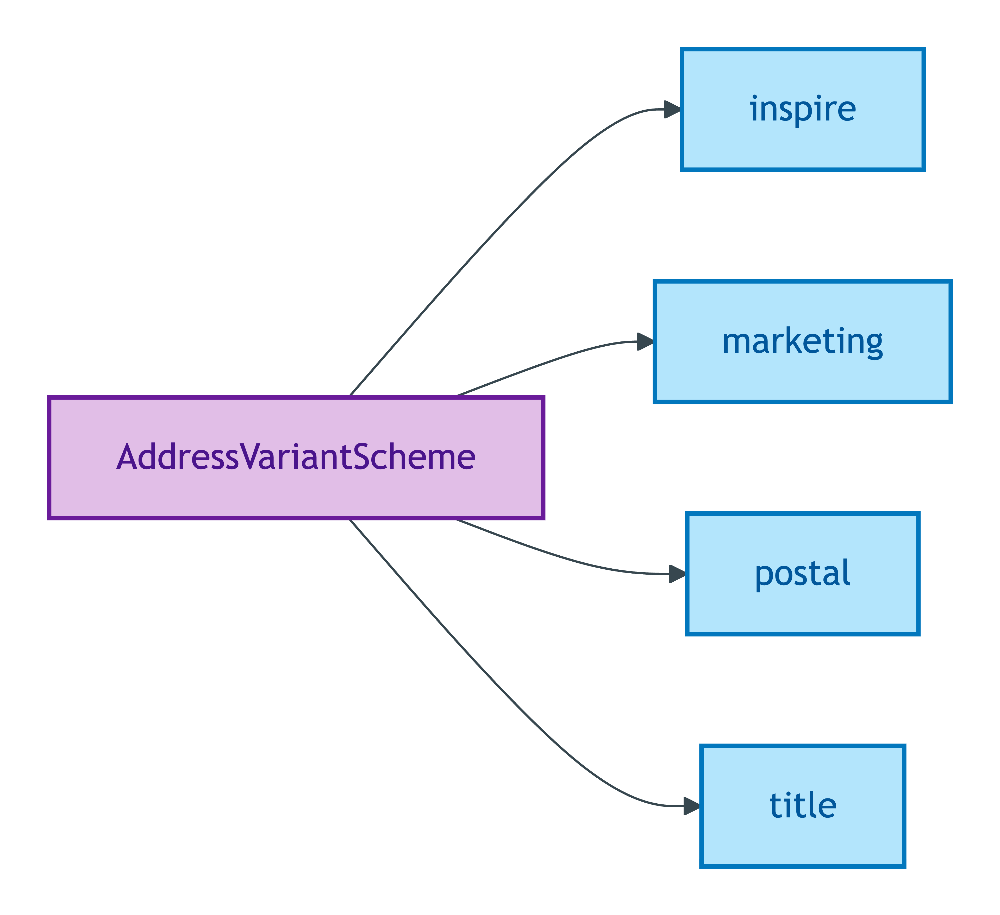
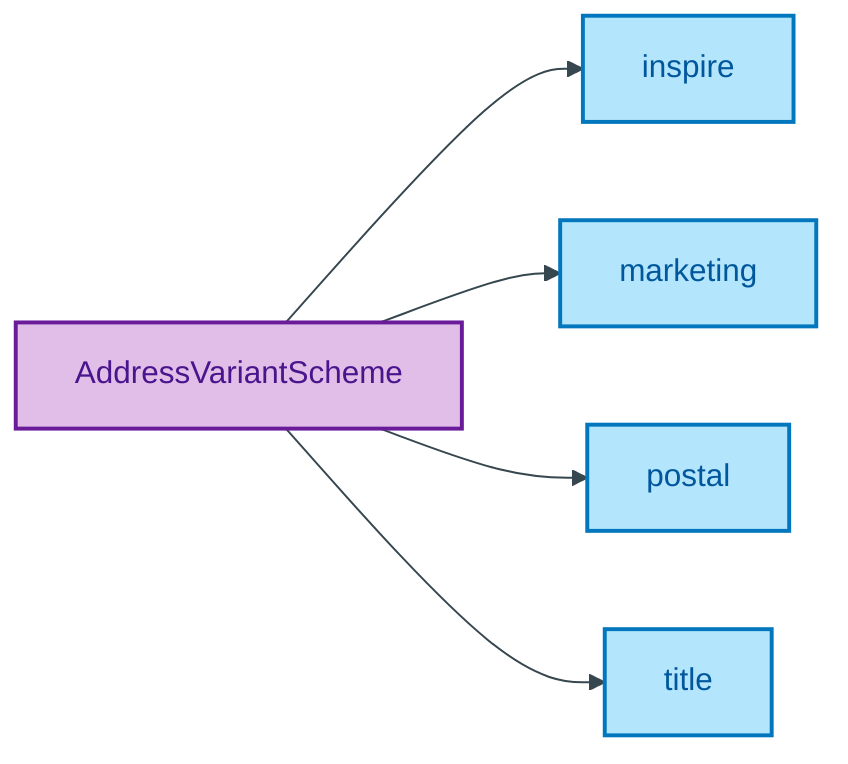

# AddressVariantScheme

## Summary

Quality Values for the variant under which an Address is presented (`marketing`, `title`, `inspire`, `postal`). Each variant particularises an underlying Address Substance Kind per ODR-0015 §Q1. [UFO Quality Value]. Steward: Guizzardi (S015 Q1).
[Concept tier — Address →](../../../concept/property/address.md)

## Members

| Notation | Label | Definition | Source |
|---|---|---|---|
| `inspire` | inspire | INSPIRE Directive variant — the regulated postal address structure published by INSPIRE-aligned registers (administrative boundary alignment) | [ODR-0015 §2a](/modelling/odr/odr-0015) |
| `marketing` | marketing | Marketing-presentation variant (estate-agent advertising format; typically de-formalised street name + town) | [ODR-0015 §2a](/modelling/odr/odr-0015) |
| `postal` | postal | Royal Mail PAF-formatted variant (the address as recognised by Royal Mail's Postcode Address File) | [ODR-0015 §2a](/modelling/odr/odr-0015) |
| `title` | title | HM Land Registry registered-title variant (the address as recorded against the title at HMLR) | [ODR-0015 §2a](/modelling/odr/odr-0015) |

## Cardinality discipline

Bound by [`Address.addressVariant`](../address.md#attributes) (`1..1`, identity-bearing). Closed scheme — overlays may subset (e.g. BASPI5 may restrict to {`marketing`, `title`} for sales-context Address payloads) but may NOT extend beyond the four members ratified at S015 Q1.

## Concept hierarchy

Mermaid Source

## Source ODR + ADR

- [ODR-0015 — Address](/modelling/odr/odr-0015), §2a Address variant
- [ADR-0010 — SKOS vocabulary emission](/modelling/adr/adr-0010) — implementation
