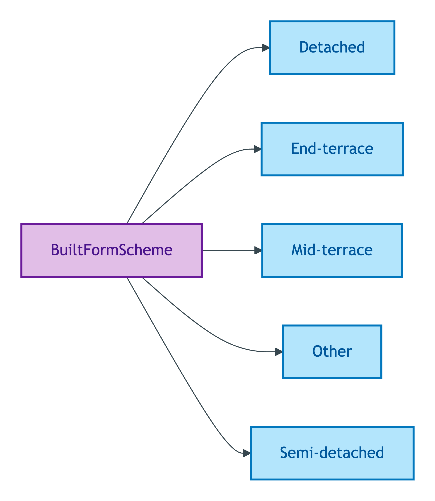
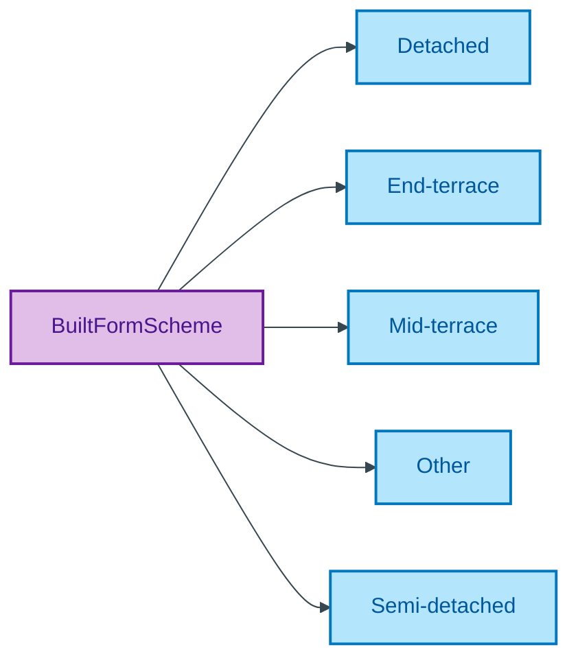

# BuiltFormScheme

## Summary

Classification of a Property's structural built-form (detached, semi-detached, terraced, etc.). [UFO Quale-in-Region / DOLCE Quality-Region]. Steward: Allemang (property-qualities sub-module steward per S008 Q2).
[Concept tier — Property →](../../../concept/property/property.md)

## Members

| Notation | Label | Definition | Source |
|---|---|---|---|
| `Detached` | Detached | Free-standing dwelling sharing no walls with neighbouring properties | OPDA data dictionary |
| `End-terrace` | End-terrace | Dwelling at the end of a terrace, sharing one wall with a neighbouring property | OPDA data dictionary |
| `Mid-terrace` | Mid-terrace | Dwelling within a terrace, sharing walls with neighbouring properties on both sides | OPDA data dictionary |
| `Other` | Other | Built form falling outside the standard categories; relies on a free-text note for context | OPDA data dictionary |
| `Semi-detached` | Semi-detached | Dwelling sharing one wall with a single neighbouring property | OPDA data dictionary |

## Cardinality discipline

Bound by [`Property.builtForm`](../property.md#attributes) (`0..1`, optional). Closed scheme — overlays may subset but may NOT extend; new members require a Council session.

## Concept hierarchy

Mermaid Source

## Source ODR + ADR

- [ODR-0011 — Enumeration vocabularies](../../../ontology/odr/ODR-0011-enumeration-vocabularies.md), §8a UFO meta-category
- [ADR-0010 — SKOS vocabulary emission](../../../adr/ADR-0010-skos-vocabulary-emission.md) — implementation
