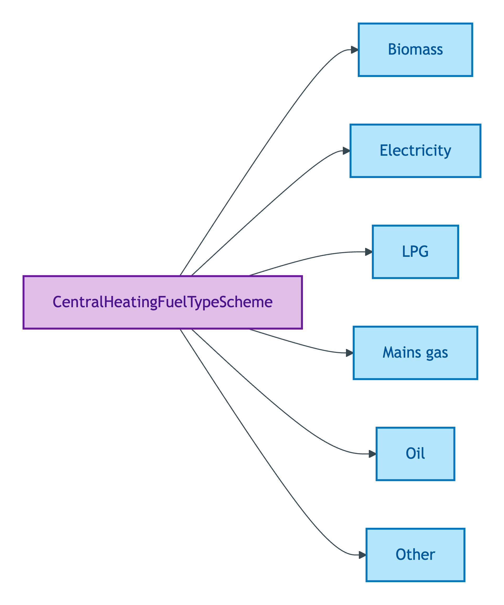
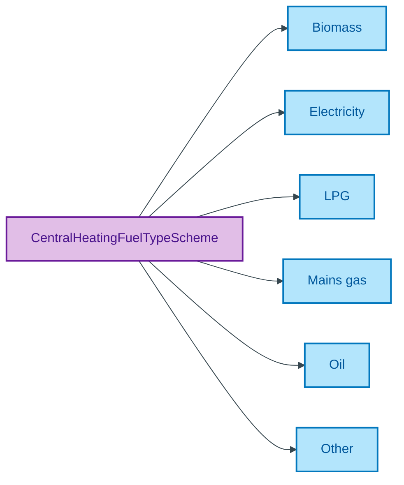

# CentralHeatingFuelTypeScheme

## Summary

Classification of the fuel used by a Property's central heating system. [UFO Quale-in-Region / DOLCE Quality-Region]. Steward: Allemang (property-qualities sub-module steward per S008 Q2).
[Concept tier — Property →](../../../concept/property/property.md)

## Members

| Notation | Label | Definition | Source |
|---|---|---|---|
| `Biomass` | Biomass | Combustible biological material (e.g. wood pellets) | OPDA data dictionary |
| `Electricity` | Electricity | Electrical heating supplied via the mains electricity network | OPDA data dictionary |
| `LPG` | LPG | Liquefied Petroleum Gas stored on-site for combustion | OPDA data dictionary |
| `Mains gas` | Mains gas | Natural gas supplied via the mains gas network | OPDA data dictionary |
| `Oil` | Oil | Heating oil stored on-site for combustion | OPDA data dictionary |
| `Other` | Other | Fuel type falling outside the standard categories | OPDA data dictionary |

## Cardinality discipline

Bound by [`Property.centralHeatingFuelType`](../property.md#attributes) (`0..1`, optional). Closed scheme — overlays may subset but may NOT extend.

## Concept hierarchy

Mermaid Source

## Source ODR + ADR

- [ODR-0011 — Enumeration vocabularies](../../../ontology/odr/ODR-0011-enumeration-vocabularies.md), §8a UFO meta-category
- [ADR-0010 — SKOS vocabulary emission](../../../adr/ADR-0010-skos-vocabulary-emission.md) — implementation
