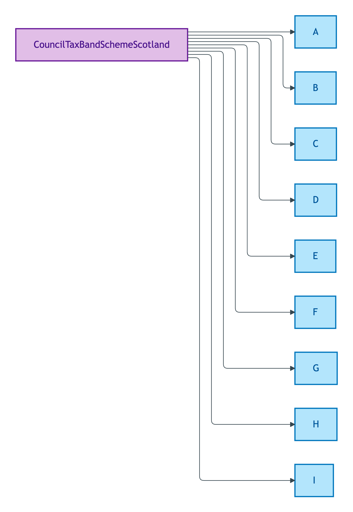
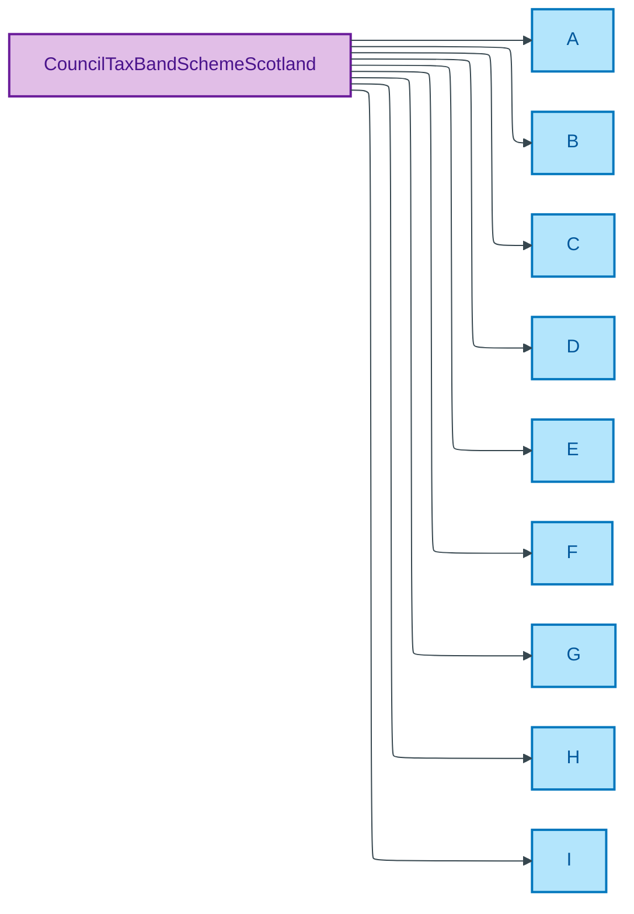

# CouncilTaxBandSchemeScotland

## Summary

Scottish Assessors Association banding for Scotland (Bands A–I) assigned to each domestic property for council tax calculation. Band I is Scotland-specific. [UFO Quale-in-Region / DOLCE Quality-Region]. Verbatim source: SAA council-tax bands. Steward: Baker (regulator-cited per ODR-0011 §4a; SAA-governed).
[Concept tier — Property module →](../../../concept/property/README.md)

## Members

| Notation | Label | Definition | Source |
|---|---|---|---|
| `A` | A | Council tax band A as defined by the SAA for properties in Scotland | [saa.gov.uk](https://www.saa.gov.uk/council-tax/council-tax-bands/) |
| `B` | B | Council tax band B as defined by the SAA for properties in Scotland | [saa.gov.uk](https://www.saa.gov.uk/council-tax/council-tax-bands/) |
| `C` | C | Council tax band C as defined by the SAA for properties in Scotland | [saa.gov.uk](https://www.saa.gov.uk/council-tax/council-tax-bands/) |
| `D` | D | Council tax band D as defined by the SAA for properties in Scotland | [saa.gov.uk](https://www.saa.gov.uk/council-tax/council-tax-bands/) |
| `E` | E | Council tax band E as defined by the SAA for properties in Scotland | [saa.gov.uk](https://www.saa.gov.uk/council-tax/council-tax-bands/) |
| `F` | F | Council tax band F as defined by the SAA for properties in Scotland | [saa.gov.uk](https://www.saa.gov.uk/council-tax/council-tax-bands/) |
| `G` | G | Council tax band G as defined by the SAA for properties in Scotland | [saa.gov.uk](https://www.saa.gov.uk/council-tax/council-tax-bands/) |
| `H` | H | Council tax band H as defined by the SAA for properties in Scotland | [saa.gov.uk](https://www.saa.gov.uk/council-tax/council-tax-bands/) |
| `I` | I | Council tax band I as defined by the SAA for properties in Scotland (Scotland-specific) | [saa.gov.uk](https://www.saa.gov.uk/council-tax/council-tax-bands/) |

## Cardinality discipline

Used by overlay-profile council-tax attributes (Scotland jurisdiction). No core-tier attribute in the emitted TBox currently binds this scheme directly; binding lives in BASPI5 and equivalent overlay profiles. Closed scheme — SAA-governed; members track upstream regulator changes only.

## Concept hierarchy

Mermaid Source

## Source ODR + ADR

- [ODR-0011 — Enumeration vocabularies](../../../ontology/odr/ODR-0011-enumeration-vocabularies.md), §4a regulator-citation discipline
- [ADR-0010 — SKOS vocabulary emission](../../../adr/ADR-0010-skos-vocabulary-emission.md) — implementation
